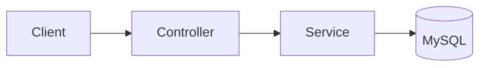

<!--
  MODULE_TEMPLATE.md — canonical shape for every module/platform/infra README.
  RULES (see docs/CLAUDE.md):
   - Keep the section order below EXACTLY. Do not add, remove, or reorder top-level sections.
   - Section HEADINGS stay in English (as written here). Prose BODY is written in Vietnamese
     to match the repo's existing docs convention.
   - Repo-relative paths inside a doc are ABSOLUTE from repo root (e.g. `apps/backend/src/notes/notes.service.ts`),
     NOT relative to the docs folder.
   - Cross-links BETWEEN docs use RELATIVE markdown paths (e.g. `../jobs/README.md`, `../../infra/queue-bullmq/README.md`).
   - Never invent facts. If something is unverified, write `TODO: confirm <what>` instead of guessing.
   - Status banner is the FIRST line. Append a Document History row on every edit.
-->

> **Status:** Verified | Draft — generated from code survey on YYYY-MM-DD | Needs review
> **Last updated:** YYYY-MM-DD
> **Owners:** TODO: confirm (team/person)

# <Module / Platform / Infra Name>

Một đoạn (2–4 câu) mô tả module này làm gì và vì sao tồn tại. Viết bằng tiếng Việt.

## Document Map

- Liệt kê các doc liên quan và link tương đối tới chúng (root `CLAUDE.md`, `docs/architecture.md`, các module/platform/infra liên quan).
- Ví dụ (đường dẫn từ một module doc `docs/<cat>/<name>/`): Root CLAUDE.md → `../../../CLAUDE.md`, Architecture index → `../../architecture.md`.

## Module Purpose

- Trách nhiệm chính của module (bullet list).
- Phạm vi: cái gì THUỘC và cái gì KHÔNG thuộc module này.

## Primary Entrypoints

| Layer | Entrypoint | Purpose |
|-------|-----------|---------|
| Controller | `apps/backend/src/<...>.controller.ts` | ... |
| Service | `apps/backend/src/<...>.service.ts` | ... |
| Entity | `apps/backend/src/<...>/entities/<...>.entity.ts` | ... |
| Shared schema | `packages/shared/src/<...>.ts` | ... |
| Frontend | `apps/frontend/src/<...>.tsx` | ... |

> Đường dẫn trong bảng là tuyệt đối từ repo root.

## Core Supporting Objects

- Các class/file phụ trợ (DTO, util, guard, mapper, queue, worker…) và vai trò ngắn gọn.

## Data Flow

Sơ đồ luồng request đồng bộ và (nếu có) luồng async/background. Dùng mermaid hoặc mô tả từng bước.

- Async flow (nếu có): mô tả queue → worker → side effect.

## When To Touch Which File

| If you want to… | Edit | Then also… |
|-----------------|------|------------|
| Thêm field persist | `entities/<...>.entity.ts` + migration mới | cập nhật shared schema + cả hai phía |
| Đổi shape API | `packages/shared/src/<...>.ts` | controller + service + frontend |

## Permission & Access Rules

- Quy tắc ownership/scoping (`userId`), guard nào áp dụng, dữ liệu nào KHÔNG được expose ra DTO.

## Legacy / Operational Notes

- Lưu ý vận hành, migration đặc biệt, hành vi cũ còn tồn tại, biến môi trường liên quan.
- Nếu không có: ghi "Không có lưu ý đặc biệt."

## Where To Start Reading For Maintenance

- Thứ tự file nên đọc khi bảo trì module này (1 → 2 → 3).

## Related Modules

- Tên module liên quan → đường dẫn tương đối (vd `../jobs/README.md`) — quan hệ ngắn gọn.

## Document History

| Date | Change | Author |
|------|--------|--------|
| YYYY-MM-DD | Initial draft generated from code survey | TODO: confirm |
