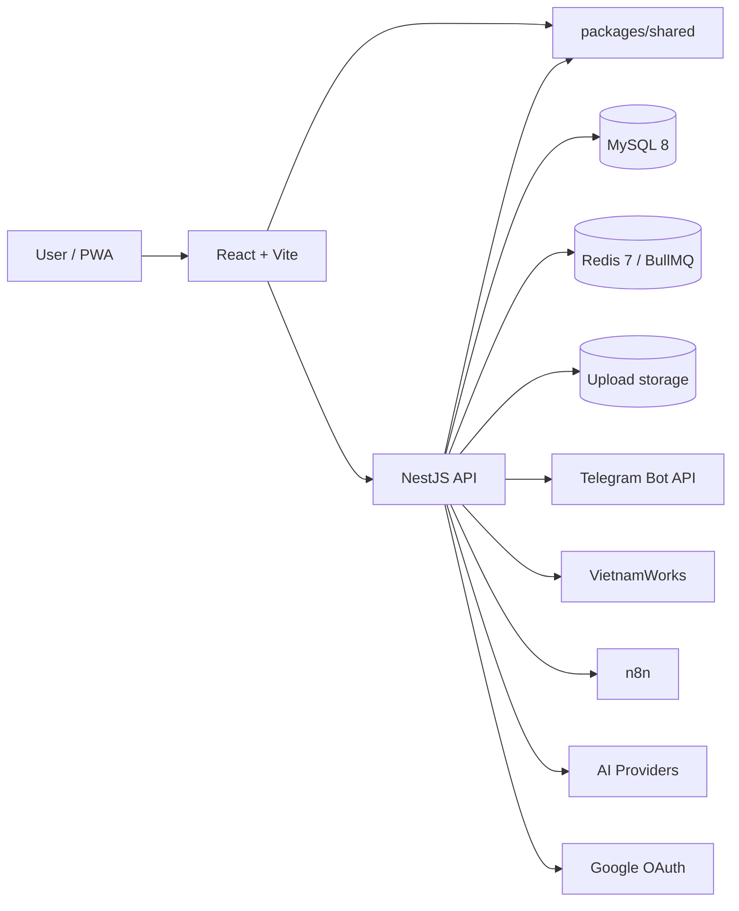

# Architecture — Master Index

> **Status:** Verified
> **Last updated:** 2026-06-15

Đây là **điểm vào duy nhất** cho mọi task cross-cutting trong `smart-assistant`. Đọc file này trước, rồi đi tới doc của module/platform/infra liên quan. Quy ước biên soạn docs: xem [`CLAUDE.md`](CLAUDE.md). Rule toàn repo: [`../CLAUDE.md`](../CLAUDE.md).

## System overview

`smart-assistant` là PWA cá nhân tự host (mobile-first) cho notes, schedule, expenses, jobs, vocab và AI assistant. Monorepo pnpm gồm 3 package: `apps/backend` (NestJS 10), `apps/frontend` (React 18 + Vite), `packages/shared` (Zod schemas — biên hợp đồng giữa hai phía).

### Cross-cutting architecture (existing, Vietnamese)

| Topic | Doc |
|-------|-----|
| Tổng quan hệ thống | [`architecture/overview.md`](architecture/overview.md) |
| Backend (layered NestJS) | [`architecture/backend.md`](architecture/backend.md) |
| Frontend (React/Vite) | [`architecture/frontend.md`](architecture/frontend.md) |
| Database (MySQL/TypeORM) | [`architecture/database.md`](architecture/database.md) |
| Security | [`architecture/security.md`](architecture/security.md) |
| Cài đặt local + prod | [`setup.md`](setup.md) |
| Đặc tả yêu cầu | [`SRS.md`](SRS.md) |

## Business modules

| Module | Code | Doc |
|--------|------|-----|
| Auth | `apps/backend/src/auth` | [`modules/auth/README.md`](modules/auth/README.md) |
| Users | `apps/backend/src/users` | [`modules/users/README.md`](modules/users/README.md) |
| Notes | `apps/backend/src/notes` | [`modules/notes/README.md`](modules/notes/README.md) · [feature](features/notes/overview.md) · [API](api/notes.md) |
| Schedule | `apps/backend/src/schedule` | [`modules/schedule/README.md`](modules/schedule/README.md) |
| Expense | `apps/backend/src/expense` | [`modules/expense/README.md`](modules/expense/README.md) |
| AI Assistant | `apps/backend/src/ai` | [`modules/ai/README.md`](modules/ai/README.md) |
| Jobs | `apps/backend/src/jobs` | [`modules/jobs/README.md`](modules/jobs/README.md) |
| Job Sync | `apps/backend/src/job-sync` | [`modules/job-sync/README.md`](modules/job-sync/README.md) |
| Vocab | `apps/backend/src/vocab` | [`modules/vocab/README.md`](modules/vocab/README.md) |
| Settings | `apps/backend/src/settings` | [`modules/settings/README.md`](modules/settings/README.md) |

## Third-party integrations (platforms)

| Platform | Code | Doc |
|----------|------|-----|
| Telegram | `apps/backend/src/schedule/telegram.service.ts` | [`platforms/telegram/README.md`](platforms/telegram/README.md) |
| VietnamWorks | `apps/backend/src/job-sync/vietnamworks.*.ts` | [`platforms/vietnamworks/README.md`](platforms/vietnamworks/README.md) |
| n8n | `apps/backend/src/n8n` | [`platforms/n8n/README.md`](platforms/n8n/README.md) |
| Google OAuth | `apps/backend/src/auth/google.*` | [`platforms/google-oauth/README.md`](platforms/google-oauth/README.md) |
| AI Providers | `apps/backend/src/ai/ai-provider.service.ts` | [`platforms/ai-providers/README.md`](platforms/ai-providers/README.md) |

## Cross-cutting infrastructure

| Infra | Code | Doc |
|-------|------|-----|
| BullMQ queues & workers | `apps/backend/src/{schedule,job-sync}` | [`infra/queue-bullmq/README.md`](infra/queue-bullmq/README.md) |
| Crypto & secret storage | `apps/backend/src/common/crypto` | [`infra/crypto-secrets/README.md`](infra/crypto-secrets/README.md) |
| Database & migrations | `apps/backend/src/database` | [`infra/database-migrations/README.md`](infra/database-migrations/README.md) |

## Conventions & how to maintain these docs

- Template for new module docs: [`_template/MODULE_TEMPLATE.md`](_template/MODULE_TEMPLATE.md).
- Editing rules + link verifier: [`CLAUDE.md`](CLAUDE.md).
- Doc-maintenance contract (read-before, update-after, self-check): root [`../CLAUDE.md` §9](../CLAUDE.md#9-documentation--architecture-maintenance-binding).

## Document History

| Date | Change | Author |
|------|--------|--------|
| 2026-06-15 | Create master architecture index linking all modules/platforms/infra | TODO: confirm |
