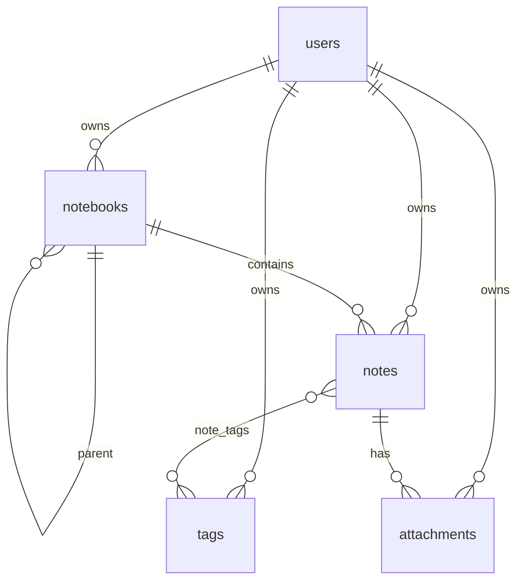

# Database Architecture

The project uses MySQL 8 as the durable data store and TypeORM migrations as the source of truth for schema changes.

## Migration strategy

- Migrations live in `apps/backend/src/database/migrations`.
- Each persisted schema change should be represented by a migration.
- TypeORM entities should match the migrated schema.
- Local migrations are compiled before running through the backend package scripts.

## Ownership pattern

Most domain tables include `user_id` and enforce ownership through foreign keys to `users(id)`. Backend services also scope queries by `userId` so a valid ID from another user cannot be accessed.

## Common field conventions

| Field | Meaning | Format |
|---|---|---|
| `id` | Primary key | UUID stored as `CHAR(36)` |
| `user_id` | Owner | UUID stored as `CHAR(36)` |
| `created_at` | Creation timestamp | MySQL `DATETIME(6)` |
| `updated_at` | Update timestamp | MySQL `DATETIME(6)` with auto-update where applicable |

API DTOs expose timestamps as ISO datetime strings.

## Notes-related schema

Tables created by the Notes migration:

- `notebooks`
- `notes`
- `tags`
- `note_tags`
- `attachments`

## Deletion behavior

- Deleting a user cascades to their notes-related data.
- Deleting a notebook sets child notebooks and notes to `NULL` parent/notebook where configured.
- Deleting a note cascades `note_tags` and attachment rows through database constraints.
- Attachment file deletion on disk is handled by the backend service when deleting an attachment directly.

## Search indexing

Notes use a full-text index on `(title, content_text)` with MySQL ngram parser, plus LIKE fallback in the service for short or partial queries.
