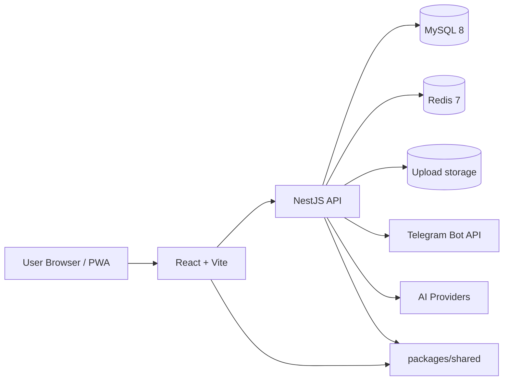
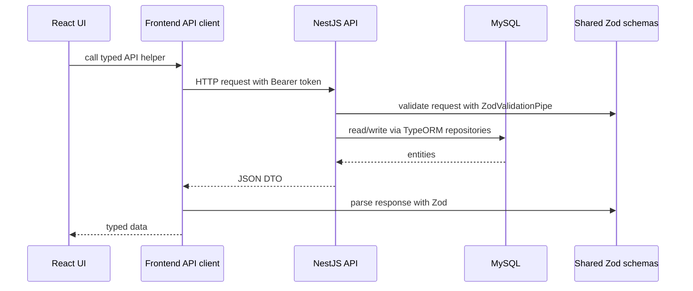

# Architecture Overview

`smart-assistant` là web app cá nhân tự host, mobile-first PWA, tập trung vào notes, schedule, expenses và AI assistant. App dùng kiến trúc monorepo để chia sẻ schema và type giữa frontend và backend.

## System context



## Monorepo layout

```txt
apps/
├── backend/       # NestJS API, TypeORM entities, migrations, workers
└── frontend/      # React + Vite PWA
packages/
└── shared/        # Zod schemas and shared TypeScript types
docs/              # Product, architecture, feature, API docs
docker/            # Infrastructure config
docker-compose.yml # Local MySQL + Redis
```

## Runtime layers

| Layer | Responsibility | Main location |
|---|---|---|
| Frontend | UI, routing, client-side state, API calls, PWA experience | `apps/frontend/src` |
| Backend API | Authenticated HTTP API, validation, business rules | `apps/backend/src` |
| Shared contracts | Zod schemas and inferred DTO types | `packages/shared/src` |
| Database | Durable relational data | MySQL via TypeORM migrations |
| Queue/cache | Reminder jobs and async work | Redis + BullMQ |
| File storage | User attachments | `UPLOAD_DIR` on backend host |
| External services | Google OAuth, Telegram, AI providers | Backend integrations |

## Request flow



## Contract strategy

Shared schemas in `packages/shared/src` are the contract boundary:

- Backend imports input schemas and DTO types for validation and return shapes.
- Frontend imports response schemas and types to parse API responses.
- Zod validation happens at system boundaries: HTTP request bodies/queries and frontend API responses.

This keeps TypeScript types aligned without trusting unvalidated external data.

## Authentication model

- API routes are protected by JWT unless explicitly public.
- Frontend stores tokens through `tokenStorage` and sends `Authorization: Bearer <accessToken>`.
- Frontend API client attempts refresh once on `401` using the refresh token.
- Google OAuth is optional and only active when configured.

## Data ownership model

Most domain tables include `user_id`. Backend queries scope reads and writes by the current authenticated user. This is the primary tenant boundary for personal data such as notes, notebooks, attachments, schedule items and expenses.

## Cross-cutting conventions

- Dates cross the API as ISO datetime strings.
- Backend validation errors use structured `{ code, message, details? }` style payloads where services throw Nest exceptions.
- List endpoints use pagination metadata when a feature can grow large.
- Destructive actions should return `204 No Content` when successful.
- UI-facing text is Vietnamese.
- Money-related features are VND-only.
