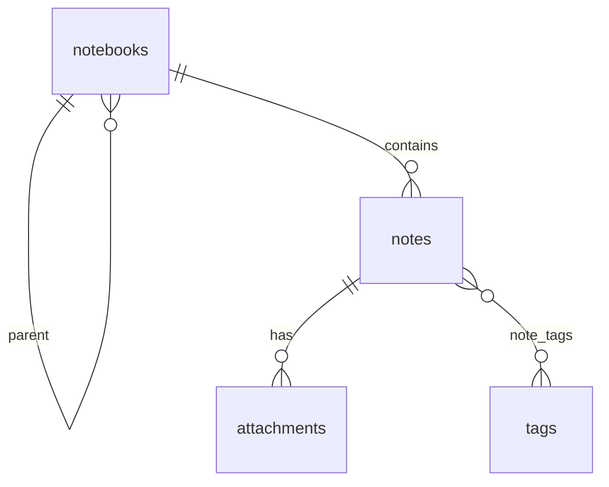

# Notes Feature

Notes là feature quản lý ghi chú cá nhân với notebook dạng cây, tag, pin, rich-text editor, search và file đính kèm.

## Goals

- Tạo và chỉnh sửa ghi chú nhanh trên desktop/mobile.
- Tổ chức ghi chú theo notebook và tag.
- Tìm lại ghi chú bằng title, content text, tag hoặc notebook.
- Lưu nội dung rich text dạng HTML và tách text thuần để search.
- Hỗ trợ đính kèm file an toàn theo từng user.

## User flows

### Create note

1. User bấm tạo ghi chú mới.
2. Frontend gọi `POST /api/notes` với title mặc định, notebook hiện tại nếu có và tag đang filter nếu có.
3. Backend validate input, kiểm tra notebook ownership nếu `notebookId` có giá trị.
4. Backend lưu `contentHtml`, sinh `contentText` từ HTML, tạo hoặc tái sử dụng tags.
5. Frontend chọn note mới và mở editor.

### Edit note

1. User sửa title, content, notebook, tags hoặc pin state.
2. Frontend autosave sau khoảng trễ ngắn hoặc save thủ công từ editor.
3. Frontend gọi `PATCH /api/notes/:id`.
4. Backend kiểm tra note thuộc user hiện tại.
5. Backend cập nhật fields và rebuild `contentText` nếu `contentHtml` thay đổi.
6. Frontend cập nhật cache note detail và invalidate list/tags.

### Browse and search

1. Frontend load notebooks, tags và notes list bằng TanStack Query.
2. Search input được debounce.
3. Frontend gọi `GET /api/notes?q=...&tag=...`.
4. Backend filter theo user, notebook/tag/pin/search query và trả về paginated summaries.
5. List ưu tiên pinned notes rồi sort theo `updatedAt DESC`.

### Manage notebooks

1. User tạo, rename, đổi màu hoặc xóa notebook trong explorer.
2. Frontend gọi `/api/notebooks` endpoints.
3. Backend validate parent notebook ownership và chặn cycle khi đổi parent.
4. Khi notebook bị xóa, notes trong notebook đó được set `notebookId = null` bởi database constraint.

### Manage attachments

1. User chọn file trong editor.
2. Frontend upload multipart `file` tới `POST /api/notes/:noteId/attachments`.
3. Backend validate note ownership, file size và MIME type.
4. Backend lưu file vào `UPLOAD_DIR/<userId>/<yyyymm>/<uuid>.<ext>` và lưu metadata trong MySQL.
5. Frontend refetch note detail để hiển thị attachment mới.

## Frontend implementation

| Area | Location | Responsibility |
|---|---|---|
| Page orchestration | `apps/frontend/src/pages/NotesPage.tsx` | Queries, mutations, selected note, mobile layout, autosave |
| Explorer UI | `apps/frontend/src/components/notes/notes-explorer.tsx` | Search, notebook tree, notes list, tag filter |
| Rich editor | `apps/frontend/src/components/editor/note-editor.tsx` | TipTap editor and save integration |
| Slash commands | `apps/frontend/src/components/editor/slash-commands.tsx` | Editor formatting commands |
| API client | `apps/frontend/src/lib/api.ts` | Notes/notebooks/tags/attachments HTTP calls |

## Backend implementation

| Area | Location | Responsibility |
|---|---|---|
| Module | `apps/backend/src/notes/notes.module.ts` | Registers controllers, services and repositories |
| Notes API | `apps/backend/src/notes/notes.controller.ts` | `/api/notes` routes |
| Notes logic | `apps/backend/src/notes/notes.service.ts` | Listing, search, CRUD, tag sync, DTO mapping |
| Notebooks API | `apps/backend/src/notes/notebooks.controller.ts` | `/api/notebooks` routes |
| Notebooks logic | `apps/backend/src/notes/notebooks.service.ts` | Tree ownership, cycle prevention, descendants |
| Tags API | `apps/backend/src/notes/tags.controller.ts` | `/api/tags` routes |
| Tags logic | `apps/backend/src/notes/tags.service.ts` | Tag list/create/delete/ensureMany |
| Attachments API | `apps/backend/src/notes/attachments.controller.ts` | Upload/download/delete routes |
| Attachments logic | `apps/backend/src/notes/attachments.service.ts` | File validation, safe storage, metadata |
| HTML text extraction | `apps/backend/src/notes/util/html-to-text.ts` | Converts rich HTML to searchable text/excerpt |

## Shared contracts

| File | Purpose |
|---|---|
| `packages/shared/src/notes.ts` | Note, attachment schemas, note list query/input schemas |
| `packages/shared/src/notebooks.ts` | Notebook DTO and create/update schemas |
| `packages/shared/src/tags.ts` | Tag DTO and create schema |
| `packages/shared/src/common.ts` | ID, ISO datetime and pagination schemas |

## Data model

### Notebook

- Belongs to one user.
- Optional `parentId` supports tree structure.
- Optional `color` supports UI grouping.
- Deleting a parent sets child `parentId` to `NULL`.

### Note

- Belongs to one user.
- Optional `notebookId` supports uncategorized notes.
- Stores `title`, `contentHtml`, derived `contentText`, and `isPinned`.
- Has many tags through `note_tags`.
- Has many attachments.

### Tag

- Belongs to one user.
- Unique by `(user_id, name)`.
- Notes service ensures tags exist when note inputs include tag names.

### Attachment

- Belongs to one user and one note.
- Stores original name, MIME, size and internal stored path.
- API DTO does not expose the internal stored path.

## Search behavior

`GET /api/notes` supports:

- `q`: search title/content.
- `notebookId`: filter by notebook UUID or `none`.
- `includeChildren`: include descendant notebooks when filtering by notebook.
- `tag`: filter by tag name.
- `pinned`: filter pinned/unpinned notes.
- `page`, `limit`: pagination.

For query length >= 2, backend uses MySQL full-text boolean query plus LIKE fallback. For shorter query, backend uses LIKE only.

## Validation rules

- Note title is trimmed, required, max 255 chars.
- Note `contentHtml` max size is 2,000,000 chars.
- Note tags max length is 20 tags per create/update payload.
- Tag names are validated by shared tag schema.
- Notebook parent must belong to the same user.
- Notebook cannot be parent of itself or create a cycle.
- Attachment must exist, be non-empty, fit `UPLOAD_MAX_MB`, and have an allowed MIME type.

## Edge cases

- Deleting selected note should clear selection and return mobile UI to list.
- Deleting notebook moves affected notes to uncategorized because DB sets `notebook_id` to `NULL`.
- Search result can hide the currently selected note; frontend clears selection when selected note is no longer visible.
- Empty title in editor is saved as `Chưa có tiêu đề`.
- Attachment metadata can exist while file is missing on disk; download returns `attachment_missing_on_disk`.
- Short search queries use LIKE fallback because full-text tokens below minimum length are not useful.

## Related docs

- Notes API: [`../../api/notes.md`](../../api/notes.md)
- Testing checklist: [`testing.md`](./testing.md)
- Database architecture: [`../../architecture/database.md`](../../architecture/database.md)
- Security architecture: [`../../architecture/security.md`](../../architecture/security.md)
