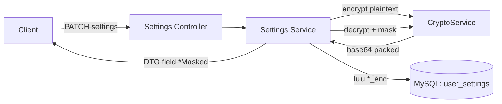
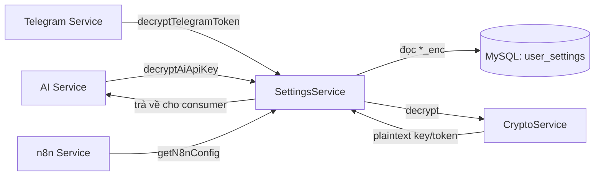
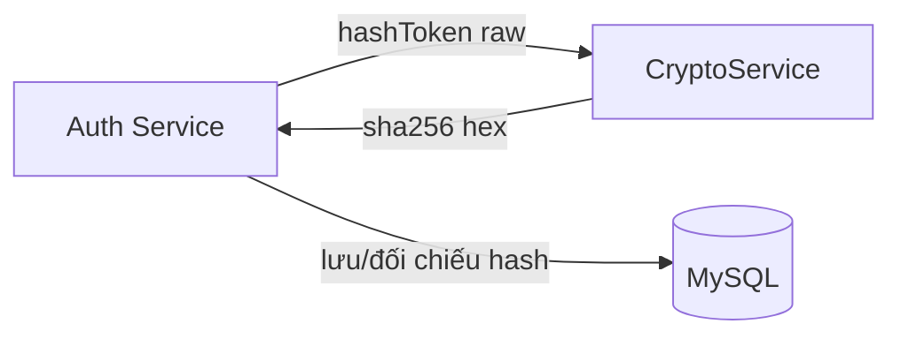

> **Status:** Draft — generated from code survey on 2026-06-15
> **Last updated:** 2026-06-15
> **Owners:** TODO: confirm

# Crypto & Secret Storage

Hạ tầng mã hóa dùng chung cho backend: cung cấp `CryptoService` để mã hóa/giải mã các bí mật theo từng user (AI API key, Telegram bot token, n8n API key) bằng **AES-256-GCM**, băm token làm mới (refresh token) bằng SHA-256, so sánh chuỗi chống timing attack, và che (mask) bí mật trước khi trả về DTO. Module tồn tại để mọi bí mật người dùng **không bao giờ** được lưu hoặc lộ ra dưới dạng plaintext.

## Document Map

- [Root CLAUDE.md](../../../CLAUDE.md) · [Architecture index](../../architecture.md)
- [Backend architecture](../../architecture/backend.md) — vị trí lớp `common` trong kiến trúc backend.
- [Security architecture](../../architecture/security.md) — chính sách bảo mật tổng thể (mã hóa, băm, redaction).
- [Settings module](../../modules/settings/README.md) — nơi gọi `encrypt`/`decrypt`/`mask` để lưu và đọc bí mật user.
- [Auth module](../../modules/auth/README.md) — dùng `hashToken` để băm refresh token.
- [AI module](../../modules/ai/README.md) — tiêu thụ AI API key đã giải mã.
- [AI providers](../../platforms/ai-providers/README.md) — nhà cung cấp dùng key đã giải mã.
- [Telegram](../../platforms/telegram/README.md) — tiêu thụ Telegram bot token đã giải mã.

## Module Purpose

- Cung cấp một dịch vụ mã hóa dùng chung (`CryptoService`) cho toàn backend qua `@Global()` module.
- **AES-256-GCM** đối xứng: `encrypt(plain)` → chuỗi base64 đóng gói; `decrypt(packed)` → plaintext, có xác thực tính toàn vẹn (auth tag).
- **SHA-256** băm một chiều cho token nhạy cảm (`hashToken`) — dùng cho refresh token trong module auth.
- So sánh hằng thời gian (`safeEqual`) bằng `timingSafeEqual` để chống timing attack.
- Che bí mật (`mask`) — chỉ hiển thị vài ký tự cuối, phần còn lại thay bằng dấu `•`, dùng cho field `*Masked` trong DTO.
- **KHÔNG thuộc phạm vi module này:** lưu trữ cấu hình/bí mật (việc đó nằm ở [Settings module](../../modules/settings/README.md) và entity `UserSettingsEntity`); băm mật khẩu khóa ghi chú (dùng `bcrypt` trực tiếp trong `settings.service.ts`, không qua `CryptoService`); quản lý vòng đời khóa `ENCRYPTION_KEY` (chỉ nạp khóa từ env lúc khởi tạo).

## Primary Entrypoints

| Layer | Entrypoint | Purpose |
|-------|-----------|---------|
| Service | `apps/backend/src/common/crypto/crypto.service.ts` | `CryptoService`: `encrypt`, `decrypt`, `hashToken`, `safeEqual`, `mask`. |
| Module | `apps/backend/src/common/crypto/crypto.module.ts` | `@Global()` module, provide + export `CryptoService` cho toàn app. |
| Spec | `apps/backend/src/common/crypto/crypto.service.spec.ts` | Test roundtrip, IV ngẫu nhiên, phát hiện ciphertext bị sửa, định dạng `hashToken`, `mask`, lỗi sai kích thước khóa. |
| Config | `apps/backend/src/config/env.validation.ts` | Xác thực `ENCRYPTION_KEY` = 64 ký tự hex (32 byte) lúc khởi động. |
| Consumer (Service) | `apps/backend/src/settings/settings.service.ts` | Gọi `encrypt`/`decrypt`/`mask` cho AI key, Telegram token, n8n key. |
| Consumer (Entity) | `apps/backend/src/settings/user-settings.entity.ts` | Lưu các blob đã mã hóa: `aiApiKeyEnc`, `telegramBotTokenEnc`, `n8nApiKeyEnc`. |
| Consumer (Service) | `apps/backend/src/auth/auth.service.ts` | Gọi `hashToken` để băm refresh token (3 chỗ). |
| Consumer (Service) | `apps/backend/src/ai/ai.service.ts` | Lấy AI API key đã giải mã qua `settings.decryptAiApiKey`. |
| Consumer (Service) | `apps/backend/src/schedule/telegram.service.ts` | Lấy Telegram bot token đã giải mã qua `settings.decryptTelegramToken`. |
| Consumer (Service) | `apps/backend/src/n8n/n8n.service.ts` | Lấy cấu hình n8n đã giải mã qua `settings.getN8nConfig`. |

> Đường dẫn trong bảng là tuyệt đối từ repo root.

## Core Supporting Objects

- **Hằng số định dạng** (`crypto.service.ts`): `ALGO = "aes-256-gcm"`, `IV_LEN = 12` (byte IV/nonce), `TAG_LEN = 16` (byte auth tag GCM).
- **`this.key`**: `Buffer` 32 byte, decode từ `ENCRYPTION_KEY` (hex) trong constructor; ném lỗi `"ENCRYPTION_KEY must decode to 32 bytes"` nếu độ dài khác 32.
- **`UserSettingsEntity`** (`apps/backend/src/settings/user-settings.entity.ts`): các cột `*_enc` (`varchar(1024)` cho AI key và Telegram token, `varchar(2048)` cho n8n key) chứa chuỗi base64 đóng gói; cột `notes_lock_hash` (`varchar(60)`) là bcrypt hash, **không** qua `CryptoService`.
- **`N8nConfig`** (interface trong `settings.service.ts`): `{ baseUrl, apiKey }` — cấu hình n8n đã giải mã.
- **Env validation** (`apps/backend/src/config/env.validation.ts`): regex `^[0-9a-fA-F]{64}$` cho `ENCRYPTION_KEY`; app từ chối khởi động nếu sai.

## Data Flow

Định dạng gói ciphertext của `encrypt`/`decrypt` (base64 của `iv ‖ ciphertext ‖ tag`):

```
base64( [ IV: 12 bytes ] [ CIPHERTEXT: n bytes ] [ AUTH TAG: 16 bytes ] )
```

- `encrypt(plain)`: sinh IV 12 byte ngẫu nhiên (`randomBytes`) → `createCipheriv("aes-256-gcm", key, iv)` → ghép `iv + ciphertext + tag` → `toString("base64")`. IV ngẫu nhiên nên cùng một plaintext cho ra ciphertext khác nhau mỗi lần.
- `decrypt(packed)`: decode base64 → kiểm tra độ dài tối thiểu `IV_LEN + TAG_LEN + 1` (nếu ngắn hơn ném `"Ciphertext too short"`) → tách `iv` (12 byte đầu), `tag` (16 byte cuối), `ct` (phần giữa) → `setAuthTag(tag)` → `decipher.final()` sẽ **ném lỗi** nếu tag không khớp (ciphertext bị sửa hoặc khóa sai).

Luồng ghi bí mật (đồng bộ, qua Settings):



Luồng đọc/tiêu thụ bí mật (đồng bộ, server-side):



Luồng băm refresh token (đồng bộ, qua Auth):



- Không có luồng async/queue trong module crypto: tất cả lời gọi `CryptoService` là đồng bộ, in-process. (Consumer như `schedule`/`job-sync` có dùng BullMQ, nhưng việc mã hóa/giải mã vẫn chạy đồng bộ trong tiến trình gọi.)

## When To Touch Which File

| If you want to… | Edit | Then also… |
|-----------------|------|------------|
| Đổi thuật toán / tham số mã hóa (ALGO, IV_LEN, TAG_LEN) | `apps/backend/src/common/crypto/crypto.service.ts` | cân nhắc tương thích ngược với các blob `*_enc` đã lưu (TODO: confirm chiến lược migrate dữ liệu cũ) + cập nhật `crypto.service.spec.ts` |
| Thêm một loại bí mật user mới cần mã hóa | `apps/backend/src/settings/user-settings.entity.ts` (cột `*_enc` mới) + migration mới | cập nhật `settings.service.ts` (encrypt khi ghi, decrypt+mask khi đọc), shared schema settings, cả hai phía; đăng ký entity trong `database/data-source.ts` |
| Đổi định dạng/độ dài che bí mật | `apps/backend/src/common/crypto/crypto.service.ts` (`mask`) | cập nhật `crypto.service.spec.ts` + kiểm tra field `*Masked` trong DTO |
| Đổi cách băm token | `apps/backend/src/common/crypto/crypto.service.ts` (`hashToken`) | cập nhật `apps/backend/src/auth/auth.service.ts` + spec |
| Đổi ràng buộc `ENCRYPTION_KEY` | `apps/backend/src/config/env.validation.ts` | đồng bộ kiểm tra độ dài trong constructor `CryptoService` + `docs/setup.md` |

## Permission & Access Rules

- **`CryptoService` không tự ý thức về user.** Nó chỉ thao tác chuỗi; việc scope theo `userId` nằm ở tầng consumer (Settings/Auth/AI/Telegram/n8n). Mọi truy vấn `user_settings` trong `settings.service.ts` đều `where: { userId }`.
- **Không có guard ở tầng crypto.** Guard `JwtAuthGuard` và `@CurrentUser()` áp dụng ở controller của các consumer (TODO: confirm chi tiết guard ở `settings.controller.ts`).
- **KHÔNG được expose ra DTO:**
  - Các blob mã hóa: `aiApiKeyEnc`, `telegramBotTokenEnc`, `n8nApiKeyEnc` (chỉ trả field `*Masked` đã che qua `crypto.mask(crypto.decrypt(...))`).
  - `notesLockHash` (bcrypt hash) — chỉ trả cờ boolean `hasNotesLock`.
  - Plaintext bí mật sau khi `decrypt` (AI key, Telegram token, n8n API key) — chỉ dùng server-side để gọi provider, không bao giờ trả về client.
  - Khóa `ENCRYPTION_KEY` / `this.key`.
- `mask` trả về `null` khi value rỗng/null; với chuỗi ngắn hơn `visible` (mặc định 4) thì che toàn bộ bằng `•`.

## Legacy / Operational Notes

- **Biến môi trường:** `ENCRYPTION_KEY` bắt buộc, đúng 64 ký tự hex (32 byte) — validate ở `config/env.validation.ts` (regex) **và** ở constructor `CryptoService` (kiểm tra `Buffer.length === 32`). App không boot nếu sai.
- **Xoay (rotate) khóa:** nếu `ENCRYPTION_KEY` đổi, mọi blob `*_enc` cũ sẽ không giải mã được (auth tag/khóa không khớp). TODO: confirm có quy trình re-encrypt khi rotate khóa hay không.
- **bcrypt tách biệt:** mật khẩu khóa ghi chú dùng `bcrypt` (cost 12) ngay trong `settings.service.ts`, **không** đi qua `CryptoService`.
- **Độ dài cột DB:** `ai_api_key_enc`/`telegram_bot_token_enc` là `varchar(1024)`, `n8n_api_key_enc` là `varchar(2048)`; do base64 nở ~33% nên cần đủ chỗ cho bí mật dài.
- Không có lưu ý vận hành đặc biệt nào khác được xác minh trong code.

## Where To Start Reading For Maintenance

1. `apps/backend/src/common/crypto/crypto.service.ts` — bản chất thuật toán và định dạng gói.
2. `apps/backend/src/common/crypto/crypto.service.spec.ts` — hợp đồng hành vi (roundtrip, IV ngẫu nhiên, phát hiện sửa đổi, mask).
3. `apps/backend/src/config/env.validation.ts` — ràng buộc `ENCRYPTION_KEY`.
4. `apps/backend/src/settings/settings.service.ts` + `apps/backend/src/settings/user-settings.entity.ts` — consumer chính (encrypt/decrypt/mask, các cột `*_enc`).
5. `apps/backend/src/auth/auth.service.ts` — consumer của `hashToken`.

## Related Modules

- [Settings module](../../modules/settings/README.md) — consumer chính: lưu và đọc bí mật user.
- [Auth module](../../modules/auth/README.md) — dùng `hashToken` cho refresh token.
- [AI module](../../modules/ai/README.md) — tiêu thụ AI API key đã giải mã.
- [AI providers](../../platforms/ai-providers/README.md) — nhà cung cấp dùng key đã giải mã.
- [Telegram](../../platforms/telegram/README.md) — tiêu thụ Telegram bot token đã giải mã.
- [Security architecture](../../architecture/security.md) — chính sách bảo mật tổng thể.
- [Backend architecture](../../architecture/backend.md) — vị trí lớp `common/crypto`.

## Document History

| Date | Change | Author |
|------|--------|--------|
| 2026-06-15 | Initial draft generated from code survey | TODO: confirm |
