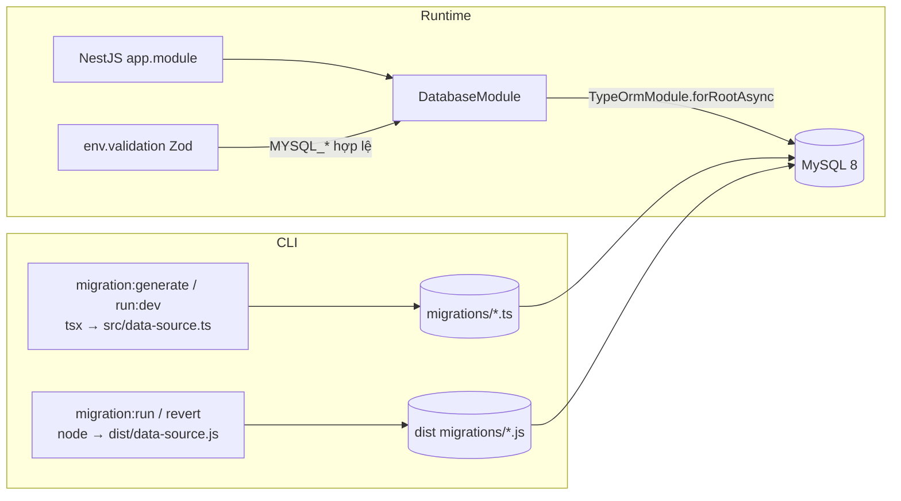

> **Status:** Draft — generated from code survey on 2026-06-15
> **Last updated:** 2026-06-15
> **Owners:** TODO: confirm

# Database & Migrations

Infra này định nghĩa cách backend kết nối MySQL 8 và quản lý schema qua TypeORM. Có hai "data source" dùng chung một cấu hình: một cho runtime ứng dụng (`DatabaseModule` của NestJS) và một cho TypeORM CLI (`data-source.ts`) phục vụ sinh/chạy/hoàn tác migration. Quy ước cốt lõi: `synchronize` luôn là `false`, nên schema chỉ thay đổi qua các file migration trong `apps/backend/src/database/migrations` — không bao giờ auto-sync từ entity.

## Document Map

- [Root CLAUDE.md](../../../CLAUDE.md) · [Architecture index](../../architecture.md)
- [Backend architecture](../../architecture/backend.md) — thiết kế phân lớp controller → service → entity.
- [Database architecture](../../architecture/database.md) — quy ước schema, kiểu dữ liệu, full-text search.
- [Setup guide](../../setup.md) — quy trình chạy migration local và prod (build → migrate).

## Module Purpose

- Cung cấp cấu hình kết nối MySQL cho cả runtime (NestJS `TypeOrmModule`) lẫn TypeORM CLI.
- Là nguồn sự thật (source of truth) của schema thông qua các migration tăng dần theo timestamp.
- Đăng ký toàn bộ entity của các domain để TypeORM ánh xạ và để CLI hiểu schema khi `migration:generate`.
- Thực thi env-validation cho các biến `MYSQL_*` (và `REDIS_*`) khi ứng dụng khởi động.
- **KHÔNG** thuộc phạm vi: business logic của từng domain (nằm ở service của module tương ứng), seeding dữ liệu, và sao lưu/khôi phục (thuộc quy trình ops trong `docs/setup.md`).

## Primary Entrypoints

| Layer | Entrypoint | Purpose |
|-------|-----------|---------|
| Runtime module | `apps/backend/src/database/database.module.ts` | `TypeOrmModule.forRootAsync` đọc env qua `ConfigService`, đăng ký entity, `synchronize:false`. Được import trong `apps/backend/src/app.module.ts`. |
| CLI data source | `apps/backend/src/database/data-source.ts` | `DataSource` cho TypeORM CLI; tự load `.env.local` rồi `.env` từ repo root; chọn glob migration theo `.ts` (src) hay `.js` (dist). |
| Env validation | `apps/backend/src/config/env.validation.ts` | Zod schema validate `MYSQL_HOST/PORT/DATABASE/USER/PASSWORD`, `REDIS_*`; app từ chối boot nếu thiếu/sai. |
| Migrations | `apps/backend/src/database/migrations/*.ts` | 16 file migration tăng dần; mỗi file có `up()`/`down()` chạy SQL thuần. |
| Initial migration | `apps/backend/src/database/migrations/1716600000000-init.ts` | Tạo `users`, `user_settings`, `refresh_tokens` — nền tảng cho mọi domain khác. |

> Đường dẫn trong bảng là tuyệt đối từ repo root.

## Core Supporting Objects

- **Entity imports trong cả hai data source** — `database.module.ts` và `data-source.ts` cùng liệt kê một danh sách entity (Users, Settings, Auth, Notes/Notebooks/Tags/Attachments/Shares/References, Schedule Events/Tasks/Reminders, Expense Wallets/Categories/Transactions/Budgets, Vocab, Jobs/Technologies, Job-sync Sources/Runs). Lưu ý: `data-source.ts` còn đăng ký thêm các entity AI (`AiConversationEntity`, `AiMessageEntity`, `AiToolCallEntity`) mà `database.module.ts` không liệt kê — TODO: confirm xem AI entity được nạp ở đâu cho runtime (có thể qua `TypeOrmModule.forFeature` trong `ai` module).
- **Scripts trong `apps/backend/package.json`** — `typeorm:dev` (tsx chạy `src/database/data-source.ts`), `typeorm:prod` (node chạy `dist/database/data-source.js`), và các alias `migration:generate`, `migration:run` (prod), `migration:run:dev`, `migration:revert` (prod).
- **`dotenv` loader** — chỉ dùng cho CLI; runtime ứng dụng nạp env qua `ConfigModule`.

## Data Flow

Schema không phục vụ request HTTP của người dùng cuối; "luồng" ở đây là vòng đời thay đổi schema và cách runtime kết nối DB.

- **Luồng dev (không cần build):** `migration:generate <Name>` sinh file `.ts` mới → sửa nếu cần → `migration:run:dev` chạy trực tiếp `src` qua `tsx`.
- **Luồng prod/CI (phải build trước):** `pnpm --filter @assistant/backend build` → `migration:run` chạy migration đã compile trong `dist/` → `migration:revert` để hoàn tác bản gần nhất. `data-source.ts` tự phát hiện `__filename` kết thúc bằng `.js` để chuyển glob từ `src/.../*.ts` sang `dist/.../*.js`.
- **Khởi động runtime:** `env.validation.ts` parse env trước; nếu `MYSQL_PASSWORD` thiếu hoặc kiểu sai thì app không boot. Sau đó `DatabaseModule` mở connection pool tới MySQL với `charset: utf8mb4_unicode_ci`, `timezone: "Z"` (UTC).

### Migration timeline

Migration đặt tên theo `<timestamp>-<slug>.ts`, chạy theo thứ tự timestamp tăng dần (16 file):

1. `1716600000000-init` — `users`, `user_settings`, `refresh_tokens`.
2. `1716700000000-notes` — bảng notes (gồm `content_text MEDIUMTEXT` và FULLTEXT index `ft_notes_title_text (title, content_text) WITH PARSER ngram`).
3. `1716800000000-schedule` — events / tasks / reminders.
4. `1717000000000-expense` — wallets / categories / transactions / budgets.
5. `1717100000000-ai` — conversation / message / tool-call.
6. `1717200000000-vocab` — vocab items.
7. `1717300000000-notes-lock` — khóa ghi chú.
8. `1717400000000-note-shares` — chia sẻ ghi chú (shares / invites).
9. `1717500000000-jobs` — bảng jobs.
10. `1717600000000-note-references` — tham chiếu giữa các ghi chú.
11. `1717700000000-job-technologies` — công nghệ gắn với job.
12. `1717800000000-job-company-logo` — logo công ty cho job.
13. `1717900000000-job-match-prefs` — tiêu chí match job.
14. `1718000000000-n8n-settings` — cấu hình n8n.
15. `1718100000000-n8n-api-key` — API key n8n.
16. `1718200000000-job-sync` — nguồn và lần chạy job-sync.

> Tên domain ở trên suy ra từ slug và file `init`; chi tiết cột của từng migration TODO: confirm bằng cách đọc trực tiếp file tương ứng.

## When To Touch Which File

| If you want to… | Edit | Then also… |
|-----------------|------|------------|
| Thêm field persist | entity của module liên quan, ví dụ `apps/backend/src/notes/entities/note.entity.ts`, + migration mới trong `apps/backend/src/database/migrations` | cập nhật shared schema tương ứng, ví dụ `packages/shared/src/notes.ts`, + service/controller + frontend |
| Thêm bảng/domain mới | migration mới + entity mới | đăng ký entity trong **cả** `data-source.ts` **và** `database.module.ts` |
| Đổi kết nối MySQL | `apps/backend/src/config/env.validation.ts` (thêm/đổi biến) | `database.module.ts` (runtime) + `data-source.ts` (CLI) đọc đúng biến |
| Đổi hành vi search full-text | migration đổi FULLTEXT index | service notes (LIKE fallback) — TODO: confirm tại module notes |

## Permission & Access Rules

- **Không có guard ở tầng này.** `DatabaseModule`/`data-source.ts` chỉ cấu hình kết nối; phân quyền HTTP (`JwtAuthGuard`, `@CurrentUser()`) nằm ở controller của từng domain.
- **Tenant boundary là `user_id`.** Hầu hết bảng domain mang FK `user_id → users(id)` (ví dụ `user_settings`, `refresh_tokens` đều `ON DELETE CASCADE`); scoping theo `userId` được thực thi ở tầng service, không ở tầng database config này.
- **Không expose qua DTO:** `users.password_hash`, `refresh_tokens.token_hash`, các cột mã hóa trong `user_settings` (`ai_api_key_enc`, `telegram_bot_token_enc`), `ENCRYPTION_KEY`, và `storedPath` của attachment. Đây là ràng buộc ở tầng DTO của từng module — infra này lưu trữ chúng dạng đã mã hóa/hash nhưng không kiểm soát việc trả ra.
- **Secret kết nối:** `MYSQL_PASSWORD`, `REDIS_PASSWORD` đến từ env đã validate; không hardcode trong source.

## Legacy / Operational Notes

- `synchronize: false` ở **cả hai** data source — đây là bất biến, đừng bật lên dù chỉ để debug.
- Prod chạy migration đã compile trong `dist/`; **phải `build` trước** `migration:run`/`migration:revert`, nếu không glob `dist/database/migrations/*.js` sẽ rỗng.
- `data-source.ts` load `.env.local` rồi `.env` từ repo root (resolve `../../../..` so với `__dirname`), nên CLI chạy đúng bất kể cwd.
- Mặc định kết nối: `host=localhost`, `port=3306`, `user/database=assistant`. Trong prod, MySQL chạy native trên host và backend trong Docker truy cập qua `host.docker.internal` (đặt `MYSQL_HOST` trong `.env.production`) — xem `docs/setup.md`.
- Quy ước schema: ID và `user_id` là `CHAR(36)` (UUID); timestamp là `DATETIME(6)` mặc định `CURRENT_TIMESTAMP(6)`; charset `utf8mb4_unicode_ci`; timezone UTC (`"Z"`).
- Notes search dựa trên FULLTEXT index với parser `ngram`, kèm LIKE fallback ở tầng service (TODO: confirm chi tiết tại module notes).
- Logging TypeORM: `["error", "warn"]` khi `NODE_ENV=development`, ngược lại chỉ `["error"]`.

## Where To Start Reading For Maintenance

1. `apps/backend/src/database/data-source.ts` — hiểu cấu hình CLI và cơ chế chọn glob `src` vs `dist`.
2. `apps/backend/package.json` (scripts `typeorm:*`, `migration:*`) — biết lệnh nào chạy ở đâu.
3. `apps/backend/src/database/migrations/1716600000000-init.ts` — đọc một migration mẫu để nắm phong cách SQL thuần và quy ước cột.
4. `apps/backend/src/database/database.module.ts` — đối chiếu danh sách entity runtime với `data-source.ts`.
5. `apps/backend/src/config/env.validation.ts` — kiểm tra ràng buộc env trước khi đổi cấu hình kết nối.

## Related Modules

- [Database architecture](../../architecture/database.md) — quy ước schema toàn cục mà các migration phải tuân theo.
- [Backend architecture](../../architecture/backend.md) — vị trí của tầng database trong kiến trúc phân lớp.
- [Crypto & secrets](../../infra/crypto-secrets/README.md) — cách các cột `*_enc` được mã hóa trước khi lưu.
- [Queue (BullMQ)](../../infra/queue-bullmq/README.md) — dùng chung biến `REDIS_*` được validate ở `env.validation.ts`.

## Document History

| Date | Change | Author |
|------|--------|--------|
| 2026-06-15 | Initial draft generated from code survey | TODO: confirm |
