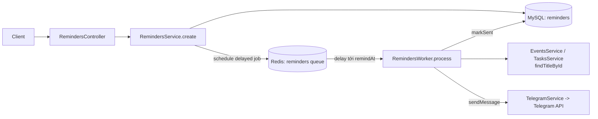
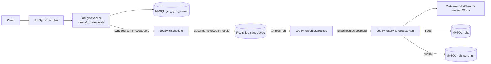

> **Status:** Draft — generated from code survey on 2026-06-15
> **Last updated:** 2026-06-15
> **Owners:** TODO: confirm

# BullMQ Queues & Workers

Tài liệu hạ tầng cho toàn bộ công việc nền chạy qua BullMQ trên Redis. Hiện có **hai hàng đợi độc lập**: `reminders` (module `schedule` — gửi nhắc lịch/việc qua Telegram theo thời điểm hẹn) và `job-sync` (module `job-sync` — đồng bộ tin tuyển dụng VietnamWorks theo lịch lặp lại). Cả hai dùng chung mẫu vòng đời NestJS (`OnModuleInit` tạo `Queue`/`Worker`, `OnModuleDestroy` đóng kết nối) và cùng đọc cấu hình Redis từ env.

## Document Map

- [Root CLAUDE.md](../../../CLAUDE.md) · [Architecture index](../../architecture.md) · [Backend architecture](../../architecture/backend.md)
- Các module dùng hàng đợi này: [Schedule module](../../modules/schedule/README.md) · [Job sync module](../../modules/job-sync/README.md)
- Kênh gửi đi của hàng đợi `reminders`: [Telegram](../../platforms/telegram/README.md)
- Cấu hình Redis / biến môi trường: TODO: confirm doc hạ tầng Redis (chưa thấy doc riêng trong khảo sát).

## Module Purpose

- Cung cấp lớp chạy nền dựa trên BullMQ/Redis cho hai nghiệp vụ tách biệt:
  - **`reminders`**: lên lịch một job *trễ* (`delay`) đúng tới mốc `remindAt`, khi tới hạn worker soạn nội dung và gọi Telegram.
  - **`job-sync`**: quản lý *job scheduler* (repeatable jobs) cho từng nguồn đồng bộ; khi tới mốc, worker nạp `sourceId` và chạy đồng bộ.
- Đảm bảo vòng đời sạch: tạo `Queue`/`Worker` trong `onModuleInit`, đóng (`close()`) trong `onModuleDestroy`.
- Bọc mọi thao tác Redis trong try/catch để Redis chập chờn không làm sập luồng HTTP đồng bộ (chỉ ghi log, trả `null`/map rỗng).
- **KHÔNG thuộc** phạm vi doc này: luật nghiệp vụ chi tiết của reminder/event/task (xem [Schedule module](../../modules/schedule/README.md)), luật đồng bộ VietnamWorks và mapping job (xem [Job sync module](../../modules/job-sync/README.md)), cách gửi tin Telegram (xem [Telegram](../../platforms/telegram/README.md)), và cấu hình Redis hạ tầng.

## Primary Entrypoints

| Layer | Entrypoint | Purpose |
|-------|-----------|---------|
| Queue | `apps/backend/src/schedule/reminders.queue.ts` | Tạo `Queue` `reminders`; `schedule()` thêm job trễ theo `remindAt`, `cancel()` xóa job theo `jobId`. |
| Worker | `apps/backend/src/schedule/reminders.worker.ts` | `Worker` tiêu thụ `reminders` (concurrency 4); soạn nội dung event/task rồi gọi Telegram, đánh dấu `sent`. |
| Service | `apps/backend/src/schedule/reminders.service.ts` | Gọi `queue.schedule()` khi tạo reminder, `queue.cancel()` khi xóa; lưu `jobId` vào DB. |
| Scheduler | `apps/backend/src/job-sync/job-sync.scheduler.ts` | Tạo `Queue` `job-sync`; quản lý *job scheduler* lặp lại (`upsertJobScheduler`/`removeJobScheduler`), reconcile khi khởi động, tính `nextRun`. |
| Worker | `apps/backend/src/job-sync/job-sync.worker.ts` | `Worker` tiêu thụ `job-sync` (concurrency 2); nạp `sourceId` rồi gọi `service.runScheduled()`. |
| Service | `apps/backend/src/job-sync/job-sync.service.ts` | Gọi scheduler khi CRUD nguồn; `onModuleInit` reconcile lịch; chứa logic `runScheduled`/`executeRun`. |
| Module | `apps/backend/src/schedule/schedule.module.ts` | Đăng ký `RemindersQueue` + `RemindersWorker` làm provider. |
| Module | `apps/backend/src/job-sync/job-sync.module.ts` | Đăng ký `JobSyncScheduler` + `JobSyncWorker` làm provider. |
| Env | `apps/backend/src/config/env.validation.ts` | Validate `REDIS_HOST`/`REDIS_PORT`/`REDIS_PASSWORD` mà cả hai hàng đợi dùng để kết nối. |

> Đường dẫn trong bảng là tuyệt đối từ repo root.

## Core Supporting Objects

- **`REMINDERS_QUEUE_NAME = "reminders"`** và **`JOB_SYNC_QUEUE_NAME = "job-sync"`**: tên hàng đợi (export const), worker tham chiếu đúng tên này khi tạo `Worker`.
- **`ReminderJobData`** (`{ reminderId, userId, targetType, targetId, remindAt }`): payload job của hàng đợi `reminders`. Job được thêm với tên `"send"`, `jobId = reminder:<reminderId>` để hủy theo id.
- **`JobSyncJobData`** (`{ sourceId }`): payload job của hàng đợi `job-sync`. Job scheduler tạo job tên `"sync"`.
- **`SCHEDULER_PREFIX = "job-sync:"`**: tiền tố mọi scheduler key (`job-sync:<sourceId>:<suffix>`) để reconcile/xóa theo prefix.
- **`schedulerSpecs(source)`**: chuyển `schedule` của nguồn thành danh sách scheduler — `interval` → một scheduler `{ every: everyMinutes*60_000 }`; `daily` → mỗi mốc giờ một scheduler cron `{ pattern: "<mm> <hh> * * *", tz: source.timezone }`.
- **`connection()`** (trong cả hai class): trả `ConnectionOptions` từ env `REDIS_HOST`/`REDIS_PORT`/`REDIS_PASSWORD`, `maxRetriesPerRequest: null`. Worker tái dùng đúng `connection()` của queue/scheduler.
- **Helper định dạng (`reminders.worker.ts`)**: `escapeHtml()` (chống HTML injection vào tin Telegram), `formatVN()` (định dạng ngày giờ theo `Asia/Ho_Chi_Minh`, tiếng Việt, 24h).
- **`describe(error)`**: chuẩn hóa lỗi unknown → chuỗi để ghi log (reminders trả `"unknown error"`, job-sync trả `"lỗi không xác định"`).

## Data Flow

### Hàng đợi `reminders` (lên lịch một-lần theo `remindAt`)

- **Đồng bộ (tạo reminder):** `RemindersService.create` lưu entity (`jobId: null`), rồi gọi `queue.schedule()` với `delay = max(0, remindAt - now)` và `jobId = reminder:<id>`. Nếu thêm job thành công, ghi `jobId` trở lại DB. Nếu queue chưa init / Redis lỗi, `schedule()` trả `null` và reminder vẫn được lưu (chỉ thiếu job nền).
- **Đồng bộ (xóa reminder):** `remove`/`removeByTarget` gọi `queue.cancel(jobId)` để `job.remove()` job đang chờ, rồi xóa entity.
- **Async (worker):** với concurrency 4, `process()` đọc payload, soạn nội dung (event → `📅 Sự kiện`, task → `✅ Task` kèm hạn nếu có). Nếu target không còn → log cảnh báo và vẫn `markSent` (không gửi). Có target → `telegram.sendMessage(userId, text)` rồi `markSent`.
- **Job options (`defaultJobOptions`):** `removeOnComplete: { age: 86_400, count: 1000 }`, `removeOnFail: { age: 7*86_400 }`, `attempts: 3`, `backoff: { type: "exponential", delay: 30_000 }`.

### Hàng đợi `job-sync` (repeatable job scheduler theo lịch nguồn)

- **Đồng bộ (CRUD nguồn):** `createSource`/`updateSource` lưu DB rồi gọi `scheduler.syncSource(saved)` — xóa hết scheduler cũ của nguồn theo prefix, tạo lại theo lịch nếu `enabled`. `deleteSource` gọi `scheduler.removeSource()` rồi xóa nguồn (lịch sử run giữ lại, FK SET NULL).
- **Khởi động:** `JobSyncService.onModuleInit` đọc tất cả nguồn rồi `scheduler.reconcile()` — tạo scheduler cho nguồn `enabled`, xóa scheduler "mồ côi" để Redis khớp DB sau restart.
- **Async (worker):** với concurrency 2, `process()` đọc `sourceId` rồi gọi `service.runScheduled(sourceId)`. Service bỏ qua nếu nguồn đã xóa/tắt/đang chạy (cửa sổ chống treo 30 phút), ngược lại tạo run "running" và chạy `executeRun` (quét VietnamWorks theo từ khóa/trang, `ingest` từng job, `finalize` bản ghi run). Lỗi trong run được nuốt + ghi vào lịch sử, nên worker hiếm khi "failed".
- **`nextRun`:** `nextRunBySource()` đọc `getJobSchedulers` lấy mốc chạy kế tiếp gần nhất theo nguồn (phục vụ hiển thị `nextRunAt`); Redis lỗi → map rỗng, không chặn list.
- **Job options (`defaultJobOptions`):** `removeOnComplete: { age: 86_400, count: 200 }`, `removeOnFail: { age: 7*86_400 }`, `attempts: 1` (không retry — sync tự ghi lịch sử lỗi).

## When To Touch Which File

| If you want to… | Edit | Then also… |
|-----------------|------|------------|
| Đổi payload job reminder | `apps/backend/src/schedule/reminders.queue.ts` (`ReminderJobData`) | cập nhật `reminders.worker.ts` (đọc `job.data`) và `reminders.service.ts` (chỗ gọi `schedule`) |
| Đổi nội dung tin nhắn nhắc | `apps/backend/src/schedule/reminders.worker.ts` (`composeMessage`) | kiểm tra `escapeHtml`/`formatVN`; đối chiếu hành vi gửi ở [Telegram](../../platforms/telegram/README.md) |
| Đổi job options reminder (retry/backoff/giữ job) | `apps/backend/src/schedule/reminders.queue.ts` (`defaultJobOptions`) | cân nhắc ảnh hưởng tới `markSent` lặp lại |
| Đổi concurrency worker reminders | `apps/backend/src/schedule/reminders.worker.ts` (`concurrency: 4`) | — |
| Đổi cách map lịch nguồn → scheduler | `apps/backend/src/job-sync/job-sync.scheduler.ts` (`schedulerSpecs`) | giữ định dạng key `job-sync:<sourceId>:<suffix>` cho reconcile theo prefix |
| Đổi payload job sync | `apps/backend/src/job-sync/job-sync.scheduler.ts` (`JobSyncJobData`) | cập nhật `job-sync.worker.ts` và chỗ `upsertJobScheduler(..., { data })` |
| Đổi job options sync (số lần thử, giữ job) | `apps/backend/src/job-sync/job-sync.scheduler.ts` (`defaultJobOptions`) | — |
| Đổi concurrency worker job-sync | `apps/backend/src/job-sync/job-sync.worker.ts` (`concurrency: 2`) | tránh gọi VietnamWorks ồ ạt |
| Thêm/đổi biến kết nối Redis | `apps/backend/src/config/env.validation.ts` | cập nhật `connection()` ở cả hai class queue/scheduler |
| Đăng ký thêm queue/worker mới | module tương ứng (`schedule.module.ts` / `job-sync.module.ts`) | thêm provider và link doc ở đây |

## Permission & Access Rules

- **Hàng đợi `reminders` gắn với `userId`:** payload mang `userId`; `RemindersService` luôn scope theo `userId` khi tạo/xóa reminder (`where: { id, userId }`). Worker dùng `userId` trong payload để gọi `events.findTitleById(userId, ...)` / `tasks.findTitleById(userId, ...)` và `telegram.sendMessage(userId, ...)` — tin chỉ tới đúng chủ sở hữu. Guard ở tầng HTTP do `RemindersController` áp dụng (`JwtAuthGuard` + `@CurrentUser()` — TODO: confirm chi tiết controller, ngoài phạm vi file đã khảo sát).
- **Hàng đợi `job-sync` KHÔNG gắn `userId`:** nguồn đồng bộ là tài nguyên dùng chung cấp hệ thống (admin), `JobSyncService` không scope theo `userId`. Quyền truy cập do `JobSyncController` quyết định — TODO: confirm guard/role áp dụng cho controller này.
- **KHÔNG được expose ra DTO / log:**
  - Reminder DTO (`toDto`) **không** chứa `jobId`, `userId`, hay `targetId` nội bộ ở dạng nhạy cảm — chỉ trả `id`, `targetType`, `targetId`, `remindAt`, `sentAt`, `createdAt`.
  - Không đưa giá trị `REDIS_PASSWORD` hay `ConnectionOptions` vào DTO/log.
  - Token Telegram (per-user secret) được giải mã trong `TelegramService` qua `common/crypto`, **không** lưu/log plaintext (xem [Telegram](../../platforms/telegram/README.md) và [infra/crypto-secrets](../../infra/crypto-secrets/README.md)).
  - Nội dung gửi Telegram đi qua `escapeHtml` để tránh inject HTML từ tiêu đề event/task do người dùng nhập.

## Legacy / Operational Notes

- **Redis là bắt buộc cho công việc nền.** Cả hai queue/scheduler khởi tạo `Queue` trong `onModuleInit` và đóng trong `onModuleDestroy`. Nếu queue chưa init, `schedule()` trả `null` và các thao tác scheduler `return` sớm — nghiệp vụ HTTP không bị chặn nhưng job nền sẽ không chạy.
- **Tương thích sau restart:** `job-sync` tự reconcile lịch khi khởi động (`onModuleInit` của `JobSyncService`). `reminders` **không** reconcile lại job đang chờ sau restart — TODO: confirm liệu reminder đã hẹn trước khi restart có được tạo lại job hay không (không thấy logic reconcile trong file đã khảo sát).
- **Biến môi trường:** `REDIS_HOST` (default `localhost`), `REDIS_PORT` (default `6379`), `REDIS_PASSWORD` (optional, default `""` → coi như không dùng password). Validate tại `apps/backend/src/config/env.validation.ts`.
- **Định danh job:** reminder dùng `jobId = reminder:<reminderId>` (idempotent — hẹn lại cùng reminder ghi đè job); scheduler dùng key `job-sync:<sourceId>:<suffix>`.
- **Job options khác nhau giữa hai queue:** `reminders` retry `attempts: 3` + backoff mũ 30s; `job-sync` `attempts: 1` (không retry, lỗi ghi vào lịch sử run). `removeOnComplete.count` lần lượt 1000 và 200.
- **Topology production:** Redis chạy trong Docker, MySQL native trên host (xem `docs/setup.md`); backend cùng process chứa cả worker (`runNow` chạy nền ngay trong tiến trình API).

## Where To Start Reading For Maintenance

1. `apps/backend/src/schedule/reminders.queue.ts` — tên queue, job options, cách lên lịch/hủy job trễ.
2. `apps/backend/src/schedule/reminders.worker.ts` — concurrency, vòng đời worker, cách soạn & gửi nội dung.
3. `apps/backend/src/schedule/reminders.service.ts` — chỗ nghiệp vụ gọi queue (tạo/xóa reminder, lưu `jobId`).
4. `apps/backend/src/job-sync/job-sync.scheduler.ts` — mô hình repeatable job scheduler, mapping lịch, reconcile theo prefix.
5. `apps/backend/src/job-sync/job-sync.worker.ts` — worker tiêu thụ và ủy quyền `runScheduled`.
6. `apps/backend/src/job-sync/job-sync.service.ts` — vòng đời reconcile khi khởi động + thực thi run.
7. `apps/backend/src/config/env.validation.ts` — biến Redis dùng cho `connection()`.

## Related Modules

- [Schedule module](../../modules/schedule/README.md) — chủ sở hữu hàng đợi `reminders`, events/tasks/reminders.
- [Job sync module](../../modules/job-sync/README.md) — chủ sở hữu hàng đợi `job-sync`, nguồn đồng bộ & lịch sử run.
- [Telegram](../../platforms/telegram/README.md) — kênh gửi đi của worker `reminders`.
- [Backend architecture](../../architecture/backend.md) — mẫu module/controller/service tổng quát.

## Document History

| Date | Change | Author |
|------|--------|--------|
| 2026-06-15 | Initial draft generated from code survey | TODO: confirm |
