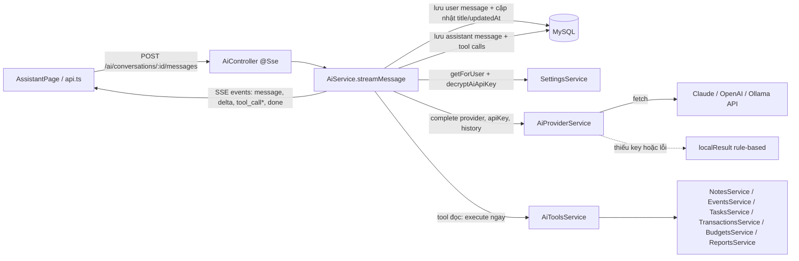

> **Status:** Draft — generated from code survey on 2026-06-15
> **Last updated:** 2026-06-15
> **Owners:** TODO: confirm

# AI Assistant Module

Module `ai` cung cấp trợ lý trò chuyện cá nhân: quản lý hội thoại, gửi tin nhắn theo kiểu streaming (SSE), gọi nhiều nhà cung cấp LLM khác nhau (Claude, OpenAI, Ollama, kèm fallback rule-based cục bộ) và thực thi các "tool call" để truy vấn/tạo dữ liệu trong các module notes, lịch và chi tiêu. Khóa API của từng người dùng được lưu mã hóa AES-256-GCM trong settings và chỉ được giải mã ngay trước khi gọi provider. Toàn bộ văn bản hệ thống và phản hồi đều bằng tiếng Việt.

## Document Map

- [Root CLAUDE.md](../../../CLAUDE.md) · [Architecture index](../../architecture.md)
- [Backend architecture](../../architecture/backend.md)
- [AI providers](../../platforms/ai-providers/README.md)
- [Crypto & secrets](../../infra/crypto-secrets/README.md)
- [Settings module](../../modules/settings/README.md)

## Module Purpose

- Quản lý vòng đời hội thoại AI: tạo, liệt kê, xem chi tiết (kèm tin nhắn và tool call).
- Nhận tin nhắn người dùng, dựng lịch sử hội thoại, gọi LLM provider và lưu phản hồi của assistant kèm thông tin provider/model/token.
- Phát luồng kết quả về client qua Server-Sent Events (`@Sse()`) dưới dạng các sự kiện `message` / `delta` / `tool_call` / `done` / `error`.
- Tạo và quản lý "tool call": tool đọc dữ liệu được thực thi ngay; tool tạo dữ liệu (tên bắt đầu bằng `create`) ở trạng thái `pending` chờ người dùng xác nhận.
- Thực thi tool bằng cách validate đối số qua Zod rồi ủy quyền sang service của module liên quan (notes/schedule/expense), luôn scope theo `userId`.
- KHÔNG thuộc phạm vi module này: lưu trữ/mã hóa khóa API (thuộc [Settings module](../../modules/settings/README.md) + [Crypto & secrets](../../infra/crypto-secrets/README.md)); nghiệp vụ chi tiết của notes/lịch/chi tiêu (chỉ gọi lại service của chúng); cấu hình chi tiết từng provider LLM (xem [AI providers](../../platforms/ai-providers/README.md)).

## Primary Entrypoints

| Layer | Entrypoint | Purpose |
|-------|-----------|---------|
| Controller | `apps/backend/src/ai/ai.controller.ts` | HTTP adapter `@Controller("ai")` dưới `JwtAuthGuard`: list/create/get hội thoại, gửi tin nhắn (SSE), xác nhận tool call. |
| Service | `apps/backend/src/ai/ai.service.ts` | Nghiệp vụ chính: scope `userId`, lưu tin nhắn, điều phối provider + tools, dựng các `AiStreamEvent`. |
| Service | `apps/backend/src/ai/ai-provider.service.ts` | Gọi đa nhà cung cấp (Claude/OpenAI/Ollama) qua `fetch`, fallback rule-based khi thiếu key hoặc lỗi. |
| Service | `apps/backend/src/ai/ai-tools.service.ts` | Thực thi 10 tool, validate đối số bằng `aiToolInputSchemas`, ủy quyền sang service notes/schedule/expense. |
| Entity | `apps/backend/src/ai/entities/ai-conversation.entity.ts` | Bảng `ai_conversations` (FK `user_id` → users, CASCADE). |
| Entity | `apps/backend/src/ai/entities/ai-message.entity.ts` | Bảng `ai_messages` (role/content/provider/model/token, FK `conversation_id`). |
| Entity | `apps/backend/src/ai/entities/ai-tool-call.entity.ts` | Bảng `ai_tool_calls` (name/arguments_json/result_json/status, FK `message_id`). |
| Shared schema | `packages/shared/src/ai.ts` | Nguồn chân lý cho shape request/response: input schemas, DTO schemas, `aiToolInputSchemas`, `aiStreamEventSchema`. |
| Frontend | `apps/frontend/src/pages/AssistantPage.tsx` | Trang trợ lý: state hội thoại, hiển thị tin nhắn/tool call, nút xác nhận. |
| Frontend | `apps/frontend/src/lib/api.ts` | Client AI: `listAiConversations`/`createAiConversation`/`getAiConversation`, đọc SSE stream và `confirmAiToolCall`; parse mọi response bằng schema chia sẻ. |

> Đường dẫn trong bảng là tuyệt đối từ repo root.

## Core Supporting Objects

- `ai.module.ts` — đăng ký 3 entity qua `TypeOrmModule.forFeature`, import `SettingsModule`, `NotesModule`, `ScheduleModule`, `ExpenseModule`; cung cấp `AiService`, `AiProviderService`, `AiToolsService`.
- DTO mappers nội bộ trong `ai.service.ts`: `toConversationDto`, `toMessageDto`, `toToolCallDto`, `toProviderMessage` (chuyển entity ↔ DTO, đổi `Date` sang chuỗi ISO).
- `isCreateTool(name)` trong `ai.service.ts` — quy ước: tool có tên bắt đầu bằng `create` cần xác nhận (`pending`), còn lại thực thi ngay.
- Interfaces/heuristics trong `ai-provider.service.ts`: `AiProviderMessage`, `AiProviderToolCall`, `AiProviderResult`; `systemPrompt` (tiếng Việt), `localResult`/`fallbackText` (phản hồi dự phòng theo từ khóa), `detectToolCalls` (suy luận tool từ nội dung tin nhắn).
- `SettingsService.decryptAiApiKey(userId)` và `SettingsService.getForUser(userId)` — lấy provider đang chọn và giải mã khóa API (AES-256-GCM) ngay trước khi gọi LLM.
- `ZodValidationPipe`, `ParseUUIDPipe`, `@CurrentUser()`, `JwtAuthGuard` — pipe/guard/decorator dùng ở controller.
- `aiToolInputSchemas` (trong `packages/shared/src/ai.ts`) — bản đồ Zod schema cho đối số từng tool, dùng `.parse()` trước khi thực thi.

## Data Flow

Luồng đồng bộ (list/create/get/confirm) đi qua controller → service → repository TypeORM. Luồng gửi tin nhắn là streaming SSE nhưng nội bộ chạy tuần tự: `streamMessage` bọc `sendMessage` trong một `Observable`, chờ hoàn tất rồi phát lần lượt các sự kiện đã dựng sẵn (không phải token-by-token thực sự từ provider).

Các bước của `sendMessage` (trong `ai.service.ts`):

1. `findConversation(userId, id)` — xác minh hội thoại thuộc về user, nếu không có ném `NotFoundException` (`conversation_not_found`).
2. Lưu tin nhắn người dùng (`role: "user"`, provider/model/token = null).
3. Nếu title vẫn là `"Đoạn chat mới"` thì đặt title = 80 ký tự đầu của nội dung; ngược lại chỉ cập nhật `updatedAt`.
4. Lấy tối đa 20 tin nhắn gần nhất làm lịch sử (`order createdAt ASC`, `take: 20`).
5. `settings.getForUser(userId)` lấy provider; `settings.decryptAiApiKey(userId)` giải mã khóa API.
6. `provider.complete(provider, apiKey, history)` gọi LLM (hoặc fallback cục bộ).
7. Lưu tin nhắn assistant kèm `provider/model/inputTokens/outputTokens`.
8. Tạo các tool call: tool `create*` → `pending`; tool còn lại → `executed` và chạy `tools.execute(...)` ngay, lưu `result`.
9. Trả về mảng sự kiện: `message` (user), `delta` (nội dung assistant), `tool_call` cho từng tool, và `done` (kèm `AiConversationDetail` mới nhất). Nếu có lỗi, `streamMessage` phát một sự kiện `error` với message tiếng Việt.

Luồng xác nhận tool call (`PATCH /ai/tool-calls/:id`): `confirmToolCall` join `tool_call → message → conversation` và lọc `c.user_id = :userId` để bảo đảm quyền sở hữu; `approved: false` → `rejected`; `approved: true` → chạy `tools.execute(...)`, set `executed` và lưu `result` + `executedAt`.

## When To Touch Which File

| If you want to… | Edit | Then also… |
|-----------------|------|------------|
| Thêm field persist cho hội thoại/tin nhắn/tool call | entity tương ứng trong `apps/backend/src/ai/entities/` (vd `ai-message.entity.ts`) + migration mới | cập nhật DTO mapper trong `ai.service.ts`, schema trong `packages/shared/src/ai.ts`, và frontend |
| Đổi shape API (request/response, sự kiện stream) | `packages/shared/src/ai.ts` | controller + service + `apps/frontend/src/lib/api.ts` + `AssistantPage.tsx` |
| Thêm endpoint AI mới | `apps/backend/src/ai/ai.controller.ts` | thêm method service tương ứng + schema chia sẻ + client frontend |
| Thêm/đổi nhà cung cấp LLM hoặc model | `apps/backend/src/ai/ai-provider.service.ts` | xem [AI providers](../../platforms/ai-providers/README.md); cập nhật enum provider trong settings nếu cần |
| Thêm tool mới | thêm vào enum `aiToolNameSchema` + `aiToolInputSchemas` trong `packages/shared/src/ai.ts` | thêm `case` trong `ai-tools.service.ts`; nếu cần xác nhận, đặt tên bắt đầu bằng `create` (xem `isCreateTool`) |
| Đổi heuristic gợi ý tool hoặc câu trả lời dự phòng | `apps/backend/src/ai/ai-provider.service.ts` (`detectToolCalls`, `fallbackText`) | kiểm tra ảnh hưởng tới luồng `pending`/`executed` |
| Thay đổi cách lấy/giải mã khóa API | `apps/backend/src/settings/settings.service.ts` | xem [Crypto & secrets](../../infra/crypto-secrets/README.md) |

## Permission & Access Rules

- Toàn bộ `AiController` áp `@UseGuards(JwtAuthGuard)`; user lấy qua `@CurrentUser()`.
- Mọi truy vấn hội thoại scope theo `userId` (`findConversation`, `listConversations` với `where: { userId }`); nếu không khớp ném `NotFoundException` (`conversation_not_found`).
- Tin nhắn và tool call được bảo vệ gián tiếp qua quyền sở hữu hội thoại; riêng `confirmToolCall` join chuỗi `tool_call → message → conversation` và bắt buộc `c.user_id = :userId`, nếu không khớp ném `tool_call_not_found`.
- Tool đều chạy với `userId` của người gọi và ủy quyền sang service đã tự scope theo user (notes/schedule/expense), nên không vượt ranh giới tenant.
- Khóa API của người dùng (`aiApiKeyEnc`) KHÔNG bao giờ xuất hiện trong DTO của module AI; nó chỉ được giải mã tạm thời trong `sendMessage` để gọi provider rồi không lưu lại. DTO tin nhắn có expose `provider`, `model`, `inputTokens`, `outputTokens` (không nhạy cảm), nhưng tuyệt đối không kèm khóa/giá trị bí mật.
- ID trên route dùng `ParseUUIDPipe`; body validate bằng `ZodValidationPipe` với các input schema chia sẻ (`createAiConversationInputSchema`, `sendAiMessageInputSchema`, `confirmAiToolCallInputSchema`).
- Lưu ý: `result_json` của tool call có thể chứa dữ liệu của chính người dùng — không vấn đề về tenant, nhưng cần thận trọng nếu mở rộng để log/chia sẻ. TODO: confirm chính sách lưu/ẩn `result_json` dài hạn.

## Legacy / Operational Notes

- Streaming hiện không phải token-by-token: `streamMessage` chờ `sendMessage` xong rồi mới phát các sự kiện đã dựng sẵn (`message` → `delta` → `tool_call*` → `done`). Frontend đọc SSE theo định dạng `data:` phân tách bằng `\n\n`.
- Khi không có khóa API (và provider khác `ollama`) hoặc khi gọi provider thất bại (`!res.ok`), service rơi về `localResult` rule-based — vẫn trả lời tiếng Việt và vẫn có thể suy luận tool qua `detectToolCalls`.
- Model đang hard-code trong `ai-provider.service.ts`: Claude `claude-3-5-sonnet-20241022`, OpenAI `gpt-4o-mini`, Ollama `llama3.1` tại `http://localhost:11434`. TODO: confirm có nên đưa các giá trị này vào config/env.
- Lịch sử gửi cho provider giới hạn 20 tin nhắn gần nhất; danh sách hội thoại giới hạn 50 bản ghi mới nhất.
- `arguments_json`/`result_json` lưu kiểu `json` của MySQL; `executed_at` là `datetime(6)`. Mọi field persist mới cần cập nhật cả entity lẫn migration (synchronize tắt).
- Provider gọi qua `fetch` trực tiếp; không dùng BullMQ/queue trong module này (khác với module schedule). Không có lưu ý vận hành đặc biệt nào khác.

## Where To Start Reading For Maintenance

1. `packages/shared/src/ai.ts` — nắm shape dữ liệu, tên tool, schema đối số và các sự kiện stream.
2. `apps/backend/src/ai/ai.controller.ts` — bản đồ endpoint và pipe/guard.
3. `apps/backend/src/ai/ai.service.ts` — nghiệp vụ cốt lõi: scope `userId`, lưu tin nhắn, dựng sự kiện, xác nhận tool call.
4. `apps/backend/src/ai/ai-provider.service.ts` — cách gọi LLM và fallback.
5. `apps/backend/src/ai/ai-tools.service.ts` — mapping tool → service khác.
6. `apps/backend/src/ai/entities/*.ts` — lược đồ bảng và quan hệ.
7. `apps/frontend/src/lib/api.ts` + `apps/frontend/src/pages/AssistantPage.tsx` — phía client tiêu thụ SSE và xác nhận tool.

## Related Modules

- [Settings module](../../modules/settings/README.md) — lưu provider đang chọn và khóa API mã hóa; cung cấp `getForUser`/`decryptAiApiKey`.
- [Crypto & secrets](../../infra/crypto-secrets/README.md) — mã hóa/giải mã AES-256-GCM cho khóa API.
- [AI providers](../../platforms/ai-providers/README.md) — chi tiết tích hợp Claude/OpenAI/Ollama.
- [Notes module](../../modules/notes/README.md) — tool `searchNotes`/`createNote`/`summarizeNotes`. TODO: confirm đường dẫn doc tồn tại.
- [Schedule module](../../modules/schedule/README.md) — tool `listSchedule`/`createEvent`/`createTask`. TODO: confirm đường dẫn doc tồn tại.
- [Expense module](../../modules/expense/README.md) — tool `queryExpenses`/`createTransaction`/`getBudgetStatus`/`getMonthlyInsights`. TODO: confirm đường dẫn doc tồn tại.

## Document History

| Date | Change | Author |
|------|--------|--------|
| 2026-06-15 | Initial draft generated from code survey | TODO: confirm |
