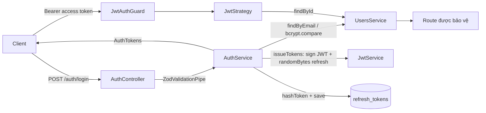

> **Status:** Draft — generated from code survey on 2026-06-15
> **Last updated:** 2026-06-15
> **Owners:** TODO: confirm

# Auth Module

Module `auth` chịu trách nhiệm xác thực người dùng cho toàn bộ backend: đăng ký/đăng nhập bằng email + mật khẩu, đăng nhập qua Google OAuth, cấp và xoay vòng cặp token (JWT access + refresh token quay vòng), cùng các guard/decorator để các module khác bảo vệ route theo `userId`. Module cũng đóng vai trò "cổng vào" cho một số endpoint cài đặt người dùng (`/auth/settings`, `/auth/settings/job-match`, `/auth/settings/notes-lock`) bằng cách ủy quyền sang `SettingsService`.

## Document Map

- [Root CLAUDE.md](../../../CLAUDE.md) · [Architecture index](../../architecture.md)
- [Backend architecture](../../architecture/backend.md) — vị trí của tầng controller/service/guard.
- [Security architecture](../../architecture/security.md) — chính sách token, băm mật khẩu, redaction log.
- [Users module](../../modules/users/README.md) — nguồn `UserEntity` mà auth truy vấn/khởi tạo.
- [Settings module](../../modules/settings/README.md) — đích ủy quyền của các endpoint `/auth/settings*`.
- [Google OAuth](../../platforms/google-oauth/README.md) — cấu hình provider Google.
- [Crypto & secrets](../../infra/crypto-secrets/README.md) — `CryptoService.hashToken` dùng để băm refresh token.

## Module Purpose

- Đăng ký tài khoản mới (`register`): kiểm tra email trùng, băm mật khẩu bằng `bcrypt` (cost 12), tạo user, khởi tạo settings và seed danh mục chi tiêu mặc định, rồi cấp token.
- Đăng nhập bằng email/mật khẩu (`login`): so khớp `bcrypt`, trả về `AuthTokens`.
- Xoay vòng refresh token (`refresh`): xác thực bản băm refresh token, thu hồi bản cũ (`revokedAt`) và cấp cặp token mới (rotation một-lần-dùng).
- Đăng xuất (`logout`): thu hồi refresh token theo bản băm.
- Đăng nhập Google OAuth (`/auth/google`, `/auth/google/callback`): tự tạo user mới hoặc liên kết `googleId` vào user sẵn có, rồi redirect về frontend kèm token trên URL fragment.
- Cung cấp `JwtAuthGuard`, `OptionalJwtAuthGuard`, decorator `@CurrentUser()` và `JwtStrategy` cho mọi module khác dùng lại.
- Phạm vi KHÔNG thuộc module: logic settings/job-match/notes-lock thực tế (nằm ở `SettingsService`), thao tác CRUD trên user (nằm ở `UsersService`), nghiệp vụ danh mục chi tiêu (`CategoriesService`). Auth chỉ điều phối và bảo vệ.

## Primary Entrypoints

| Layer | Entrypoint | Purpose |
|-------|-----------|---------|
| Controller | `apps/backend/src/auth/auth.controller.ts` | Route `register/login/refresh/logout/me` và proxy `/auth/settings*`. |
| Controller | `apps/backend/src/auth/google.controller.ts` | Khởi tạo luồng Google OAuth và xử lý callback redirect. |
| Service | `apps/backend/src/auth/auth.service.ts` | Nghiệp vụ xác thực, cấp/xoay vòng token, ánh xạ `UserEntity` → `UserProfile`. |
| Entity | `apps/backend/src/auth/refresh-token.entity.ts` | Bảng `refresh_tokens` lưu bản băm token, hạn dùng, thời điểm thu hồi. |
| Shared schema | `packages/shared/src/auth.ts` | Zod schema/type cho input và DTO (register/login/refresh/logout, `AuthTokens`, `UserProfile`). |
| Module | `apps/backend/src/auth/auth.module.ts` | Wiring: Passport, JwtModule, TypeORM feature, import Users/Settings/Expense. |
| Frontend | `apps/frontend/src/features/auth/AuthContext.tsx` | State phiên đăng nhập phía client (TODO: confirm chi tiết hành vi). |
| Frontend | `apps/frontend/src/lib/api.ts` | Gọi `/auth/*`, đính `Authorization: Bearer`, tự refresh token khi gặp 401. |

> Đường dẫn trong bảng là tuyệt đối từ repo root.

## Core Supporting Objects

- `apps/backend/src/auth/guards/jwt-auth.guard.ts` — `JwtAuthGuard` (mở rộng `AuthGuard("jwt")`): bắt buộc JWT hợp lệ, gắn `UserEntity` vào `req.user`.
- `apps/backend/src/auth/guards/optional-jwt-auth.guard.ts` — `OptionalJwtAuthGuard`: nếu có JWT hợp lệ thì gắn user, ngược lại trả `null` thay vì ném lỗi (dùng cho route share công khai cần biết user nếu đã đăng nhập).
- `apps/backend/src/auth/decorators/current-user.decorator.ts` — `@CurrentUser()`: lấy `req.user`; ném lỗi nếu dùng trên route chưa qua guard.
- `apps/backend/src/auth/strategies/jwt.strategy.ts` — `JwtStrategy`: rút bearer token, verify bằng `JWT_ACCESS_SECRET`, nạp lại user qua `UsersService.findById` (ném `user_not_found` nếu không còn).
- `apps/backend/src/auth/strategies/google.strategy.provider.ts` — `GoogleStrategyProvider`: chỉ đăng ký strategy `"google"` khi có `GOOGLE_CLIENT_ID`/`GOOGLE_CLIENT_SECRET`; `validate()` tìm/tạo/liên kết user theo email + `googleId`.
- `CryptoService.hashToken` (`apps/backend/src/common/crypto/crypto.service.ts`) — băm refresh token trước khi lưu/đối chiếu (DB chỉ giữ bản băm, không giữ token thô).
- `ZodValidationPipe` (`apps/backend/src/common/pipes/zod-validation.pipe.ts`) — validate body theo schema từ `@assistant/shared` tại biên controller.
- Helper nội bộ trong `auth.service.ts`: `parseTtlToMs` / `ttlToSeconds` (chuyển TTL dạng `15m`/`30d` sang ms/giây); hằng số `BCRYPT_COST=12`, `REFRESH_BYTES=48`.

## Data Flow

Luồng đồng bộ — đăng nhập/đăng ký và truy cập route được bảo vệ:

Các bước chính:

1. `register`/`login` validate input bằng `ZodValidationPipe` → `AuthService` xử lý → `issueTokens` ký JWT access (`JWT_ACCESS_TTL`) và sinh refresh token ngẫu nhiên 48 byte (base64url).
2. Refresh token thô được trả về client; backend chỉ lưu bản băm (`tokenHash`, `CHAR(64)`) cùng `expiresAt` trong bảng `refresh_tokens`.
3. `refresh`: tra cứu theo `tokenHash`, từ chối nếu không tồn tại / đã `revokedAt` / quá hạn; nếu hợp lệ thì đánh dấu `revokedAt` (rotation) rồi cấp cặp token mới từ `record.user`.
4. `logout`: cập nhật `revokedAt` cho bản băm tương ứng (không xóa hàng).
5. Route được bảo vệ: `JwtAuthGuard` → `JwtStrategy.validate` nạp lại `UserEntity` từ DB và gắn vào `req.user`; `@CurrentUser()` đọc ra.

Luồng Google OAuth (redirect, không phải JSON API):

1. `GET /auth/google` (`AuthGuard("google")`) bắt đầu OAuth; nếu thiếu credential → `ServiceUnavailableException` (`google_oauth_disabled`).
2. Google gọi lại `GET /auth/google/callback`; `GoogleStrategy.validate` tìm user theo `googleId` rồi theo email, tạo mới (kèm `initForUser` + `seedDefaults`) hoặc liên kết `googleId` nếu user đã có.
3. Controller gọi `issueTokensForGoogleUser` rồi `res.redirect` về `"/auth/callback#access_token=...&refresh_token=...&expires_in=..."` (token nằm trên URL fragment). Thất bại → redirect `"/login?error=google_failed"`.

Không có luồng queue/worker trong module này. Dọn token hết hạn qua `AuthService.pruneExpired` (xóa hàng `expiresAt < now`); TODO: confirm nơi/lịch gọi `pruneExpired`.

## When To Touch Which File

| If you want to… | Edit | Then also… |
|-----------------|------|------------|
| Đổi shape request/response auth (register/login/refresh/logout, `AuthTokens`, `UserProfile`) | `packages/shared/src/auth.ts` | Cập nhật `auth.controller.ts` + `auth.service.ts` + parse phía `apps/frontend/src/lib/api.ts` |
| Thêm field persist cho refresh token | `apps/backend/src/auth/refresh-token.entity.ts` + migration mới | Cập nhật logic `issueTokens`/`refresh` trong `auth.service.ts` |
| Đổi chính sách token (TTL, độ dài, thuật toán băm) | `apps/backend/src/auth/auth.service.ts` (+ env `JWT_*`) | Kiểm tra `jwt.strategy.ts` và `auth.module.ts` (cấu hình `JwtModule`) |
| Thêm/đổi endpoint settings dưới `/auth` | `apps/backend/src/auth/auth.controller.ts` | Triển khai nghiệp vụ trong `SettingsService` (module Settings) |
| Đổi hành vi xác thực bắt buộc/tùy chọn | `apps/backend/src/auth/guards/*.ts` | Kiểm tra các module dùng `JwtAuthGuard`/`OptionalJwtAuthGuard` |
| Đổi cách tạo/liên kết user Google | `apps/backend/src/auth/strategies/google.strategy.provider.ts` | Kiểm tra redirect trong `google.controller.ts` + env `GOOGLE_*` |

## Permission & Access Rules

- Bảng `refresh_tokens` mang FK `user_id` → `users(id)` với `onDelete: CASCADE`; mỗi hàng gắn với một `userId` cụ thể.
- Route công khai (không guard): `POST /auth/register`, `/auth/login`, `/auth/refresh`, `/auth/logout`, và toàn bộ luồng `/auth/google*` (dùng `AuthGuard("google")` thay cho JWT).
- Route bảo vệ bằng `JwtAuthGuard`: `GET /auth/me`, `GET/PATCH /auth/settings`, `GET/PUT /auth/settings/job-match`, `POST/DELETE /auth/settings/notes-lock`. Mọi thao tác đều scope theo `user.id` lấy từ `@CurrentUser()` (ví dụ `settings.getForUser(user.id)`).
- `JwtStrategy.validate` luôn nạp lại user từ DB theo `payload.sub`; user đã bị xóa → `UnauthorizedException` (`user_not_found`) dù JWT còn hạn.
- Refresh token là one-time-use: mỗi lần `refresh` thu hồi bản cũ trước khi cấp mới, hạn chế tái sử dụng.
- KHÔNG được expose ra DTO: `passwordHash`, bản băm refresh token (`tokenHash`), bí mật JWT/khóa mã hóa, hay refresh token thô đã lưu. `UserProfile` chỉ gồm `id`, `email`, `name`, `avatarUrl`, `createdAt` (xem `AuthService.toProfile`). Refresh token thô chỉ xuất hiện một lần trong response `AuthTokens` và không bao giờ đọc lại từ DB.
- Lỗi xác thực trả về với `code` ổn định + `message` tiếng Việt (`email_in_use`, `invalid_credentials`, `refresh_invalid`, `user_not_found`, `google_oauth_disabled`).

## Legacy / Operational Notes

- Biến môi trường liên quan (xác thực tại `apps/backend/src/config/env.validation.ts`): `JWT_ACCESS_SECRET` (≥32 ký tự), `JWT_ACCESS_TTL` (mặc định `15m`), `JWT_REFRESH_SECRET` (≥32), `JWT_REFRESH_TTL` (mặc định `30d`), `GOOGLE_CLIENT_ID`/`GOOGLE_CLIENT_SECRET` (optional, mặc định rỗng → tắt Google OAuth), `GOOGLE_CALLBACK_URL`, `BACKEND_PUBLIC_URL` (mặc định `http://localhost:3000`, dùng để dựng URL callback frontend).
- Lưu ý: module chỉ dùng `JWT_ACCESS_SECRET` để ký/verify access token; refresh token KHÔNG phải JWT mà là chuỗi ngẫu nhiên băm-và-lưu. `JWT_REFRESH_SECRET` được khai báo trong env nhưng TODO: confirm liệu auth module có dùng tới `JWT_REFRESH_SECRET` không (không thấy tham chiếu trong `auth.service.ts`).
- Google OAuth tự kích hoạt/tắt theo sự hiện diện của credential: thiếu thì `GoogleStrategyProvider` chỉ log cảnh báo và không đăng ký strategy; route `/auth/google` ném `google_oauth_disabled`.
- Schema bảng `refresh_tokens` được tạo trong migration `apps/backend/src/database/migrations/1716600000000-init.ts` (`synchronize: false`); thay đổi entity phải đi kèm migration mới.
- Token Google trả về client qua URL fragment (`#`) tại `"/auth/callback"` — phần xử lý fragment nằm ở frontend (TODO: confirm route/logic phía `apps/frontend`).

## Where To Start Reading For Maintenance

1. `packages/shared/src/auth.ts` — hiểu hợp đồng input/DTO trước.
2. `apps/backend/src/auth/auth.controller.ts` — bản đồ route và guard nào áp dụng ở đâu.
3. `apps/backend/src/auth/auth.service.ts` — nghiệp vụ cốt lõi: cấp/xoay vòng token, băm mật khẩu.
4. `apps/backend/src/auth/refresh-token.entity.ts` — mô hình lưu trữ refresh token.
5. `apps/backend/src/auth/strategies/jwt.strategy.ts` + `guards/*.ts` — cơ chế bảo vệ route dùng chung.
6. `apps/backend/src/auth/strategies/google.strategy.provider.ts` + `google.controller.ts` — luồng OAuth (nếu cần).
7. `apps/backend/src/auth/auth.module.ts` — cách mọi thứ được wiring lại.

## Related Modules

- [Users module](../../modules/users/README.md) — cung cấp `UserEntity`, `findByEmail/findById/create/linkGoogle`; auth phụ thuộc trực tiếp.
- [Settings module](../../modules/settings/README.md) — đích ủy quyền của `/auth/settings*`; auth gọi `initForUser` khi tạo user.
- [Google OAuth](../../platforms/google-oauth/README.md) — cấu hình credential và callback cho strategy Google.
- [Crypto & secrets](../../infra/crypto-secrets/README.md) — `CryptoService.hashToken` băm refresh token.
- [Security architecture](../../architecture/security.md) — chính sách token, redaction, băm mật khẩu cấp hệ thống.
- Module Expense (`CategoriesService.seedDefaults`) được auth gọi khi tạo user mới — TODO: confirm link doc Expense.

## Document History

| Date | Change | Author |
|------|--------|--------|
| 2026-06-15 | Initial draft generated from code survey | TODO: confirm |
