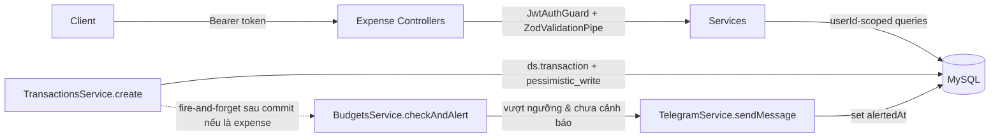

> **Status:** Draft — generated from code survey on 2026-06-15
> **Last updated:** 2026-06-15
> **Owners:** TODO: confirm

# Expense Module

Module quản lý tài chính cá nhân của Personal Assistant: ví tiền (wallets), danh mục thu/chi (categories), giao dịch (transactions), ngân sách theo tháng (budgets) và báo cáo tổng hợp (reports). Toàn bộ tiền tệ là **VND, chỉ dùng số nguyên** (không có phần thập phân). Mỗi tài nguyên đều thuộc về một người dùng và được scope theo `userId`.

## Document Map

- [Root CLAUDE.md](../../../CLAUDE.md) · [Architecture index](../../architecture.md) · [Backend architecture](../../architecture/backend.md)
- Module liên quan: [Auth](../../modules/auth/README.md) · [Users](../../modules/users/README.md)
- Tích hợp gửi cảnh báo ngân sách qua Telegram nằm trong module `schedule` (`apps/backend/src/schedule/telegram.service.ts`) — TODO: confirm đường dẫn doc cho module schedule.

## Module Purpose

- Quản lý **ví** (CRUD + lưu trữ/archive), giữ số dư `balance` của từng ví đồng bộ với giao dịch.
- Quản lý **danh mục** thu/chi (CRUD), hỗ trợ danh mục cha–con cùng loại, và seed 12 danh mục mặc định cho người dùng mới.
- Ghi nhận **giao dịch** thu/chi/chuyển khoản, cập nhật số dư ví trong transaction DB có khoá hàng (pessimistic lock).
- Quản lý **ngân sách** theo cặp (danh mục chi tiêu, tháng `YYYY-MM`) và bắn cảnh báo Telegram khi chi tiêu vượt ngưỡng.
- Cung cấp **báo cáo**: chi tiêu theo danh mục, xu hướng thu/chi theo ngày/tuần/tháng, và export CSV.
- KHÔNG thuộc module này: xác thực/đăng ký người dùng (module `auth`), hạ tầng gửi Telegram và hàng đợi nhắc lịch (module `schedule`), mã hoá khoá bí mật (`common/crypto`).

## Primary Entrypoints

| Layer | Entrypoint | Purpose |
|-------|-----------|---------|
| Module | `apps/backend/src/expense/expense.module.ts` | Đăng ký controllers/services, import `ScheduleModule` (để dùng `TelegramService`) và 4 entity. |
| Controller | `apps/backend/src/expense/wallets.controller.ts` | REST `/wallets` — list/findOne/create/update/remove. |
| Controller | `apps/backend/src/expense/categories.controller.ts` | REST `/categories` — CRUD danh mục. |
| Controller | `apps/backend/src/expense/transactions.controller.ts` | REST `/transactions` — list (có filter+phân trang)/findOne/create/update/remove. |
| Controller | `apps/backend/src/expense/budgets.controller.ts` | REST `/budgets` — CRUD; list trả về `BudgetStatus` (đã tính chi tiêu). |
| Controller | `apps/backend/src/expense/reports.controller.ts` | REST `/reports/expense-by-category`, `/reports/trend`, `/reports/export.csv`. |
| Service | `apps/backend/src/expense/wallets.service.ts` | Logic ví + `assertOwnership`/`assertActive`. |
| Service | `apps/backend/src/expense/categories.service.ts` | Logic danh mục + `seedDefaults(userId)`. |
| Service | `apps/backend/src/expense/transactions.service.ts` | Logic giao dịch + cập nhật số dư trong DB transaction + kích hoạt cảnh báo ngân sách. |
| Service | `apps/backend/src/expense/budgets.service.ts` | Logic ngân sách + `checkAndAlert` (gửi Telegram). |
| Service | `apps/backend/src/expense/reports.service.ts` | Truy vấn tổng hợp trực tiếp trên bảng `transactions`. |
| Entity | `apps/backend/src/expense/entities/wallet.entity.ts` | Bảng `wallets`, `balance` decimal(15,0). |
| Entity | `apps/backend/src/expense/entities/category.entity.ts` | Bảng `categories`, có quan hệ cha–con. |
| Entity | `apps/backend/src/expense/entities/transaction.entity.ts` | Bảng `transactions`, `amount` decimal(15,0). |
| Entity | `apps/backend/src/expense/entities/budget.entity.ts` | Bảng `budgets`, unique `(user, category, month)`. |
| Shared schema | `packages/shared/src/wallets.ts` | Zod schema + type cho ví. |
| Shared schema | `packages/shared/src/categories.ts` | Zod schema + type cho danh mục. |
| Shared schema | `packages/shared/src/transactions.ts` | Zod schema + type cho giao dịch (gồm `superRefine` cho transfer). |
| Shared schema | `packages/shared/src/budgets.ts` | Zod schema + type cho ngân sách và `BudgetStatus`. |
| Shared schema | `packages/shared/src/reports.ts` | Zod schema + type cho các báo cáo. |
| Frontend | `apps/frontend/src/pages/ExpensePage.tsx` | Trang quản lý chi tiêu phía client (gọi API qua `apps/frontend/src/lib/api.ts`). |

> Đường dẫn trong bảng là tuyệt đối từ repo root.

## Core Supporting Objects

- `apps/backend/src/expense/util/category-seed.ts` — hằng `DEFAULT_CATEGORY_SEED`: 12 danh mục VN mặc định (8 chi tiêu + 4 thu nhập) kèm icon/màu.
- `TelegramService` (`apps/backend/src/schedule/telegram.service.ts`) — được `BudgetsService` dùng để gửi cảnh báo vượt ngân sách; lý do `ExpenseModule` phải `import ScheduleModule`.
- `JwtAuthGuard` (`apps/backend/src/auth/guards/jwt-auth.guard.ts`) + decorator `@CurrentUser()` (`apps/backend/src/auth/decorators/current-user.decorator.ts`) — áp dụng ở mọi controller.
- `ZodValidationPipe` (`apps/backend/src/common/pipes/zod-validation.pipe.ts`) — validate body/query theo shared schema; route ID dùng `ParseUUIDPipe`.
- Hàm `toDto(...)` cục bộ trong mỗi service — ánh xạ entity sang DTO, ép `balance`/`amount` sang `Number`, timestamp sang ISO string, và **loại bỏ `userId`** khỏi response.
- `amountTransformer` trong các entity — chuyển đổi decimal MySQL (chuỗi) ↔ number để giữ kiểu số nguyên VND.
- Các helper trong `budgets.service.ts` (`monthKey`, `monthRange`, `buildStatus`, `formatVnd`, `escapeHtml`) và `reports.service.ts` (`bucketExpression`, `csvCell`, `formatVnDate`).

## Data Flow

Luồng đồng bộ (mọi endpoint): client → controller (qua `JwtAuthGuard` + `ZodValidationPipe`) → service (scope theo `userId`) → TypeORM → MySQL.

Chi tiết các luồng quan trọng:

- **Tạo/sửa/xoá giao dịch** (`transactions.service.ts`): chạy trong `ds.transaction(...)`. Ví nguồn (và ví đích nếu là transfer) được khoá bằng `setLock("pessimistic_write")` rồi cộng/trừ `balance`: `expense` trừ ví nguồn, `income` cộng ví nguồn, `transfer` trừ nguồn + cộng đích. Khi sửa số tiền chỉ áp `delta`; khi xoá thì hoàn tác (đảo dấu). Giao dịch `transfer` luôn có `categoryId = null`.
- **Cảnh báo ngân sách (best-effort, KHÔNG dùng queue)**: sau khi commit một giao dịch `expense` có `categoryId`, `TransactionsService` gọi `budgets.checkAndAlert(...)` theo kiểu fire-and-forget (`.catch` chỉ log warning, không chặn response). `checkAndAlert` tính tổng chi tiêu trong tháng của danh mục; nếu `percent >= alertThresholdPct` và `alertedAt` còn null thì gửi Telegram và set `alertedAt` (chống gửi lặp).
- **Seed danh mục mặc định**: `categoriesService.seedDefaults(userId)` được gọi từ `apps/backend/src/auth/auth.service.ts` (đăng ký) và `apps/backend/src/auth/strategies/google.strategy.provider.ts` (Google OAuth). Hàm idempotent: bỏ qua nếu người dùng đã có danh mục.
- **Báo cáo**: `reports.service.ts` truy vấn trực tiếp bảng `transactions` (có `leftJoin` `categories`/`wallets`), không đi qua các service khác. Export CSV thêm BOM (``) để Excel đọc đúng UTF-8, header và nhãn loại bằng tiếng Việt.

## When To Touch Which File

| If you want to… | Edit | Then also… |
|-----------------|------|------------|
| Thêm field persist cho ví/giao dịch/ngân sách/danh mục | entity tương ứng trong `apps/backend/src/expense/entities/` (vd `wallet.entity.ts`) + tạo migration mới | cập nhật shared schema tương ứng trong `packages/shared/src/*.ts` + DTO `toDto` trong service + frontend |
| Đổi shape request/response của một API | `packages/shared/src/<wallets|categories|transactions|budgets|reports>.ts` | controller, service (`toDto`), và `apps/frontend/src/lib/api.ts` |
| Đổi quy tắc tính số dư ví | `apps/backend/src/expense/transactions.service.ts` (`create`/`update`/`remove`) | kiểm tra lại logic khoá hàng (`pessimistic_write`) |
| Đổi ngưỡng/nội dung cảnh báo ngân sách | `apps/backend/src/expense/budgets.service.ts` (`checkAndAlert`, `formatVnd`) | xác nhận `TelegramService` trong module `schedule` |
| Sửa danh mục mặc định | `apps/backend/src/expense/util/category-seed.ts` | không cần migration (seed lúc đăng ký) |
| Thêm loại báo cáo/định dạng export | `apps/backend/src/expense/reports.service.ts` + `reports.controller.ts` | `packages/shared/src/reports.ts` |

## Permission & Access Rules

- **Guard**: tất cả controller (`wallets`, `categories`, `transactions`, `budgets`, `reports`) đều có `@UseGuards(JwtAuthGuard)`; lấy người dùng qua `@CurrentUser()` và luôn truyền `user.id` xuống service.
- **Scoping theo `userId`**: mọi truy vấn đều lọc theo `userId`. Các service có `assertOwnership(userId, id)` (ví, danh mục, ngân sách) ném `NotFoundException` nếu không thuộc người dùng. Giao dịch kiểm tra ownership ngay trong câu truy vấn (`where id AND user_id`).
- **Kiểm tra tài nguyên cha/liên quan**:
  - Tạo/sửa giao dịch: xác minh ví nguồn (và ví đích) thuộc người dùng và chưa archive; xác minh danh mục thuộc người dùng và đúng `kind` (chi tiêu/thu nhập khớp loại giao dịch).
  - Tạo ngân sách: danh mục phải thuộc người dùng và có `kind = "expense"`; unique theo `(user, category, month)`.
  - Danh mục con phải cùng `kind` với danh mục cha; danh mục không thể là cha của chính nó.
- **Route ID**: dùng `ParseUUIDPipe` cho mọi `:id`.
- **KHÔNG expose ra DTO**: `userId`, và các quan hệ ManyToOne nội bộ (`user`, `wallet`, `category`, `parent`, `transferToWallet`). Các hàm `toDto` chỉ trả về field nghiệp vụ; nếu thêm field nhạy cảm vào entity, KHÔNG được đưa vào DTO.

## Legacy / Operational Notes

- **VND-only**: `balance` và `amount` là `decimal(15,0)` (scale 0). Shared schema bắt buộc số nguyên dương, tối đa `999_999_999_999_999`. `amountTransformer` chuyển chuỗi decimal ↔ number.
- **Số dư có thể âm**: logic trừ tiền (`expense`/`transfer`) không chặn `balance < 0`. TODO: confirm đây là hành vi mong muốn.
- **Xoá ví bị chặn** nếu còn giao dịch tham chiếu (qua `wallet_id` hoặc `transfer_to_wallet_id`) → ném `wallet_in_use`, gợi ý archive. FK giao dịch→ví dùng `onDelete: RESTRICT`.
- **Xoá danh mục bị chặn** nếu đang được dùng bởi giao dịch hoặc ngân sách → `category_in_use`. FK: giao dịch→danh mục và danh mục→cha là `SET NULL`; ngân sách→danh mục là `CASCADE`.
- **Cảnh báo ngân sách chống lặp** bằng `alertedAt`: chỉ gửi 1 lần cho tới khi reset. `update` ngân sách (đổi `amount` hoặc `alertThresholdPct`) sẽ reset `alertedAt = null` để cảnh báo có thể bắn lại. `alertThresholdPct` mặc định 80.
- **`month`**: định dạng `YYYY-MM` (`char(7)`), khoảng tháng tính theo UTC (`monthRange`/`monthKey`).
- **Báo cáo**: `expense-by-category` gắn nhãn `"Chưa phân loại"` cho giao dịch không có danh mục; `trend` dùng `DATE_FORMAT` của MySQL (tuần = `%x-W%v`). Export CSV có BOM UTF-8 và nhãn loại tiếng Việt (Chi/Thu/Chuyển khoản).
- **Cảnh báo Telegram là best-effort**: lỗi gửi chỉ ghi log `warn`, không làm hỏng giao dịch.

## Where To Start Reading For Maintenance

1. `apps/backend/src/expense/expense.module.ts` — bức tranh tổng (controllers, services, entity, import ScheduleModule).
2. `apps/backend/src/expense/entities/*.entity.ts` — mô hình dữ liệu và quan hệ FK.
3. `packages/shared/src/{wallets,categories,transactions,budgets,reports}.ts` — hợp đồng API (input/response).
4. `apps/backend/src/expense/transactions.service.ts` — phần phức tạp nhất (DB transaction + khoá hàng + cập nhật số dư + kích hoạt cảnh báo).
5. `apps/backend/src/expense/budgets.service.ts` và `reports.service.ts` — tổng hợp chi tiêu, cảnh báo, báo cáo.
6. Các controller tương ứng để xem mapping HTTP và validation.

## Related Modules

- [Auth](../../modules/auth/README.md) — cung cấp `JwtAuthGuard`/`@CurrentUser()`; gọi `seedDefaults` khi đăng ký và qua Google OAuth.
- [Users](../../modules/users/README.md) — `UserEntity`, là FK `user_id` của mọi bảng trong module này.
- Schedule (`apps/backend/src/schedule/telegram.service.ts`) — gửi cảnh báo ngân sách qua Telegram. TODO: confirm đường dẫn doc module schedule (`../../modules/schedule/README.md`).

## Document History

| Date | Change | Author |
|------|--------|--------|
| 2026-06-15 | Initial draft generated from code survey | TODO: confirm |
