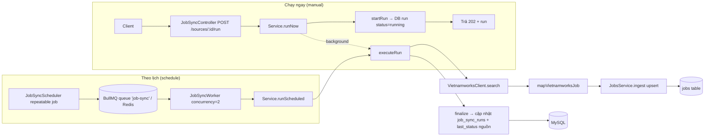

> **Status:** Draft — generated from code survey on 2026-06-15
> **Last updated:** 2026-06-15
> **Owners:** TODO: confirm

# Job Sync Module

Module đồng bộ việc làm tự động từ nguồn ngoài (hiện chỉ VietnamWorks) về bảng `jobs` chung của hệ thống. Một "nguồn sync" (source) khai báo danh sách từ khóa, bộ lọc địa điểm, phân trang và lịch chạy; scheduler dùng BullMQ repeatable jobs để kích hoạt, worker chạy client + mapper rồi ingest từng job qua `JobsService`, và mỗi lần chạy được ghi lại thành một "run" trong lịch sử để theo dõi trạng thái. Module cũng cho phép người dùng bấm "Chạy ngay" (manual) ngoài lịch định kỳ.

## Document Map

- [Root CLAUDE.md](../../../CLAUDE.md) · [Architecture index](../../architecture.md) · [Backend architecture](../../architecture/backend.md)
- Module liên quan: [Jobs module](../../modules/jobs/README.md) — đích ingest (bảng `jobs`).
- Nền tảng ngoài: [VietnamWorks](../../platforms/vietnamworks/README.md) — chi tiết client/endpoint.
- Hạ tầng: [BullMQ queues](../../infra/queue-bullmq/README.md) — scheduler + worker chạy trên Redis.

## Module Purpose

- Quản lý vòng đời CRUD của các **nguồn sync** (`job_sync_sources`): tạo/sửa/xóa/liệt kê, kèm bật-tắt lịch.
- Lên lịch chạy định kỳ bằng BullMQ repeatable jobs (kiểu `interval` hoặc `daily` theo timezone của nguồn) và đồng bộ lịch với DB sau mỗi thay đổi/khởi động.
- Thực thi một lần chạy: gọi VietnamWorks theo từng từ khóa × từng trang, map dữ liệu thô, rồi ingest (upsert) vào bảng `jobs` qua [Jobs module](../../modules/jobs/README.md).
- Ghi **lịch sử run** (`job_sync_runs`) với số liệu (trang đã lấy, job tìm thấy/tạo/cập nhật/lỗi) và trạng thái (`running`/`success`/`partial`/`error`), phục vụ drawer + badge ở frontend.
- KHÔNG thuộc module này: lưu trữ/định nghĩa bản ghi job (thuộc [Jobs module](../../modules/jobs/README.md)); việc chấm điểm phù hợp (fit score) — mapper để `fitScore`/`fitReason` = null; cấu hình kết nối Redis (thuộc `config`).

## Primary Entrypoints

| Layer | Entrypoint | Purpose |
|-------|-----------|---------|
| Controller | `apps/backend/src/job-sync/job-sync.controller.ts` | HTTP adapter dưới `/job-sync` (sau prefix toàn cục → `/api/job-sync`): overview, CRUD sources, run thủ công, liệt kê runs. |
| Service | `apps/backend/src/job-sync/job-sync.service.ts` | Business rules + persistence: CRUD nguồn, tạo/finalize run, vòng lặp `executeRun`, overview. |
| Scheduler | `apps/backend/src/job-sync/job-sync.scheduler.ts` | Quản lý BullMQ repeatable job schedulers (`interval`/`daily`), reconcile, tính `nextRunAt`. |
| Worker | `apps/backend/src/job-sync/job-sync.worker.ts` | BullMQ `Worker` (concurrency 2) nhận job theo lịch và gọi `service.runScheduled`. |
| Entity | `apps/backend/src/job-sync/entities/job-sync-source.entity.ts` | Bảng `job_sync_sources` (global, không `user_id`). |
| Entity | `apps/backend/src/job-sync/entities/job-sync-run.entity.ts` | Bảng `job_sync_runs` (lịch sử; `source_id` nullable, FK SET NULL). |
| Shared schema | `packages/shared/src/job-sync.ts` | Zod input/DTO schemas + type cho cả hai phía. |
| Frontend | `apps/frontend/src/components/jobs/JobSyncDrawer.tsx` | Drawer cấu hình nguồn + xem run; gọi các endpoint qua `apps/frontend/src/lib/api.ts`. |

> Đường dẫn trong bảng là tuyệt đối từ repo root.

## Core Supporting Objects

- `VietnamworksClient` (`apps/backend/src/job-sync/vietnamworks.client.ts`): gọi public API tìm việc `POST https://ms.vietnamworks.com/job-search/v1.0/search` với header giống trình duyệt, timeout 20s; trả `{ nbPages, nbHits, items }`. Ném `VietnamworksError` mang `code` ổn định (`vietnamworks_http_error` / `vietnamworks_timeout` / `vietnamworks_unreachable`). URL là hằng số nên không có rủi ro SSRF từ input.
- `mapVietnamworksJob` (`apps/backend/src/job-sync/vietnamworks.mapper.ts`): map job thô → object khớp `ingestJobInputSchema` (tiền tố `job_id` = `vnw_`), giải mã HTML entity, tách bullet (`htmlToBullets`), làm sạch text (`htmlToText`). Trả `null` nếu thiếu `jobId`/`title`.
- `JobSyncJobData` + hằng `JOB_SYNC_QUEUE_NAME` (`"job-sync"`) trong `job-sync.scheduler.ts`: payload của job hàng đợi chỉ chứa `sourceId`.
- `JobsService.ingest` (`apps/backend/src/jobs/jobs.service.ts`): nơi validate Zod + upsert thực sự; service job-sync chỉ đếm kết quả `created`/`updated`.
- DTO mappers nội bộ trong service: `toSourceDto` / `toRunDto` (chuyển entity → DTO, format ISO string, gắn `nextRunAt` từ scheduler).

## Data Flow

Luồng chạy thủ công (đồng bộ tới mức tạo run, rồi chạy nền) và luồng theo lịch (qua hàng đợi):

- **Khởi động:** `JobSyncService.onModuleInit` đọc toàn bộ nguồn và gọi `scheduler.reconcile(...)` để khớp scheduler trong Redis với DB (tạo cho nguồn đang bật, xóa scheduler "mồ côi") — bảo đảm lịch đúng sau restart.
- **Tạo/sửa/xóa nguồn:** sau mỗi `save`, service gọi `scheduler.syncSource` (xóa hết scheduler cũ của nguồn rồi tạo lại nếu `enabled`); khi xóa gọi `scheduler.removeSource` rồi mới `delete` nguồn (lịch sử run giữ lại nhờ FK SET NULL).
- **`executeRun`:** quét lần lượt từng từ khóa → từng trang (giới hạn `maxPages`, dừng khi `result.items` rỗng, nghỉ `PAGE_DELAY_MS = 400ms` giữa các trang). Khử trùng `jobId` qua `Set`. Lỗi một từ khóa được ghi nhận (`firstError`) nhưng không làm hỏng cả run; trạng thái cuối do `resolveStatus` quyết (`success`/`partial`/`error`). `finalize` dùng `runs.update(...)` theo cột (KHÔNG `save` cả entity) để tránh ghi lại `source_id` đã bị SET NULL giữa chừng.
- **Chống chạy chồng:** `runNow` ném `409` (`job_sync_already_running`) nếu nguồn đang có run `running` mới hơn `STALE_RUNNING_MS = 30 phút`; `runScheduled` thì bỏ qua lần kích hoạt (chỉ log). Run "running" cũ hơn ngưỡng coi như treo → cho chạy lại.

## When To Touch Which File

| If you want to… | Edit | Then also… |
|-----------------|------|------------|
| Thêm field persist cho nguồn/run | `entities/job-sync-source.entity.ts` hoặc `entities/job-sync-run.entity.ts` + migration mới trong `apps/backend/src/database/migrations` | cập nhật `packages/shared/src/job-sync.ts` + `toSourceDto`/`toRunDto` trong service + frontend; đăng ký entity trong `apps/backend/src/database/data-source.ts` nếu là entity mới |
| Đổi shape API (input/DTO) | `packages/shared/src/job-sync.ts` (sửa schema trước) | `job-sync.controller.ts` + `job-sync.service.ts` + frontend `apps/frontend/src/lib/api.ts` & `JobSyncDrawer.tsx` |
| Đổi kiểu lịch / chu kỳ | `packages/shared/src/job-sync.ts` (`jobSyncScheduleSchema`, hằng `MIN/MAX_INTERVAL_MINUTES`) | `schedulerSpecs(...)` trong `job-sync.scheduler.ts` |
| Đổi cách gọi VietnamWorks (endpoint/header/field) | `vietnamworks.client.ts` (hằng `SEARCH_ENDPOINT`, `RETRIEVE_FIELDS`, `buildSearchBody`) | kiểm tra `vietnamworks.mapper.ts` còn map đúng các field trả về |
| Đổi cách map sang job | `vietnamworks.mapper.ts` | đối chiếu `ingestJobInputSchema` trong [Jobs module](../../modules/jobs/README.md) |
| Đổi concurrency / retention hàng đợi | `job-sync.worker.ts` (concurrency) / `job-sync.scheduler.ts` (`defaultJobOptions`) | xem [BullMQ queues](../../infra/queue-bullmq/README.md) |

## Permission & Access Rules

- **Guard:** toàn bộ controller áp `@UseGuards(JwtAuthGuard)` ở cấp class — mọi endpoint yêu cầu đăng nhập (lý do: thao tác tạo request đi ra ngoài và ghi vào bảng `jobs` chung).
- **KHÔNG có scoping theo `userId`:** `job_sync_sources` và `job_sync_runs` là **bảng global** (không cột `user_id`) — đây là cấu hình chung của hệ thống tự lưu trữ, giống `jobs`. Vì vậy service KHÔNG lọc theo `@CurrentUser()`; mọi người dùng đã đăng nhập đều thấy/sửa cùng tập nguồn. (Khác với các module có chủ sở hữu như notes/expense.)
- **Validate biên:** body create/update validate bằng `ZodValidationPipe` (`createJobSyncSourceInputSchema`/`updateJobSyncSourceInputSchema`); route id dùng `ParseUUIDPipe`; query `sourceId` ở `/runs` chỉ nhận UUID hợp lệ (rác → bỏ qua, liệt kê tất cả).
- **Không có per-user secret** trong module này: VietnamWorks là API public, client không gửi credential — nên không có khóa/token cần che. (TODO: confirm nếu sau này thêm provider cần khóa thì phải qua `common/crypto`.)
- **Dữ liệu KHÔNG expose ra DTO:** payload thô từ VietnamWorks (`items` trong `VietnamworksSearchResult`) không bao giờ được trả về client — chỉ object đã map mới đi vào bảng `jobs`. DTO `toSourceDto`/`toRunDto` chỉ trả các cột cấu hình + số liệu run; không expose chi tiết kết nối Redis hay header client.

## Legacy / Operational Notes

- **Biến môi trường:** scheduler/worker đọc `REDIS_HOST`, `REDIS_PORT`, `REDIS_PASSWORD` qua `ConfigService` (validate ở `apps/backend/src/config/env.validation.ts`). Cần Redis chạy để lịch và "Chạy ngay (nền)" hoạt động.
- **Hàng đợi:** tên queue cố định `"job-sync"`; scheduler id có dạng `job-sync:<sourceId>:<suffix>` để reconcile/xóa theo prefix. `defaultJobOptions`: `removeOnComplete` (age 86400s, count 200), `removeOnFail` (age 7 ngày), `attempts: 1`.
- **Redis chập chờn không làm sập API:** mọi thao tác Redis trong scheduler bọc `try/catch` (chỉ log); nếu `nextRunBySource` lỗi thì `nextRunAt` = null nhưng list vẫn trả.
- **Chạy nền cùng process API:** `runNow` chạy `executeRun` trong tiến trình API (không qua hàng đợi) và chỉ log lỗi — trả `202` ngay; worker và run thủ công có thể cùng process.
- **FK SET NULL:** xóa nguồn giữ lại lịch sử run (`source_id` → NULL, `source_name` là snapshot). `finalize` cố ý dùng `update` theo cột để không vi phạm FK khi nguồn bị xóa giữa lúc chạy.
- **Lịch lịch sự với nguồn:** `MIN_INTERVAL_MINUTES = 15` (tránh spam), nghỉ 400ms giữa các trang, concurrency worker = 2.
- **Migration:** TODO: confirm tên migration tạo `job_sync_sources` và `job_sync_runs` trong `apps/backend/src/database/migrations`.

## Where To Start Reading For Maintenance

1. `packages/shared/src/job-sync.ts` — hiểu hợp đồng (schedule union, filters, DTO) trước.
2. `apps/backend/src/job-sync/job-sync.controller.ts` — bề mặt HTTP và validate.
3. `apps/backend/src/job-sync/job-sync.service.ts` — CRUD, `executeRun`, `finalize`, overview (lõi nghiệp vụ).
4. `apps/backend/src/job-sync/job-sync.scheduler.ts` + `job-sync.worker.ts` — luồng lịch/queue.
5. `apps/backend/src/job-sync/vietnamworks.client.ts` + `vietnamworks.mapper.ts` — gọi ngoài + map dữ liệu.
6. `apps/backend/src/job-sync/entities/*.ts` — cột DB và ràng buộc.

## Related Modules

- [Jobs module](../../modules/jobs/README.md) — đích ingest; `JobsService.ingest` validate + upsert vào bảng `jobs`.
- [VietnamWorks](../../platforms/vietnamworks/README.md) — chi tiết nền tảng nguồn dữ liệu ngoài.
- [BullMQ queues](../../infra/queue-bullmq/README.md) — hạ tầng scheduler + worker trên Redis.

## Document History

| Date | Change | Author |
|------|--------|--------|
| 2026-06-15 | Initial draft generated from code survey | TODO: confirm |
