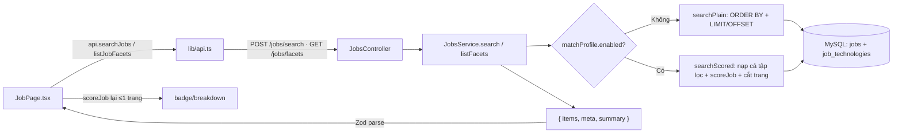

> **Status:** Draft — generated from code survey on 2026-06-15
> **Last updated:** 2026-06-17
> **Owners:** TODO: confirm

# Jobs Module

Module `jobs` lưu trữ các tin tuyển dụng được crawl từ nguồn ngoài (LinkedIn, TopCV, VietnamWorks, ITviec…) và đẩy vào qua n8n. Nó chịu trách nhiệm nhận-và-chống-trùng job (upsert theo `jobId`), chuẩn hóa danh sách công nghệ thành các thực thể `Technology` dùng chung, và phục vụ danh sách job + facet công nghệ cho giao diện Jobs. Điểm phù hợp ("Matching Job") dùng chung hàm thuần `scoreJob()` trong `@assistant/shared`: frontend chấm để hiển thị badge/breakdown; backend cũng gọi `scoreJob()` trong `POST /jobs/search` **khi bật barem** để sắp xếp/ẩn/phân trang đúng (xem [Data Flow](#data-flow)). Danh sách Jobs dùng **phân trang phía server** qua `POST /jobs/search`; `GET /jobs` (trả toàn bộ) vẫn giữ cho trang Thống kê.

## Document Map

- [Root CLAUDE.md](../../../CLAUDE.md) · [Architecture index](../../architecture.md) · [Backend architecture](../../architecture/backend.md)
- Module liên quan: [Job sync](../../modules/job-sync/README.md) — nguồn đồng bộ việc làm chạy theo cron nội bộ.
- Nền tảng tích hợp: [VietnamWorks](../../platforms/vietnamworks/README.md) · [n8n](../../platforms/n8n/README.md) — n8n là phía gọi `POST /jobs` để đẩy job đã crawl.

## Module Purpose

- Nhận job từ crawler (`POST /jobs`): validate payload bằng Zod, upsert theo `jobId` (đã có thì cập nhật, chưa có thì tạo) trong một transaction.
- Chuẩn hóa `techStack` (chuỗi tự do) thành các `Technology` dùng chung qua `slug`, đồng bộ bảng nối N–N `job_technologies`.
- Phục vụ danh sách job:
  - `GET /jobs` (lọc theo slug công nghệ) — trả **toàn bộ** `Job[]`, dùng cho trang Thống kê (`/job/stats`) vốn cần đủ tập dữ liệu.
  - `POST /jobs/search` — **tìm/lọc/sắp xếp + phân trang phía server** cho danh sách Jobs (`/job`): trả `{ items, meta, summary }`. Dùng POST vì body chứa barem (`matchProfile`) lồng nhau.
  - `GET /jobs/tech-facets` (facet công nghệ) và `GET /jobs/facets` (facet đếm global theo cấp bậc/hình thức/nguồn/địa điểm/công nghệ) cho rail lọc.
- Xóa job (`DELETE /jobs/:id`).
- Cung cấp barem chấm điểm dùng chung (`packages/shared/src/job-match.ts`); frontend tính để hiển thị, backend tính trong `POST /jobs/search` khi bật barem.

Phạm vi **KHÔNG** thuộc module này:
- Việc crawl/đồng bộ định kỳ và quản lý nguồn → thuộc [Job sync](../../modules/job-sync/README.md).
- Lưu & sửa cấu hình barem của người dùng (`user_settings.job_match_prefs`, endpoint `PUT /auth/settings/job-match`) → thuộc module settings/auth; ở đây chỉ định nghĩa schema + hàm chấm điểm dùng chung.
- Theo dõi trạng thái workflow n8n → thuộc [n8n](../../platforms/n8n/README.md).

## Primary Entrypoints

| Layer | Entrypoint | Purpose |
|-------|-----------|---------|
| Controller | `apps/backend/src/jobs/jobs.controller.ts` | `@Controller("jobs")` công khai (không guard): `GET /jobs`, `POST /jobs/search`, `GET /jobs/tech-facets`, `GET /jobs/facets`, `POST /jobs`, `DELETE /jobs/:id`. |
| Service | `apps/backend/src/jobs/jobs.service.ts` | Logic nghiệp vụ + persistence: ingest/upsert, lọc theo slug, tìm-kiếm-phân-trang (`search`), đếm facet (`listTechFacets`/`listFacets`), xóa; đồng bộ bảng nối trong transaction. |
| Helper | `apps/backend/src/jobs/jobs.search-utils.ts` | Helper **thuần** (không DB) cho `search`: `repOf`/`timeOf`/`sortScored`/`summarizeScored`/`makeMeta`/`escapeLike`; được unit-test ở `jobs.search-utils.spec.ts`. |
| Entity | `apps/backend/src/jobs/entities/job.entity.ts` | Bảng `jobs` (global, không `user_id`); `job_id` unique chống trùng; N–N tới `technologies`. |
| Entity | `apps/backend/src/jobs/entities/technology.entity.ts` | Bảng `technologies` (global); `slug` unique là khóa hợp nhất biến thể, `name` là nhãn hiển thị. |
| Module | `apps/backend/src/jobs/jobs.module.ts` | Đăng ký `JobEntity`, `TechnologyEntity`; export `JobsService`. |
| Helper | `apps/backend/src/jobs/tech-normalize.ts` | Chuẩn hóa tên công nghệ → `{ slug, name }`; alias biến thể; giữ `+ # .` để phân biệt `C`/`C++`/`C#`. |
| Shared schema | `packages/shared/src/jobs.ts` | `ingestJobInputSchema`, `jobSchema`, `ingestJobResponseSchema`, `techFacetSchema`; schema tìm kiếm `jobSearchInputSchema`/`jobSearchResponseSchema`/`jobSearchSummarySchema`, facet `jobFacetsResponseSchema`/`jobFacetCountSchema`, `jobSortSchema`/`jobSalaryBucketSchema`. |
| Shared schema | `packages/shared/src/job-match.ts` | Barem `jobMatchProfileSchema`, `scoreJob()` (hàm thuần), `DEFAULT_JOB_MATCH_PROFILE`, `normalizeJobMatchProfile()`. |
| Frontend | `apps/frontend/src/pages/JobPage.tsx` | Trang Jobs: gọi `api.searchJobs` (phân trang) + `api.listJobFacets` + `deleteJob`; lọc/sắp xếp/phân trang do server, client `scoreJob()` lại ≤1 trang để vẽ badge. UI số trang qua `JobsPagination`/`pageWindow`. |
| Frontend | `apps/frontend/src/lib/use-debounce.ts` | `useDebounce(value, delay)` — gom thay đổi ô tìm + kéo slider barem thành một lần gọi server. |

> Đường dẫn trong bảng là tuyệt đối từ repo root.

## Core Supporting Objects

- **`parseTechSlugs(tech)`** (`jobs.controller.ts`) — chuẩn hóa query `?tech=`: nhận lặp (`?tech=a&tech=b`) hoặc phẩy (`?tech=a,b`); trim, lowercase, bỏ rỗng, khử trùng lặp.
- **`normalizeTechList` / `slugifyTech` / `baseSlug`** (`tech-normalize.ts`) — sinh `slug` chuẩn: bỏ dấu tiếng Việt, gom khoảng trắng thành `-`, chỉ giữ `a-z 0-9 + # . -`, áp `SLUG_ALIASES` (vd `reactjs`→`react`, `golang`→`go`, `k8s`→`kubernetes`). `MAX_TECH_SLUG_LENGTH = 64` khớp cột DB.
- **`upsertTechnologies(manager, techs)`** (`jobs.service.ts`) — chèn các technology còn thiếu theo `slug` (bỏ qua lỗi trùng do request song song), trả về danh sách entity.
- **`syncJobTechnologies(manager, jobId, techIds)`** (`jobs.service.ts`) — xóa rồi chèn lại toàn bộ liên kết `job_technologies` (re-crawl ghi đè) bằng SQL tham số hóa.
- **`toFields` / `toDateOnly` / `toCrawlDate`** (`jobs.service.ts`) — quy đổi input đã validate sang cột entity; tách phần ngày `YYYY-MM-DD`; `crawlAt` thiếu/không hợp lệ → thời điểm hiện tại.
- **`orderedTechPairs` / `techPairs` / `toDto` / `toDtoFromEntity`** (`jobs.service.ts`) — dựng DTO: response ingest giữ thứ tự công nghệ của input; danh sách `list()` sắp công nghệ theo tên. `techStack[i]` luôn căn chỉ số với `techSlugs[i]`.
- **`isDuplicateEntry(e)`** (`jobs.service.ts`) — nhận diện lỗi `ER_DUP_ENTRY` của MySQL để chuyển nhánh create→update khi đua ghi.
- **`scoreJob` + các `*Criterion`** (`job-match.ts`) — chấm điểm 0–100; chỉ tính tiêu chí có trọng số > 0 **và** đã cấu hình (dữ liệu thiếu không bị dìm), trừ `AVOID_PENALTY_POINTS = 12` cho mỗi công nghệ né tránh, ẩn job theo luật cứng (`hideMissingMustHave`, `hideBelowMinSalary`, `minScore`).
- **`search(input)`** (`jobs.service.ts`) — điểm vào `POST /jobs/search`: Zod-validate (`jobSearchInputSchema`; lỗi → `BadRequestException({ code: "job_query_invalid" })`); rẽ nhánh theo barem.
- **`buildFilteredQb(q)`** (`jobs.service.ts`) — dựng `WHERE` dùng chung cho cả hai nhánh: từ khóa (`LIKE` trên title/company/location, escape qua `escapeLike`), `level/employmentType/source/location` (`IN`), bucket lương (`applySalaryBucket`, rep = `COALESCE(salary_max, salary_min)`), `postedWithinDays` (`COALESCE(posted_at, crawl_at) >= since`), và công nghệ qua subquery trên `job_technologies` (không join → không nhân dòng).
- **`searchPlain(q)`** (`jobs.service.ts`) — nhánh **barem tắt**: phân trang SQL thật. Chọn `id` theo `ORDER BY` (`applySortPlain`, tie-break `j.id`) + `OFFSET/LIMIT`, rồi `loadDtosByIds` nạp DTO giữ đúng thứ tự; `summarizePlain` tính summary bằng vài câu COUNT + median qua `OFFSET`.
- **`searchScored(q, profile)`** (`jobs.service.ts`) — nhánh **barem bật**: nạp **cả tập đã lọc** (`getMany` hydrate to-many), `scoreJob` từng job, lọc `hidden`, `sortScored`, cắt trang trong bộ nhớ, `summarizeScored`. `scoreJob` là JS thuần → không biểu diễn được bằng SQL nên buộc nạp cả tập.
- **`listFacets()` / `facetColumn(prop)`** (`jobs.service.ts`) — đếm **global toàn bảng** số job theo từng giá trị `level/employmentType/source/location` (bỏ NULL/rỗng) + facet công nghệ; nhiều nhất trước.
- **`jobs.search-utils.ts`** — helper thuần: `repOf` (lương đại diện), `timeOf` (mốc thời gian), `sortScored` (4 chế độ, NULL xuống cuối, immutable), `summarizeScored` (total/new7/withSalary/median/matchAvg/matchTop), `makeMeta` (`totalPages` tối thiểu 1), `escapeLike`. Ngưỡng lương `SALARY_15M/30M/50M` khớp `salaryBucketOf` ở frontend.

## Data Flow

Luồng ingest đồng bộ (n8n đẩy job vào):

```mermaid
flowchart LR
  n8n[n8n crawler] -->|POST /jobs| C[JobsController.ingest]
  C -->|@Body unknown| S[JobsService.ingest]
  S -->|ingestJobInputSchema.safeParse| Z{Hợp lệ?}
  Z -->|Không| ERR[BadRequest job_invalid]
  Z -->|Có| TX[(transaction)]
  TX -->|upsert theo jobId| JOBS[(jobs)]
  TX -->|normalizeTechList + upsert| TECH[(technologies)]
  TX -->|sync bảng nối| JT[(job_technologies)]
  TX --> DTO[IngestJobResponse: created 201 / updated 200]
```

Luồng đọc — danh sách Jobs (`/job`, phân trang phía server):



Luồng đọc — trang Thống kê (`/job/stats`, cần đủ tập):

```mermaid
flowchart LR
  STATS[JobStatsPage.tsx] -->|api.listJobs| API2[lib/api.ts]
  API2 -->|GET /jobs| C2[JobsController.list]
  C2 --> S2[JobsService.list] --> DB2[(MySQL)]
  S2 --> ALL[Job[] toàn bộ] -->|scoreJob client| TREND[xu hướng + phân bổ]
```

- **Đặc tính quan trọng:** khi **bật barem**, `searchScored` **nạp toàn bộ tập đã lọc vào backend** rồi mới cắt trang (server-side pagination khi đó chỉ giảm payload xuống client, không giảm tải DB). Khi **tắt barem** (mặc định), `searchPlain` dùng `LIMIT/OFFSET` thuần.
- **Ngữ nghĩa facet vs summary:** `GET /jobs/facets` đếm **global toàn bảng** (không co theo bộ lọc đang chọn) — đơn giản, ổn định, luôn cho phép chọn mọi giá trị; khác bản client cũ (đếm trên tập đang tải). `summary` trong `/jobs/search` tính trên **tập đã lọc** (khớp nhãn "Khớp bộ lọc" của StatsBar).
- **`now` lệch FE/BE:** server chấm bằng `Date.now()` lúc request; client re-score badge bằng `now` đóng băng phiên — chênh sub-score "độ mới" không đáng kể (thứ tự do server quyết, hiển thị do client).
- **Không có queue/worker trong module này.** Toàn bộ thao tác là đồng bộ HTTP; phần async (cron đồng bộ việc làm) nằm ở module [Job sync](../../modules/job-sync/README.md).
- Ingest đặt trong một `dataSource.transaction` để job, technologies và bảng nối không bao giờ lệch nhau; xử lý `ER_DUP_ENTRY` để chịu được hai request song song cùng `jobId`/`slug`.

## When To Touch Which File

| If you want to… | Edit | Then also… |
|-----------------|------|------------|
| Thêm/đổi field persist của job | `apps/backend/src/jobs/entities/job.entity.ts` + migration mới trong `apps/backend/src/database/migrations` | cập nhật `packages/shared/src/jobs.ts` (input + `jobSchema`), `toFields`/`toDto` trong service, và frontend hiển thị |
| Đổi shape API job | `packages/shared/src/jobs.ts` | controller + service (`jobs.service.ts`) + `apps/frontend/src/lib/api.ts` + `JobPage.tsx` |
| Đổi lọc / sắp xếp / phân trang danh sách | `jobSearchInputSchema` trong `packages/shared/src/jobs.ts` + `JobsService.search`/`buildFilteredQb` (và helper `jobs.search-utils.ts`) | `JobPage.tsx` (map UI→query) + `jobs.search-utils.spec.ts` |
| Thêm/sửa alias công nghệ hoặc luật slug | `apps/backend/src/jobs/tech-normalize.ts` | cân nhắc dữ liệu cũ đã lưu slug cũ (re-crawl mới chuẩn hóa lại) |
| Đổi cách chấm điểm phù hợp | `packages/shared/src/job-match.ts` | cập nhật `apps/backend/src/jobs/job-match.spec.ts` và UI dùng `scoreJob` (`JobPage.tsx`, `components/jobs/*`) |
| Thêm endpoint job mới | `apps/backend/src/jobs/jobs.controller.ts` + `jobs.service.ts` | thêm schema response ở `jobs.ts`, thêm hàm gọi ở `lib/api.ts` |

## Permission & Access Rules

- **Các endpoint `jobs` là CÔNG KHAI** — `JobsController` không gắn `JwtAuthGuard`; frontend gọi với `auth: false` (`lib/api.ts`). Đây là chủ đích: `jobs` và `technologies` là **bảng global, không có cột `user_id`** (giống `vocab_items`), tức dữ liệu chung của hệ thống tự lưu trữ; không có scoping theo `userId` ở module này. TODO: confirm — xác nhận tầng Nginx/host không chặn các route này nếu cần giới hạn truy cập.
- **`POST /jobs` cố ý bỏ qua `ValidationPipe` toàn cục** bằng `@Body() body: unknown`; thay vào đó service tự validate bằng `ingestJobInputSchema` và ném `BadRequestException({ code: "job_invalid" })`. Payload hỏng từng phần được điền mặc định an toàn thay vì từ chối.
- **`POST /jobs/search` cũng công khai** và dùng `@Body() body: unknown` → service validate bằng `jobSearchInputSchema` (lỗi → `BadRequestException({ code: "job_query_invalid" })`). Body có thể chứa `matchProfile` (barem) nhưng **không nhạy cảm và không được lưu** — chỉ dùng để chấm điểm/sắp xếp/ẩn cho đúng trang. `GET /jobs/facets` công khai, không tham số.
- `DELETE /jobs/:id` dùng `ParseUUIDPipe`; không thấy job → `NotFoundException({ code: "job_not_found", message: "Không tìm thấy công việc" })`. Bảng nối `job_technologies` tự dọn theo FK CASCADE.
- **Cấu hình barem (`job_match_prefs`) là per-user và CÓ xác thực**, nhưng được đọc/ghi qua `PUT /auth/settings/job-match` ở module settings/auth — không thuộc controller này.
- **Dữ liệu không nhạy cảm:** entity job chỉ chứa dữ liệu crawl công khai (kể cả `fitScore`/`fitReason`), `toDto` map toàn bộ; module này không lưu mật khẩu/refresh-token/khóa mã hóa/credential nên không có trường nào phải ẩn khỏi DTO. Các bí mật per-user (khóa AI, token Telegram, key n8n) nằm ở module khác và đi qua `common/crypto`.

## Legacy / Operational Notes

- **Đổi mô hình lưu công nghệ:** trước đây job có cột JSON `tech_stack`; nay thay bằng quan hệ N–N qua `technologies` + `job_technologies` (migration `1717700000000-job-technologies.ts`). Hiển thị lấy `technologies[].name`, lọc theo `technologies[].slug`.
- **Migration liên quan:** `1717500000000-jobs.ts` (bảng `jobs`), `1717700000000-job-technologies.ts` (bảng `technologies` + bảng nối), `1717800000000-job-company-logo.ts` (thêm `company_logo`), `1717900000000-job-match-prefs.ts` (cột `user_settings.job_match_prefs` cho barem). Mọi field persist mới cần cả entity **và** migration (`synchronize: false`). TODO: confirm — nội dung chi tiết từng migration chưa khảo sát trong tài liệu này.
- **Index cho phân trang/sắp xếp/lọc:** `POST /jobs/search` chưa thêm index chuyên dụng cho `crawl_at`/`source`/`level`/`employment_type` — bảng `jobs` quy mô cá nhân (vài trăm–vài nghìn dòng) nên `ORDER BY ... LIMIT` và facet `GROUP BY` còn rẻ. Nếu bảng phình to (hoặc bật barem khiến phải nạp cả tập), cân nhắc thêm migration index + (tương lai) cột điểm vật hóa. Mọi index mới đi kèm entity + migration (`synchronize: false`).
- **Tương thích payload n8n:** `jobs.ts` preprocess mảng (`techStack`/`requirements`/…) nhận cả `string[]` lẫn chuỗi `JSON.stringify([...])`; `jobId` số → chuỗi; tiền clamp về `[0, UNSIGNED_INT_MAX]`; `fitScore` clamp `0–100` thay vì từ chối job.
- **Chuẩn hóa slug có chủ đích giữ `+ # .`** để không gộp nhầm `C`, `C++`, `C#` vào cùng slug `c`; danh sách `SLUG_ALIASES` mở rộng dần khi gặp biến thể mới.

## Where To Start Reading For Maintenance

1. `packages/shared/src/jobs.ts` — hiểu hợp đồng dữ liệu job (input crawler vs DTO trả về client).
2. `apps/backend/src/jobs/jobs.controller.ts` — các endpoint công khai và ranh giới validate.
3. `apps/backend/src/jobs/jobs.service.ts` — luồng ingest/upsert + transaction + đồng bộ bảng nối; `search`/`buildFilteredQb`/`searchPlain`/`searchScored`/`listFacets` cho danh sách phân trang.
4. `apps/backend/src/jobs/tech-normalize.ts` — quy tắc slug/alias công nghệ.
5. `packages/shared/src/job-match.ts` + `apps/backend/src/jobs/job-match.spec.ts` — barem chấm điểm và hành vi kỳ vọng (độ mới, tỉ lệ kỹ năng, nội suy lương, né tránh, ẩn theo luật cứng/ngưỡng).
6. `apps/frontend/src/pages/JobPage.tsx` — cách UI tiêu thụ DTO và gọi `scoreJob`.

## Related Modules

- [Job sync](../../modules/job-sync/README.md) — đồng bộ việc làm theo cron nội bộ; nguồn dữ liệu đổ vào bảng `jobs`.
- [VietnamWorks](../../platforms/vietnamworks/README.md) — một nguồn crawl (`source = "vietnamworks"`).
- [n8n](../../platforms/n8n/README.md) — workflow crawler gọi `POST /jobs` để đẩy job vào module này.

## Document History

| Date | Change | Author |
|------|--------|--------|
| 2026-06-15 | Initial draft generated from code survey | TODO: confirm |
| 2026-06-17 | Thêm phân trang server-side cho danh sách jobs: `POST /jobs/search` (+ `search`/`searchPlain`/`searchScored`/`buildFilteredQb`/`jobs.search-utils.ts`), `GET /jobs/facets` (facet global), summary theo tập lọc; `JobPage` chuyển sang server-side + UI số trang; `GET /jobs` giữ cho trang Thống kê. | vnt04 |
