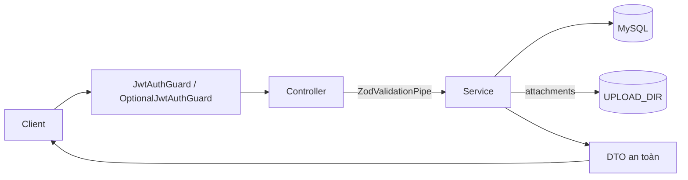

> **Status:** Draft — generated from code survey on 2026-06-15
> **Last updated:** 2026-06-15
> **Owners:** TODO: confirm

# Notes Module

Module `notes` quản lý toàn bộ miền ghi chú của ứng dụng: ghi chú (notes), notebook phân cấp, tag, file đính kèm, liên kết nội bộ giữa các ghi chú (mention `@`), khóa nội dung bằng mật khẩu, và chia sẻ note/notebook qua link công khai hoặc lời mời theo email. Tất cả tài nguyên đều thuộc về một người dùng (`userId`) và được scope chặt ở tầng service. Đây là module backend lớn nhất theo số lượng controller/entity; tài liệu này mô tả cấu trúc mã nguồn để bảo trì, không lặp lại đặc tả API hay UX (xem các doc tính năng đã có).

## Document Map

- [Root CLAUDE.md](../../../CLAUDE.md) · [Architecture index](../../architecture.md)
- [Backend architecture](../../architecture/backend.md) — quy ước controller/service/entity dùng chung.
- [Notes feature overview](../../features/notes/overview.md) — đặc tả tính năng và UX (tiếng Việt), nguồn chính cho hành vi nghiệp vụ.
- [Notes API](../../api/notes.md) — hợp đồng HTTP chi tiết (request/response, mã lỗi).
- [Crypto & secrets](../../infra/crypto-secrets/README.md) — cách mật khẩu khóa ghi chú được lưu/kiểm tra.

## Module Purpose

- Trách nhiệm chính:
  - CRUD ghi chú (`NotesService`) kèm tìm kiếm full-text + LIKE fallback và phân trang.
  - Cây notebook có cha/con, chống vòng lặp, và khóa lan xuống con cháu (`NotebooksService`).
  - Tag dùng chung trong phạm vi user, unique theo `(userId, name)`, tự tạo khi gán (`TagsService`).
  - File đính kèm lưu trên đĩa dưới `UPLOAD_DIR`, kiểm tra MIME/kích thước và chống path traversal (`AttachmentsService`).
  - Liên kết nội bộ giữa ghi chú (mention `@`) và backlinks, đồng bộ từ HTML mỗi lần lưu (`note_references`).
  - Khóa nội dung bằng mật khẩu (per-note flag + cascade từ notebook), kiểm tra mật khẩu qua `SettingsService`.
  - Chia sẻ note/notebook qua link công khai (`view`) hoặc lời mời theo email (`SharesService` + route công khai `PublicShareController`).
- Phạm vi:
  - THUỘC module: notes, notebooks, tags, attachments, shares/invites, note-references, logic khóa nội dung.
  - KHÔNG thuộc module: lưu/đổi mật khẩu khóa (ở `settings`), xác thực JWT (ở `auth`), thông tin người dùng (ở `users`). Module này chỉ phụ thuộc vào `SettingsModule` và `UsersModule`.

## Primary Entrypoints

| Layer | Entrypoint | Purpose |
|-------|-----------|---------|
| Controller | `apps/backend/src/notes/notes.controller.ts` | `@Controller("notes")` — list/findOne/create/update/remove + `lock`/`unlock`/`reveal`. |
| Controller | `apps/backend/src/notes/notebooks.controller.ts` | `@Controller("notebooks")` — CRUD notebook + `lock`/`unlock`. |
| Controller | `apps/backend/src/notes/tags.controller.ts` | `@Controller("tags")` — list/create/remove tag. |
| Controller | `apps/backend/src/notes/attachments.controller.ts` | `@Controller()` — `notes/:noteId/attachments` (list/upload), `attachments/:id` (download/remove). |
| Controller | `apps/backend/src/notes/shares.controller.ts` | `@Controller("shares")` — cấu hình chia sẻ cho chủ sở hữu. |
| Controller | `apps/backend/src/notes/public-share.controller.ts` | `@Controller("share")` — route công khai cho người nhận link (`OptionalJwtAuthGuard`). |
| Service | `apps/backend/src/notes/notes.service.ts` | Nghiệp vụ ghi chú, tìm kiếm, khóa, đồng bộ note-references, dựng DTO. |
| Service | `apps/backend/src/notes/notebooks.service.ts` | Cây notebook, chống chu trình, `lockedNotebookIds`/`descendantIds`. |
| Service | `apps/backend/src/notes/tags.service.ts` | Tag + `ensureMany` (idempotent get-or-create). |
| Service | `apps/backend/src/notes/attachments.service.ts` | Ghi/đọc file trên đĩa, `safeJoin`, whitelist MIME, giới hạn dung lượng. |
| Service | `apps/backend/src/notes/shares.service.ts` | Chia sẻ polymorphic, resolve token, kiểm soát quyền theo link/email. |
| Entity | `apps/backend/src/notes/entities/note.entity.ts` | Bảng `notes`; `content_html`/`content_text` (MEDIUMTEXT), ManyToMany `note_tags`. |
| Entity | `apps/backend/src/notes/entities/notebook.entity.ts` | Bảng `notebooks`; self-reference `parent_id`. |
| Entity | `apps/backend/src/notes/entities/tag.entity.ts` | Bảng `tags`; unique `(user_id, name)`. |
| Entity | `apps/backend/src/notes/entities/attachment.entity.ts` | Bảng `attachments`; `stored_path` (không expose). |
| Entity | `apps/backend/src/notes/entities/share.entity.ts` | Bảng `shares`; unique `(resource_type, resource_id)` + token unique. |
| Entity | `apps/backend/src/notes/entities/share-invite.entity.ts` | Bảng `share_invites`; unique `(share_id, email)`. |
| Entity | `apps/backend/src/notes/entities/note-reference.entity.ts` | Bảng `note_references`; cạnh `from→to`, CASCADE hai phía. |
| Shared schema | `packages/shared/src/notes.ts` | Schema note/attachment/note-link + input/query. |
| Shared schema | `packages/shared/src/notebooks.ts` | Schema notebook + input. |
| Shared schema | `packages/shared/src/tags.ts` | Schema tag + `tagNameSchema`. |
| Shared schema | `packages/shared/src/shares.ts` | Schema share + payload công khai cho người nhận. |
| Frontend | `apps/frontend/src/pages/NotesPage.tsx` | Trang Notes (state, TanStack Query). TODO: confirm các trang/route liên quan khác (share công khai). |

> Đường dẫn trong bảng là tuyệt đối từ repo root.

## Core Supporting Objects

- `apps/backend/src/notes/util/extract-note-refs.ts` — `extractNoteRefIds(html)`: bóc `data-note-id` từ các `` bằng regex, trả id duy nhất (lowercase). Không parse cả cây HTML.
- `apps/backend/src/notes/util/html-to-text.ts` — `htmlToText(html)` (dựng `content_text` cho tìm kiếm) và `excerpt(text, max=200)` (cắt đoạn xem trước, gắn `…`).
- `apps/backend/src/notes/notes.module.ts` — đăng ký 7 entity qua `TypeOrmModule.forFeature`, 6 controller, 5 service; import `SettingsModule` + `UsersModule`; export `NotesService`/`NotebooksService`/`TagsService`/`AttachmentsService`.
- `ZodValidationPipe` (`apps/backend/src/common/pipes/zod-validation.pipe.ts`) — validate body/query/param theo schema shared tại biên controller.
- `JwtAuthGuard` / `OptionalJwtAuthGuard` + `@CurrentUser()` / `@OptionalUser()` (module `auth`) — lấy user; route công khai chỉ dùng email (nếu có) để kiểm tra invite.
- `SettingsService.hasNotesLock` / `requireNotesLock` — kiểm tra mật khẩu khóa ghi chú (xem [Crypto & secrets](../../infra/crypto-secrets/README.md)).
- `UsersService.findById` — lấy `name` chủ sở hữu để hiển thị trên trang share.
- Hàm dựng DTO nội bộ (`toDto`/`toSharedNotePayload`...) — chỉ map các field an toàn ra ngoài (không gồm `storedPath`, `userId` của chủ trong payload công khai).

## Data Flow

Luồng request đồng bộ điển hình (mọi route đi qua global prefix `api`):

- Tìm kiếm ghi chú (`NotesService.list`): nếu `q.length >= 2` dùng `MATCH(title, content_text) AGAINST (... IN BOOLEAN MODE)` (full-text ngram) HOẶC `LIKE` fallback; nếu `q` ngắn hơn chỉ dùng `LIKE`. Query danh sách chỉ select metadata + `LEFT(content_text, 300)` để dựng excerpt, KHÔNG kéo `content_html`/`content_text` đầy đủ (cả hai là MEDIUMTEXT). Tags nạp riêng bằng một query nhẹ trên `note_tags` để tránh nhân dòng.
- Đồng bộ liên kết nội bộ (`syncReferences`, gọi trong `create`/`update`): parse mention từ HTML → lọc id thật sự là note của user và bỏ self-reference → `delete` toàn bộ ref cũ của note nguồn rồi `insert` tập mới (idempotent).
- Khóa hiệu lực (effective lock): `is_locked` riêng của note HOẶC một notebook tổ tiên bị khóa (`lockedNotebookIds` duyệt cây). `findOne` strip nội dung khi bị khóa; `reveal`/`unlock` yêu cầu mật khẩu qua `SettingsService`.
- Upload file (`AttachmentsService.upload`): validate MIME/size → ghi file vào `UPLOAD_DIR/<userId>/<YYYYMM>/<uuid><ext>` → lưu metadata (`stored_path` tương đối) vào DB. Download (`openStream`) resolve đường dẫn qua `safeJoin` (chặn `..`) rồi `res.sendFile`.
- Chia sẻ công khai (`PublicShareController` → `SharesService.resolve`): resolve token → kiểm tra `linkAccess` (`view` cho mọi người, `none` yêu cầu email được mời + đăng nhập) → trả payload read-only. Với share một note, người nhận đi theo liên kết mention (BFS `reachableNoteIds`, chỉ chiều `from→to`) để xem các note liên quan.
- Async/queue: KHÔNG có hàng đợi hay worker trong module này. Mọi side effect (ghi DB, ghi/xóa file đĩa, đồng bộ references) đều đồng bộ trong vòng đời request. Các bảng `shares` là polymorphic, không có FK tới `notes`/`notebooks`, nên khi xóa note/notebook service phải tự `delete` bản ghi share tương ứng.

## When To Touch Which File

| If you want to… | Edit | Then also… |
|-----------------|------|------------|
| Thêm field persist cho note/notebook/tag/attachment/share | entity tương ứng trong `apps/backend/src/notes/entities/` (vd `note.entity.ts`) + migration mới trong `apps/backend/src/database/migrations` | cập nhật schema shared tương ứng + hàm `toDto` + cả frontend (`synchronize: false`). |
| Đổi shape API note | `packages/shared/src/notes.ts` | `notes.controller.ts` + `notes.service.ts` + frontend (`apps/frontend/src/lib/api.ts`, `NotesPage.tsx`). |
| Đổi shape API notebook/tag/share | `packages/shared/src/{notebooks,tags,shares}.ts` | controller + service tương ứng + frontend. |
| Sửa logic tìm kiếm / excerpt | `notes.service.ts` (hàm `list`, `toBooleanQuery`, `escapeLike`) + `util/html-to-text.ts` | TODO: confirm migration cho full-text index `(title, content_text)` ngram. |
| Đổi quy tắc parse mention `@` | `util/extract-note-refs.ts` | đảm bảo frontend serialize đúng `data-note-id` trong HTML. |
| Đổi quy tắc khóa nội dung | `notes.service.ts` / `notebooks.service.ts` (`lockedNotebookIds`, `isEffectivelyLocked`) | xác minh phần kiểm tra mật khẩu ở `SettingsService`. |
| Đổi whitelist MIME / giới hạn dung lượng / nơi lưu file | `attachments.service.ts` (`ALLOWED_MIME`, `maxBytes`, `uploadDir`) | biến môi trường `UPLOAD_DIR`, `UPLOAD_MAX_MB`. |
| Đổi quy tắc chia sẻ | `shares.service.ts` (`resolveAccess`, `assertNotLocked`, `reachableNoteIds`) | `packages/shared/src/shares.ts` + `shares.controller.ts`/`public-share.controller.ts`. |

## Permission & Access Rules

- Scoping theo `userId`: tất cả controller owner-facing áp `@UseGuards(JwtAuthGuard)` và lấy user qua `@CurrentUser()`. Mọi truy vấn DB trong service đều scope theo `userId`/`ownerUserId`; tài nguyên lồng nhau (attachment, share) kiểm tra quyền sở hữu note/notebook cha trước khi đọc/ghi (`assertOwnership`).
- Route công khai (`/api/share/...`) dùng `OptionalJwtAuthGuard`: không bắt buộc đăng nhập. `linkAccess = "view"` cho mọi người; `linkAccess = "none"` chỉ cho phép email nằm trong invites VÀ đã đăng nhập đúng email (ngược lại trả `share_login_required`/`share_forbidden`). Tài nguyên đang khóa hiệu lực bị ẩn (404) và không thể bật link/invite (`assertNotLocked`).
- `ParseUUIDPipe` áp cho mọi route ID; `resourceType` của share validate qua `shareResourceTypeSchema`.
- Dữ liệu KHÔNG được expose ra DTO:
  - `attachments.stored_path` — chỉ dùng nội bộ để resolve file; DTO `Attachment` không có field này.
  - Trong payload công khai (`SharedResource`/`SharedNotePayload`): KHÔNG lộ `userId` của chủ, email/credential, hay `storedPath`. Chỉ trả `ownerName` (tên hiển thị).
  - `share.token` chỉ trả cho CHỦ SỞ HỮU qua `/api/shares/...`, không xuất hiện trong payload người nhận.
  - Theo quy ước chung của repo: không expose password hash, refresh-token hash, khóa/blob mã hóa, hay credential provider — module này không chạm tới các field đó.
- Mật khẩu khóa ghi chú không được lưu/kiểm tra trong module notes; ủy quyền hoàn toàn cho `SettingsService` (xem [Crypto & secrets](../../infra/crypto-secrets/README.md)).

## Legacy / Operational Notes

- Schema là migrations (`apps/backend/src/database/migrations`), KHÔNG dùng entity auto-sync (`synchronize: false`). Thêm field cần sửa cả entity và migration.
- Tìm kiếm dựa trên full-text index ngram trên `(title, content_text)` cộng LIKE fallback cho truy vấn ngắn/một phần. Ngưỡng token tối thiểu cho full-text là `FT_MIN_TOKEN = 2`. TODO: confirm tên migration tạo index này.
- Cột `content_html`/`content_text` là MEDIUMTEXT; query danh sách cố tình tránh select chúng (chỉ lấy `LEFT(content_text, 300)`), giữ nguyên ràng buộc này khi sửa `list`.
- Biến môi trường liên quan: `UPLOAD_DIR` (mặc định `/data/uploads`), `UPLOAD_MAX_MB` (mặc định 20). File ghi theo cây `<userId>/<YYYYMM>/<uuid><ext>`; phần mở rộng được `sanitizeExt` làm sạch.
- Bảng `shares` polymorphic, không có FK tới `notes`/`notebooks` → khi xóa note/notebook, service tự dọn cấu hình share (`shares.delete(...)`). `share_invites` dọn theo CASCADE từ `shares`.
- `note_references` CASCADE theo cả `from_note_id` lẫn `to_note_id`; xóa note tự dọn liên kết liên quan, nhưng `syncReferences` vẫn rebuild tập ref mỗi lần lưu note nguồn.

## Where To Start Reading For Maintenance

1. `apps/backend/src/notes/notes.module.ts` — bản đồ controller/service/entity của module.
2. `packages/shared/src/notes.ts` (rồi `notebooks.ts`/`tags.ts`/`shares.ts`) — hợp đồng dữ liệu giữa front/back.
3. `apps/backend/src/notes/notes.service.ts` — logic trung tâm: list/search, khóa, đồng bộ references, dựng DTO.
4. `apps/backend/src/notes/notebooks.service.ts` — cây notebook + khóa cascade (`lockedNotebookIds`, `descendantIds`).
5. `apps/backend/src/notes/shares.service.ts` + `public-share.controller.ts` — luồng chia sẻ và kiểm soát quyền công khai.
6. `apps/backend/src/notes/attachments.service.ts` — lưu trữ file trên đĩa và `safeJoin`.
7. Tham chiếu chéo: [Notes feature overview](../../features/notes/overview.md) và [Notes API](../../api/notes.md) cho hành vi/hợp đồng chi tiết.

## Related Modules

- [Notes feature overview](../../features/notes/overview.md) — đặc tả tính năng & UX (không lặp lại ở đây).
- [Notes API](../../api/notes.md) — hợp đồng HTTP chi tiết của module.
- [Crypto & secrets](../../infra/crypto-secrets/README.md) — kiểm tra mật khẩu khóa ghi chú (qua `SettingsService`).
- [Backend architecture](../../architecture/backend.md) — quy ước controller/service/entity dùng chung.
- Settings module — `apps/backend/src/settings` (TODO: confirm doc tương ứng `../settings/README.md`).
- Users module — `apps/backend/src/users` (TODO: confirm doc tương ứng `../users/README.md`).

## Document History

| Date | Change | Author |
|------|--------|--------|
| 2026-06-15 | Initial draft generated from code survey | TODO: confirm |
