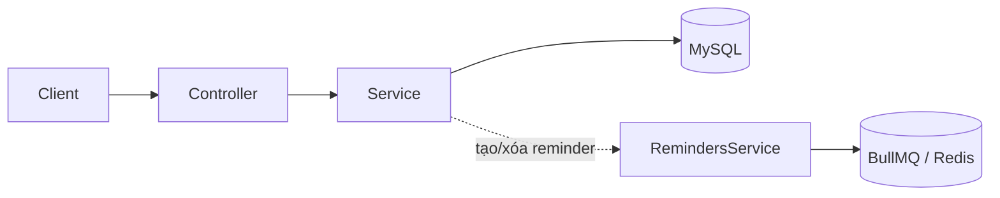
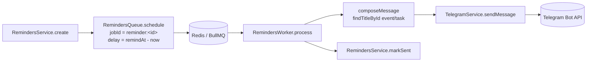

> **Status:** Draft — generated from code survey on 2026-06-15
> **Last updated:** 2026-06-15
> **Owners:** TODO: confirm

# Schedule Module

Module `schedule` quản lý ba loại dữ liệu lịch của người dùng: **sự kiện** (events), **công việc** (tasks) và **nhắc nhở** (reminders). Ngoài CRUD đồng bộ qua HTTP, module còn lên lịch nhắc nhở chạy nền bằng BullMQ trên Redis và gửi thông báo qua Telegram đúng thời điểm `remindAt`. Đây là nơi duy nhất trong backend kết nối dữ liệu lịch với hàng đợi nền và bot Telegram.

## Document Map

- [Root CLAUDE.md](../../../CLAUDE.md) · [Architecture index](../../architecture.md) · [Backend architecture](../../architecture/backend.md)
- Tích hợp nền: [BullMQ queues](../../infra/queue-bullmq/README.md) · [Telegram](../../platforms/telegram/README.md)
- Phụ thuộc: Settings module (giải mã token Telegram + `telegramChatId`) — xem `../settings/README.md` (TODO: confirm đường dẫn doc settings).

## Module Purpose

- CRUD **events**: tiêu đề, mô tả, thời gian bắt đầu/kết thúc, cờ cả ngày, địa điểm; lọc theo khoảng thời gian.
- CRUD **tasks**: tiêu đề, mô tả, độ ưu tiên, trạng thái (`todo`/`doing`/`done`), deadline, thời điểm hoàn thành; lọc theo trạng thái/độ ưu tiên.
- CRUD **reminders**: gắn vào một event hoặc task (`targetType` + `targetId`), lưu `remindAt`, lên lịch job BullMQ và đánh dấu `sentAt` khi đã gửi.
- Khi tạo event/task có `remindAt`, tự động tạo reminder tương ứng; khi xóa event/task, tự động xóa reminder gắn với nó.
- Gửi nhắc nhở qua Telegram (worker nền) và endpoint thử nghiệm kết nối Telegram.
- **KHÔNG thuộc module này:** lưu trữ/giải mã bí mật Telegram (bot token, chat id) — việc đó nằm ở Settings module; module này chỉ gọi `SettingsService` để lấy cấu hình đã giải mã.

## Primary Entrypoints

| Layer | Entrypoint | Purpose |
|-------|-----------|---------|
| Module | `apps/backend/src/schedule/schedule.module.ts` | Khai báo controllers, services, queue, worker; đăng ký 3 entity với TypeORM; import `ConfigModule` + `SettingsModule`. |
| Controller | `apps/backend/src/schedule/events.controller.ts` | HTTP CRUD cho `events` (prefix `/api/events`). |
| Controller | `apps/backend/src/schedule/tasks.controller.ts` | HTTP CRUD cho `tasks` (prefix `/api/tasks`). |
| Controller | `apps/backend/src/schedule/reminders.controller.ts` | HTTP cho `reminders` + endpoint `POST /api/reminders/telegram/test`. |
| Service | `apps/backend/src/schedule/events.service.ts` | Business rules + persistence cho event; tạo/xóa reminder liên quan. |
| Service | `apps/backend/src/schedule/tasks.service.ts` | Business rules + persistence cho task; xử lý `completedAt` theo trạng thái. |
| Service | `apps/backend/src/schedule/reminders.service.ts` | Persistence reminder + lên lịch/hủy job qua queue; `markSent`. |
| Service | `apps/backend/src/schedule/telegram.service.ts` | Gọi Telegram Bot API `sendMessage`; resolve cấu hình từ Settings. |
| Queue | `apps/backend/src/schedule/reminders.queue.ts` | Wrapper BullMQ `Queue` (`reminders`): `schedule` (delay theo `remindAt`) + `cancel`. |
| Worker | `apps/backend/src/schedule/reminders.worker.ts` | BullMQ `Worker` xử lý job `send`: soạn nội dung → gửi Telegram → `markSent`. |
| Entity | `apps/backend/src/schedule/entities/event.entity.ts` | Bảng `events`. |
| Entity | `apps/backend/src/schedule/entities/task.entity.ts` | Bảng `tasks`. |
| Entity | `apps/backend/src/schedule/entities/reminder.entity.ts` | Bảng `reminders` (chứa `job_id` BullMQ — không expose ra DTO). |
| Shared schema | `packages/shared/src/events.ts` | Zod schema + types cho event (`createEventInputSchema`, `eventSchema`, …). |
| Shared schema | `packages/shared/src/tasks.ts` | Zod schema + types cho task (enum `priority`/`status`). |
| Shared schema | `packages/shared/src/reminders.ts` | Zod schema cho reminder + `telegramTestSchema`. |
| Frontend | `apps/frontend/src/pages/SchedulePage.tsx` | Trang lịch phía client (state, query/mutation). TODO: confirm chi tiết hành vi UI. |

> Đường dẫn trong bảng là tuyệt đối từ repo root.

## Core Supporting Objects

- `ZodValidationPipe` (`apps/backend/src/common/pipes/zod-validation.pipe.ts`) — validate body/query theo input schema tại controller.
- `JwtAuthGuard` + `@CurrentUser()` (`apps/backend/src/auth/...`) — xác thực và cấp `UserEntity` cho mọi handler.
- `ParseUUIDPipe` — kiểm tra định dạng UUID cho tham số route `:id`.
- `RemindersQueue` — hằng `REMINDERS_QUEUE_NAME = "reminders"`, interface `ReminderJobData`; `defaultJobOptions`: `attempts: 3`, backoff `exponential` 30s, `removeOnComplete` (age 86400s / count 1000), `removeOnFail` (age 7 ngày).
- `RemindersWorker` — `concurrency: 4`; dùng `forwardRef` cho `EventsService`, `TasksService`, `RemindersService` (tránh circular dependency); hàm `escapeHtml` + `formatVN` (định dạng `vi-VN`, timezone `Asia/Ho_Chi_Minh`).
- `TelegramService` — hằng `TELEGRAM_BASE = "https://api.telegram.org"`, `REQUEST_TIMEOUT_MS = 10000` (AbortController); `resolveConfig` gọi `SettingsService.decryptTelegramToken` + `getForUser`.
- Hàm `toDto` cục bộ trong mỗi service — map entity → DTO (chuyển `Date` sang ISO string, ép `allDay` về boolean).
- `findTitleById` trên `EventsService`/`TasksService` — chỉ lấy `title` (+ `startAt`/`deadline`) để worker soạn nội dung nhắc nhở.

## Data Flow

Luồng đồng bộ (CRUD):

1. Request đi qua `JwtAuthGuard` → `@CurrentUser()` cung cấp `user`.
2. Controller validate body/query bằng `ZodValidationPipe`, validate `:id` bằng `ParseUUIDPipe`, rồi gọi service với `user.id`.
3. Service truy vấn/ghi MySQL, **mọi query scope theo `userId`**, trả về DTO (hoặc `204 No Content` cho delete).
4. Khi `create` event/task có `remindAt`: service gọi `RemindersService.create(...)` với `targetType` tương ứng. Khi `remove`: gọi `removeByTarget(userId, targetType, id)` trước khi xóa.

Luồng async (nhắc nhở qua Telegram):

- `RemindersService.create` lưu reminder (`sentAt = null`, `jobId = null`), gọi `queue.schedule(...)`, nhận `jobId = reminder:<reminderId>` và lưu lại vào cột `job_id`.
- Worker (`concurrency: 4`) nhận job `send`, soạn nội dung từ event/task (HTML, escape, giờ VN). Nếu target đã bị xóa → log cảnh báo, vẫn `markSent` và bỏ qua gửi.
- `TelegramService.sendMessage` lấy token (đã giải mã) + `chatId` từ Settings; nếu chưa cấu hình → log cảnh báo và bỏ qua (không ném lỗi). Gọi `POST /bot<token>/sendMessage` với `parse_mode: HTML`, timeout 10s.
- Hủy reminder hoặc xóa event/task → `queue.cancel(jobId)` gỡ job khỏi BullMQ rồi xóa bản ghi.

## When To Touch Which File

| If you want to… | Edit | Then also… |
|-----------------|------|------------|
| Thêm field persist cho event/task/reminder | entity tương ứng `apps/backend/src/schedule/entities/{event,task,reminder}.entity.ts` + migration mới (`migration:generate`) | cập nhật shared schema (`packages/shared/src/{events,tasks,reminders}.ts`) + service `toDto`/`create`/`update` + frontend |
| Đổi shape API event/task/reminder | `packages/shared/src/events.ts` \| `tasks.ts` \| `reminders.ts` | controller, service, và frontend (`lib/api.ts` parse lại response) |
| Thêm/đổi endpoint | controller tương ứng (`*.controller.ts`) | thêm method service + (nếu cần) shared schema |
| Đổi quy tắc lên lịch/retry job | `reminders.queue.ts` (`defaultJobOptions`, `schedule`) | kiểm tra `reminders.worker.ts` |
| Đổi nội dung/định dạng tin nhắn nhắc nhở | `reminders.worker.ts` (`composeMessage`, `formatVN`) | — |
| Đổi cách gọi Telegram | `telegram.service.ts` | xác nhận Settings cung cấp đúng token/chatId |
| Thêm `targetType` mới cho reminder | `packages/shared/src/reminders.ts` (enum) + entity enum + migration | `reminders.worker.ts` (`composeMessage`) + service tạo reminder |

## Permission & Access Rules

- Cả ba controller (`events`, `tasks`, `reminders`) đều gắn `@UseGuards(JwtAuthGuard)`; không có route công khai.
- `user` lấy qua `@CurrentUser()`; **mọi truy vấn service được scope theo `userId`** (ví dụ `where("e.user_id = :userId")`, `findOne({ where: { id, userId } })`). Không tìm thấy → ném `NotFoundException` với `code` ổn định (`event_not_found` / `task_not_found` / `reminder_not_found`) và message tiếng Việt.
- Reminder gắn vào event/task được xác minh gián tiếp qua `userId`: worker chỉ soạn nội dung khi `findTitleById(userId, targetId)` trả về bản ghi của đúng user; reminder mồ côi (target đã xóa) bị bỏ qua gửi.
- Tham số route `:id` luôn qua `ParseUUIDPipe`.
- **KHÔNG expose ra DTO:**
  - `reminders`: cột `job_id` (BullMQ job id nội bộ) — `toDto` không trả `jobId`.
  - Bí mật Telegram (bot token, `telegramChatId`) — không bao giờ nằm trong DTO của module này; token được Settings giải mã AES-256-GCM ở phía server và chỉ dùng nội bộ trong `TelegramService`.
  - Các trường liên kết `user`/`userId` ngoài phạm vi cần thiết không được trả về (DTO chỉ chứa trường nghiệp vụ).

## Legacy / Operational Notes

- **Worker chạy in-process:** `RemindersWorker` khởi tạo BullMQ `Worker` ngay trong tiến trình backend (`onModuleInit`), không phải tiến trình worker riêng. Cần Redis sẵn sàng để lên lịch/gửi nhắc nhở.
- Biến môi trường liên quan: `REDIS_HOST`, `REDIS_PORT`, `REDIS_PASSWORD` (đọc trong `reminders.queue.ts`); cấu hình Telegram (token + chat id) lấy từ user settings, không từ env.
- `RemindersQueue.schedule`/`cancel` được viết phòng thủ: nếu queue chưa khởi tạo hoặc lỗi thì log và trả `null`/bỏ qua thay vì ném lỗi ra request.
- `ReminderEntity` **không có cột `updatedAt`** (chỉ `createdAt`), khác với event/task — lưu ý khi viết migration.
- `markSent` chỉ ghi `sentAt` (không xóa bản ghi); BullMQ tự dọn job theo `removeOnComplete`/`removeOnFail`.
- Telegram chưa cấu hình: `sendMessage` im lặng bỏ qua (chỉ log warn); riêng `sendTest` ném `BadRequestException` (`telegram_not_configured`).
- TODO: confirm hành vi frontend `SchedulePage.tsx` và các query key TanStack Query liên quan.

## Where To Start Reading For Maintenance

1. `apps/backend/src/schedule/schedule.module.ts` — bản đồ tổng thể providers/controllers/entities.
2. `packages/shared/src/events.ts`, `tasks.ts`, `reminders.ts` — hợp đồng dữ liệu (đọc trước khi đổi API).
3. `events.controller.ts` / `tasks.controller.ts` / `reminders.controller.ts` → service tương ứng — luồng CRUD đồng bộ.
4. `reminders.service.ts` → `reminders.queue.ts` → `reminders.worker.ts` → `telegram.service.ts` — luồng nhắc nhở nền (theo đúng thứ tự này).
5. `entities/*.entity.ts` — cấu trúc bảng và index khi cần thêm field/migration.

## Related Modules

- [Telegram](../../platforms/telegram/README.md) — kênh gửi nhắc nhở (Bot API).
- [BullMQ queues](../../infra/queue-bullmq/README.md) — hạ tầng hàng đợi/worker cho reminders.
- Settings module — cung cấp token Telegram đã giải mã + `telegramChatId` (TODO: confirm đường dẫn `../settings/README.md`).
- [Backend architecture](../../architecture/backend.md) — quy ước chung controller/service/entity.

## Document History

| Date | Change | Author |
|------|--------|--------|
| 2026-06-15 | Initial draft generated from code survey | TODO: confirm |
