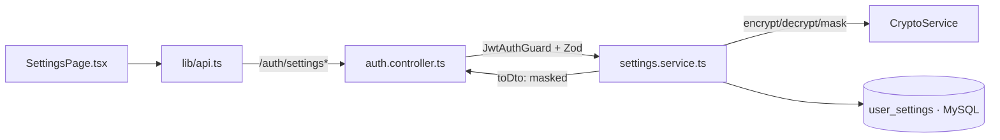
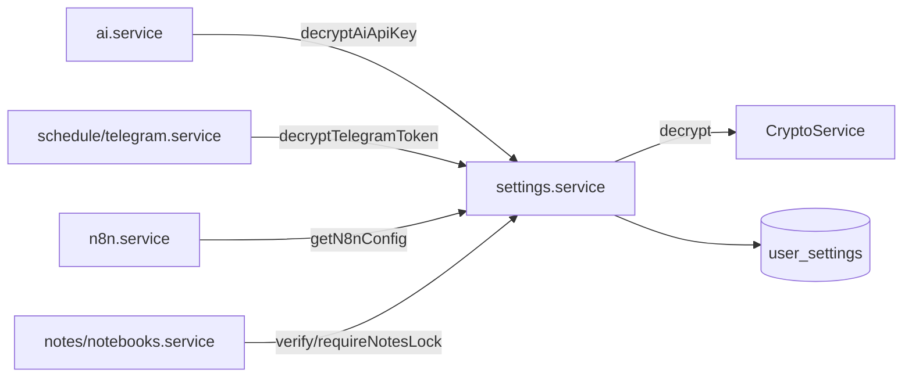

> **Status:** Draft — generated from code survey on 2026-06-15
> **Last updated:** 2026-06-15
> **Owners:** TODO: confirm

# Settings Module

Module quản lý cấu hình theo từng người dùng: provider AI, theme, ví mặc định, mật khẩu khóa ghi chú, barem chấm điểm "Matching Job", và các bí mật tích hợp bên ngoài (API key AI, Telegram bot token, n8n API key). Tất cả bí mật được lưu **mã hóa AES-256-GCM** (riêng mật khẩu khóa ghi chú băm bằng bcrypt) và **không bao giờ** trả plaintext ra DTO — API chỉ trả giá trị đã masked hoặc cờ boolean. Module này không tự sở hữu route HTTP riêng; các endpoint được gắn vào controller `auth` dưới tiền tố `/auth/settings`.

## Document Map

- [Root CLAUDE.md](../../../CLAUDE.md) · [Architecture index](../../architecture.md)
- [Backend architecture](../../architecture/backend.md) — mô hình phân tầng controller → service → entity.
- [Crypto & secrets](../../infra/crypto-secrets/README.md) — chi tiết `CryptoService` (encrypt/decrypt/mask).
- [AI module](../../modules/ai/README.md) — bên tiêu thụ `decryptAiApiKey`.
- [Telegram](../../platforms/telegram/README.md) — bên tiêu thụ `decryptTelegramToken`.
- [n8n](../../platforms/n8n/README.md) — bên tiêu thụ `getN8nConfig`.

## Module Purpose

- Lưu và phục vụ bản ghi cấu hình 1-1 với mỗi user (`user_settings`).
- Mã hóa/giải mã các bí mật theo user qua `CryptoService` (AES-256-GCM): API key AI, Telegram bot token, n8n API key.
- Quản lý mật khẩu khóa ghi chú (bcrypt): đặt/đổi/xác minh/xóa; khi xóa thì mở khóa toàn bộ note + notebook của user.
- Lưu barem chấm điểm "Matching Job" (`jobMatchPrefs`) dưới dạng JSON thường (không nhạy cảm), chuẩn hóa trước khi ghi.
- Cung cấp các getter giải mã cho module khác tiêu thụ (AI, Telegram, n8n) mà không lộ secret ra ngoài tầng API.
- **Không thuộc phạm vi:** route HTTP đặt trong `auth` controller; thuật toán mã hóa nằm ở `common/crypto`; logic verify thực tế của AI/Telegram/n8n nằm ở module tương ứng. Profile user (tên, email) thuộc module `users`/`auth`, không phải module này.

## Primary Entrypoints

| Layer | Entrypoint | Purpose |
|-------|-----------|---------|
| Controller | `apps/backend/src/auth/auth.controller.ts` | Host các route `/auth/settings*` (không có controller riêng cho settings); validate body bằng Zod, gắn `JwtAuthGuard`, ủy quyền cho `SettingsService`. |
| Service | `apps/backend/src/settings/settings.service.ts` | Toàn bộ business rule + persistence: upsert settings, mã hóa/giải mã/mask secret, quản lý mật khẩu khóa ghi chú, barem job-match. |
| Module | `apps/backend/src/settings/settings.module.ts` | Đăng ký repository `UserSettingsEntity`, export `SettingsService` cho các module khác. |
| Entity | `apps/backend/src/settings/user-settings.entity.ts` | Bảng `user_settings` (PK = `user_id`, OneToOne tới `users`). |
| Shared schema | `packages/shared/src/settings.ts` | Schema/Zod cho DTO `UserSettings`, input update, và notes-lock; nguồn sự thật của shape API. |
| Frontend (page) | `apps/frontend/src/pages/SettingsPage.tsx` | Màn hình cấu hình; sở hữu state + TanStack Query. |
| Frontend (API) | `apps/frontend/src/lib/api.ts` | Hàm gọi `/auth/settings*` và parse response bằng `userSettingsSchema` / `jobMatchProfileSchema`. |

> Đường dẫn trong bảng là tuyệt đối từ repo root.

## Core Supporting Objects

- `CryptoService` (`apps/backend/src/common/crypto/crypto.service.ts`) — `encrypt`, `decrypt`, `mask`; mọi secret đi qua đây.
- `ZodValidationPipe` (`apps/backend/src/common/pipes/zod-validation.pipe.ts`) — validate body theo schema `@assistant/shared` tại biên controller.
- `JwtAuthGuard` + `@CurrentUser()` (`apps/backend/src/auth/`) — xác thực và lấy user; mọi route settings đều scope theo `user.id`.
- `normalizeJobMatchProfile` (từ `@assistant/shared`) — chuẩn hóa barem job-match trước khi đọc/ghi.
- `normalizeBaseUrl` (hàm cục bộ trong `settings.service.ts`) — bỏ dấu `/` cuối base URL n8n.
- `N8nConfig` (interface trong `settings.service.ts`) — `{ baseUrl, apiKey }` đã giải mã, dùng để gọi public API n8n.
- `toDto` (private) — map entity → `UserSettings`, mask secret và chỉ phơi bày `hasNotesLock` (boolean), không bao giờ trả blob mã hóa hay hash.
- Bên tiêu thụ `SettingsService` (qua export của module): `ai.service.ts` (`decryptAiApiKey`), `schedule/telegram.service.ts` (`decryptTelegramToken`), `n8n.service.ts` (`getN8nConfig`), `notes.service.ts` + `notebooks.service.ts` (`requireNotesLock`/`verifyNotesLock`), `auth.service.ts` (`initForUser` khi tạo user — TODO: confirm điểm gọi chính xác).

## Data Flow

Luồng request đồng bộ (đọc/ghi settings từ frontend):

Các endpoint (đều dưới tiền tố global `api`, controller `@Controller("auth")`, đều gắn `JwtAuthGuard`):

- `GET /auth/settings` → `getForUser` → trả `UserSettings` (ném `settings_not_found` nếu chưa có bản ghi).
- `PATCH /auth/settings` → `update` → upsert; nếu chưa có bản ghi thì tự `initForUser`. Các field secret (`aiApiKey`, `telegramBotToken`, `n8nApiKey`) được `crypto.encrypt`; truyền `null` để xóa secret. `n8nBaseUrl` được chuẩn hóa bỏ `/` cuối.
- `GET /auth/settings/job-match` → `getJobMatchProfile` → barem đã chuẩn hóa (mặc định nếu chưa cấu hình).
- `PUT /auth/settings/job-match` → `updateJobMatchProfile` → ghi trọn barem (chuẩn hóa trước khi lưu).
- `POST /auth/settings/notes-lock` (HTTP 200) → `setNotesLock` → đặt mới hoặc đổi (bắt buộc `currentPassword` đúng nếu đã có hash), băm bcrypt cost 12.
- `DELETE /auth/settings/notes-lock` (HTTP 200) → `clearNotesLock` → xác minh mật khẩu, xóa hash, **đồng thời** chạy `UPDATE notes/notebooks SET is_locked = 0 WHERE user_id = ?` để không khóa vĩnh viễn.

Luồng cross-module (không qua HTTP của module này) — secret được giải mã ngay khi cần:

## When To Touch Which File

| If you want to… | Edit | Then also… |
|-----------------|------|------------|
| Thêm field cấu hình persist | `apps/backend/src/settings/user-settings.entity.ts` + migration mới trong `apps/backend/src/database/migrations` | cập nhật `packages/shared/src/settings.ts` + `toDto`/`update` trong service + frontend |
| Đổi shape API settings | `packages/shared/src/settings.ts` (sửa schema TRƯỚC) | `auth.controller.ts` + `settings.service.ts` + `apps/frontend/src/lib/api.ts` + `SettingsPage.tsx` |
| Thêm/đổi secret mã hóa | `settings.service.ts` (`update`/`toDto` + getter giải mã) | dùng `CryptoService.encrypt/decrypt/mask`; đảm bảo DTO chỉ trả masked |
| Đổi quy tắc mật khẩu khóa ghi chú | `settings.service.ts` (`setNotesLock`/`verifyNotesLock`/`clearNotesLock`) + schema notes-lock | kiểm tra side-effect mở khóa note/notebook |
| Thêm route settings mới | `apps/backend/src/auth/auth.controller.ts` | thêm method service tương ứng + hàm `api.ts` |

## Permission & Access Rules

- **Authentication:** mọi route settings áp dụng `JwtAuthGuard`; user lấy qua `@CurrentUser()`.
- **Ownership/scoping:** mọi truy vấn scope theo `userId` (PK của `user_settings` chính là `user_id`). Không có endpoint nào nhận `userId` từ phía client.
- **Validation:** body validate bằng schema `@assistant/shared` (`updateSettingsInputSchema` ở chế độ `.strict()`, `setNotesLockInputSchema`, `verifyNotesLockInputSchema`, `updateJobMatchProfileInputSchema`).
- **KHÔNG được expose ra DTO:** các cột mã hóa `aiApiKeyEnc`, `telegramBotTokenEnc`, `n8nApiKeyEnc` (chỉ trả `*Masked`); hash bcrypt `notesLockHash` (chỉ trả cờ `hasNotesLock`); quan hệ `user`; `updatedAt` không nằm trong DTO. Mật khẩu khóa và mọi secret không bao giờ trả plaintext.
- **Mã hóa:** secret tích hợp dùng AES-256-GCM qua `CryptoService`; mật khẩu khóa ghi chú băm bcrypt (cost 12). `jobMatchPrefs` không nhạy cảm nên lưu JSON thường, không mã hóa.

## Legacy / Operational Notes

- Module không có controller riêng: các endpoint nằm trong `auth.controller.ts` dưới `/auth/settings*` (lưu ý khi tìm route).
- `update` và `setNotesLock`/`updateJobMatchProfile` đều **lazily init** bản ghi nếu chưa tồn tại (`initForUser`); nhưng `getForUser` lại ném `settings_not_found` khi thiếu bản ghi — bản ghi mặc định thường được tạo lúc đăng ký.
- `clearNotesLock` thực hiện **raw SQL** mở khóa `notes` và `notebooks`; nếu thay đổi tên cột `is_locked`/`user_id` phải cập nhật cả hai câu lệnh này.
- Biến môi trường liên quan: `ENCRYPTION_KEY` (64 hex) bắt buộc để `CryptoService` hoạt động — xem [Crypto & secrets](../../infra/crypto-secrets/README.md).
- `synchronize: false`: thêm field mới phải có migration đi kèm và đăng ký entity trong `apps/backend/src/database/data-source.ts`.

## Where To Start Reading For Maintenance

1. `packages/shared/src/settings.ts` — hiểu shape DTO/input là hợp đồng API.
2. `apps/backend/src/settings/user-settings.entity.ts` — các field persist và field nào nhạy cảm.
3. `apps/backend/src/settings/settings.service.ts` — toàn bộ logic mã hóa/mask, notes-lock, job-match (bắt đầu từ `toDto` và `update`).
4. `apps/backend/src/auth/auth.controller.ts` — cách route gắn guard và validate.
5. `apps/frontend/src/lib/api.ts` + `apps/frontend/src/pages/SettingsPage.tsx` — phía tiêu thụ.

## Related Modules

- [Crypto & secrets](../../infra/crypto-secrets/README.md) — cung cấp encrypt/decrypt/mask cho mọi secret.
- [AI module](../../modules/ai/README.md) — đọc API key AI đã giải mã.
- [Telegram](../../platforms/telegram/README.md) — đọc bot token đã giải mã để gửi nhắc lịch.
- [n8n](../../platforms/n8n/README.md) — đọc `N8nConfig` để gọi public API n8n.
- [Backend architecture](../../architecture/backend.md) — mô hình tầng controller/service/entity dùng chung.

## Document History

| Date | Change | Author |
|------|--------|--------|
| 2026-06-15 | Initial draft generated from code survey | TODO: confirm |
