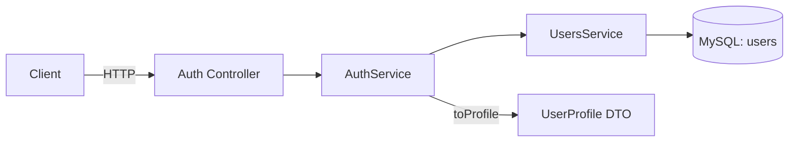

> **Status:** Draft — generated from code survey on 2026-06-15
> **Last updated:** 2026-06-15
> **Owners:** TODO: confirm

# Users Module

Module `users` quản lý thực thể người dùng gốc của hệ thống — bảng `users` là ranh giới tenant chính mà hầu hết các domain khác tham chiếu qua `user_id`. Module này chỉ cung cấp một service tra cứu/tạo người dùng (`UsersService`) và entity `UserEntity`; nó **không có controller HTTP riêng**. Các module khác (đặc biệt là `auth`) sử dụng nó để xác thực, đăng ký và liên kết tài khoản Google.

## Document Map

- [Root CLAUDE.md](../../../CLAUDE.md) · [Architecture index](../../architecture.md) · [Backend architecture](../../architecture/backend.md)
- Module tiêu thụ trực tiếp: [Auth module](../../modules/auth/README.md), [Settings module](../../modules/settings/README.md)

## Module Purpose

- Định nghĩa `UserEntity` (bảng `users`) — danh tính người dùng gốc, là khóa tenant cho toàn bộ ứng dụng.
- Cung cấp `UsersService` với các thao tác tra cứu và tạo người dùng: `findByEmail`, `findById`, `findByGoogleId`, `create`, `linkGoogle`.
- Export `UsersService` để các module khác (`auth`, `notes`) inject và dùng lại.
- **KHÔNG thuộc phạm vi module này:**
  - Cấp/đổi/refresh JWT, hash mật khẩu, đăng nhập/đăng ký, OAuth Google → thuộc [Auth module](../../modules/auth/README.md).
  - Tùy chọn người dùng, secret mã hóa (AI key, Telegram token) → thuộc [Settings module](../../modules/settings/README.md).
  - Không có endpoint HTTP nào, không có guard, không có queue/worker trong module này.

## Primary Entrypoints

| Layer | Entrypoint | Purpose |
|-------|-----------|---------|
| Module | `apps/backend/src/users/users.module.ts` | Đăng ký `TypeOrmModule.forFeature([UserEntity])`, provide + export `UsersService`. |
| Service | `apps/backend/src/users/users.service.ts` | Tra cứu (`findByEmail`/`findById`/`findByGoogleId`), tạo (`create`) và liên kết Google (`linkGoogle`) người dùng. |
| Entity | `apps/backend/src/users/entities/user.entity.ts` | Map bảng `users`; quan hệ tới `UserSettingsEntity` (1-1) và `RefreshTokenEntity` (1-n). |
| Shared schema | `packages/shared/src/auth.ts` | `userProfileSchema` / `UserProfile` — shape công khai của người dùng dùng cho API (do `auth` trả về). |
| Migration | `apps/backend/src/database/migrations/1716600000000-init.ts` | Tạo bảng `users` (cùng `user_settings`, `refresh_tokens`). |

> Đường dẫn trong bảng là tuyệt đối từ repo root.
>
> Controller: không có — module này không tự expose HTTP. TODO: confirm có frontend nào đọc/sửa trực tiếp `users` ngoài luồng auth/settings không (hiện hồ sơ người dùng được phục vụ qua `auth`).

## Core Supporting Objects

- `UserEntity` (`apps/backend/src/users/entities/user.entity.ts`): các cột `id` (UUID, PK), `email` (varchar 254, unique), `passwordHash` (`password_hash`, varchar 60, nullable — chứa bcrypt hash), `googleId` (`google_id`, varchar 64, nullable, unique một phần khi `google_id IS NOT NULL`), `name` (varchar 100), `avatarUrl` (`avatar_url`, varchar 500, nullable), `createdAt`/`updatedAt` (`DATETIME(6)`). Quan hệ: `@OneToOne` → `UserSettingsEntity`, `@OneToMany` → `RefreshTokenEntity`.
- `AuthService.toProfile()` (`apps/backend/src/auth/auth.service.ts`): mapper chuyển `UserEntity` thành `UserProfile` công khai — đây là nơi duy nhất quyết định field nào của user lộ ra ngoài.
- `userProfileSchema` (`packages/shared/src/auth.ts`): hợp đồng Zod cho hồ sơ người dùng công khai gồm `id`, `email`, `name`, `avatarUrl`, `createdAt`.

## Data Flow

`UsersService` không phục vụ request trực tiếp; nó được gọi từ trong tầng `auth`. Luồng đồng bộ tiêu biểu:

- **Đăng ký** (`AuthService.register`): `users.findByEmail` để chặn trùng email → `users.create({ email, passwordHash, googleId: null, name })` → `settings.initForUser` + `categories.seedDefaults`.
- **Đăng nhập** (`AuthService.login`): `users.findByEmail` → so khớp bcrypt với `passwordHash`.
- **Xác thực JWT** (`JwtStrategy.validate`, `apps/backend/src/auth/strategies/jwt.strategy.ts`): `users.findById(payload.sub)`; nếu không thấy → ném `UnauthorizedException` (`code: user_not_found`).
- **OAuth Google** (`GoogleStrategy.validate`, `apps/backend/src/auth/strategies/google.strategy.provider.ts`): `users.findByGoogleId` → fallback `users.findByEmail`; nếu chưa có thì `users.create({ ..., googleId })` + `settings.initForUser` + `categories.seedDefaults`; nếu user có sẵn nhưng chưa liên kết Google thì `users.linkGoogle(user.id, profile.id)`.
- **Chia sẻ ghi chú** (`apps/backend/src/notes/shares.service.ts`): inject `UsersService` để phân giải người dùng được chia sẻ. TODO: confirm chi tiết phương thức được dùng tại shares.
- Async/queue: **không có** queue hay worker trong module này.

## When To Touch Which File

| If you want to… | Edit | Then also… |
|-----------------|------|------------|
| Thêm field persist cho người dùng | `apps/backend/src/users/entities/user.entity.ts` + migration mới trong `apps/backend/src/database/migrations` | Nếu field cần lộ ra API: cập nhật `userProfileSchema` ở `packages/shared/src/auth.ts` và `AuthService.toProfile`. |
| Đổi cách tra cứu/tạo người dùng | `apps/backend/src/users/users.service.ts` | Kiểm tra các consumer: `auth.service.ts`, `jwt.strategy.ts`, `google.strategy.provider.ts`, `notes/shares.service.ts`. |
| Đổi shape hồ sơ người dùng công khai | `packages/shared/src/auth.ts` (`userProfileSchema`) | `AuthService.toProfile` (backend) + nơi frontend parse `UserProfile`. |
| Thêm quan hệ tới domain mới | `apps/backend/src/users/entities/user.entity.ts` (`@OneToMany`/`@OneToOne`) + entity phía kia | Migration tạo FK `user_id` REFERENCES `users(id)`. |

## Permission & Access Rules

- `UserEntity` **là gốc tenant**, không bị scope theo `userId` như các bảng domain khác; thay vào đó `users.id` chính là `user_id` mà mọi bảng khác tham chiếu (FK `ON DELETE CASCADE`).
- Các phương thức tra cứu (`findById`/`findByEmail`/`findByGoogleId`) là lookup toàn cục, **chỉ được gọi từ tầng `auth`** trong quá trình xác thực/đăng ký — không expose qua HTTP. Email luôn được hạ về chữ thường trước khi lưu/tra cứu.
- Bản thân module không gắn guard. Việc bảo vệ truy cập thuộc về consumer: `JwtAuthGuard` (qua `JwtStrategy`) ở các controller khác, `GoogleStrategy` cho luồng OAuth.
- **KHÔNG được expose ra DTO:** `passwordHash` (bcrypt hash) và `googleId`. DTO công khai duy nhất là `UserProfile` (`id`, `email`, `name`, `avatarUrl`, `createdAt`) tạo bởi `AuthService.toProfile`; mọi field nhạy cảm bị loại bỏ tại mapper này.

## Legacy / Operational Notes

- Cột `password_hash` có thể `NULL` đối với tài khoản chỉ đăng nhập bằng Google; `login` từ chối user không có `passwordHash` (`code: invalid_credentials`).
- `google_id` dùng unique index một phần (`WHERE google_id IS NOT NULL`) để cho phép nhiều user chưa liên kết Google cùng tồn tại với `google_id = NULL`.
- Schema là source-of-truth ở migration `1716600000000-init.ts` (`synchronize: false`). Thêm field mới phải cập nhật **cả** entity **và** một migration mới.
- Bảng dùng `utf8mb4_unicode_ci`, timestamp `DATETIME(6)` (UTC), id `CHAR(36)`.
- Không có biến môi trường riêng cho module này; OAuth phụ thuộc `GOOGLE_CLIENT_ID`/`GOOGLE_CLIENT_SECRET`/`GOOGLE_CALLBACK_URL` thuộc tầng `auth`.

## Where To Start Reading For Maintenance

1. `apps/backend/src/users/entities/user.entity.ts` — hiểu hình dạng dữ liệu người dùng và quan hệ.
2. `apps/backend/src/users/users.service.ts` — các thao tác sẵn có và quy ước (hạ chữ thường email, `linkGoogle`).
3. `apps/backend/src/users/users.module.ts` — cách module được wire và export.
4. `apps/backend/src/auth/auth.service.ts` + `strategies/jwt.strategy.ts` + `strategies/google.strategy.provider.ts` — các consumer chính và `toProfile`.
5. `packages/shared/src/auth.ts` (`userProfileSchema`) — hợp đồng DTO công khai.

## Related Modules

- [Auth module](../../modules/auth/README.md) — consumer chính: đăng ký/đăng nhập/refresh, JWT & Google strategy, và mapper `toProfile`.
- [Settings module](../../modules/settings/README.md) — quan hệ 1-1 `UserEntity.settings`; `settings.initForUser` được gọi khi tạo user.
- TODO: confirm doc cho module `notes` (shares) tại `../../modules/notes/README.md` — `shares.service.ts` inject `UsersService`.

## Document History

| Date | Change | Author |
|------|--------|--------|
| 2026-06-15 | Initial draft generated from code survey | TODO: confirm |
