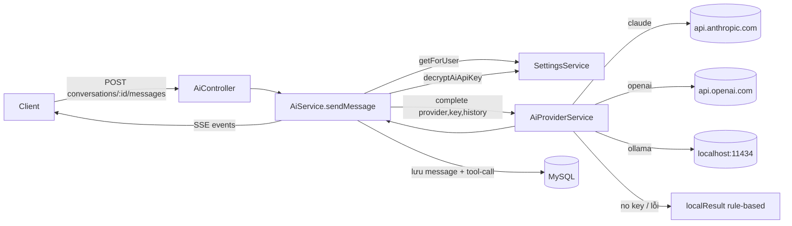

> **Status:** Draft — generated from code survey on 2026-06-15
> **Last updated:** 2026-06-15
> **Owners:** TODO: confirm

# AI Providers Integration

Lớp trừu tượng đa nhà cung cấp (multi-provider) cho tính năng chat AI và tool calling. Nó nhận một danh sách message hội thoại, chọn nhà cung cấp theo cấu hình của người dùng, gọi API tương ứng (Claude / OpenAI / Ollama) và chuẩn hóa kết quả về một shape chung `AiProviderResult`. Khi không có API key (hoặc nhà cung cấp lỗi), nó rơi xuống một fallback nội bộ dựa trên luật (rule-based) để chat không bao giờ "chết". Lớp này tồn tại để phần còn lại của module `ai` không phải biết chi tiết của từng nhà cung cấp.

## Document Map

- [Root CLAUDE.md](../../../CLAUDE.md) · [Architecture index](../../architecture.md)
- [Backend architecture](../../architecture/backend.md) — mô hình layered (controller → service).
- [AI module](../../modules/ai/README.md) — hội thoại, message, tool-call, SSE streaming.
- [Settings module](../../modules/settings/README.md) — nơi lưu `aiProvider` và API key đã mã hóa.
- [Crypto & secrets](../../infra/crypto-secrets/README.md) — AES-256-GCM cho API key per-user.

## Module Purpose

- Cung cấp một entrypoint duy nhất `AiProviderService.complete(provider, apiKey, messages)` trả về `AiProviderResult` chuẩn hóa (`content`, `provider`, `model`, `inputTokens`, `outputTokens`, `toolCalls`).
- Hỗ trợ ba nhà cung cấp được khai báo trong `aiProviderSchema`: `claude`, `openai`, `ollama`.
- Phát hiện tool call cần chạy (`detectToolCalls`) và thực thi chúng qua `AiToolsService` trên dữ liệu của chính người dùng.
- Cung cấp fallback rule-based (`localResult` / `fallbackText`) khi thiếu key hoặc nhà cung cấp trả lỗi.
- **KHÔNG thuộc module này:** lưu trữ hội thoại/message/tool-call và luồng SSE (thuộc [AI module](../../modules/ai/README.md)); lưu và mã hóa API key (thuộc [Settings module](../../modules/settings/README.md) + [Crypto & secrets](../../infra/crypto-secrets/README.md)); business logic của notes/lịch/chi tiêu (các module domain tương ứng).

## Primary Entrypoints

| Layer | Entrypoint | Purpose |
|-------|-----------|---------|
| Service | `apps/backend/src/ai/ai-provider.service.ts` | Chọn nhà cung cấp, gọi API (Claude/OpenAI/Ollama), chuẩn hóa kết quả, fallback rule-based. |
| Service | `apps/backend/src/ai/ai-tools.service.ts` | Thực thi tool call (đã validate bằng `aiToolInputSchemas`) trên dữ liệu của `userId`. |
| Service | `apps/backend/src/ai/ai.service.ts` | Orchestrator: lấy `aiProvider` + key đã giải mã từ settings, gọi `complete`, lưu message và tool-call. |
| Controller | `apps/backend/src/ai/ai.controller.ts` | HTTP adapter: `JwtAuthGuard`, SSE message, xác nhận tool call. |
| Shared schema | `packages/shared/src/ai.ts` | `aiToolNameSchema`, `aiToolInputSchemas`, `aiToolCallSchema`, `aiStreamEventSchema`, các input schema. |
| Shared schema | `packages/shared/src/settings.ts` | `aiProviderSchema` (`claude`/`openai`/`ollama`) — nguồn của type `AiProvider`. |
| Service (settings) | `apps/backend/src/settings/settings.service.ts` | `getForUser` (lấy `aiProvider`) và `decryptAiApiKey` (giải mã key per-user). |

> Đường dẫn trong bảng là tuyệt đối từ repo root.

## Core Supporting Objects

- `AiProviderMessage` / `AiProviderToolCall` / `AiProviderResult` (`ai-provider.service.ts`) — các interface contract nội bộ giữa orchestrator và lớp provider.
- `systemPrompt` (`ai-provider.service.ts`) — prompt hệ thống tiếng Việt gửi kèm cho mọi nhà cung cấp.
- `localResult` / `fallbackText` (`ai-provider.service.ts`) — sinh câu trả lời rule-based khi không có key hoặc API lỗi; `model` được đặt là `"local-rule-based"`.
- `detectToolCalls` (`ai-provider.service.ts`) — heuristic dựa trên từ khóa của message cuối; hiện chỉ phát hiện `searchNotes`. TODO: confirm liệu có dự định mở rộng heuristic này.
- `aiToolInputSchemas` (`packages/shared/src/ai.ts`) — bản đồ Zod schema cho từng tool, dùng để `parse` `rawArgs` trước khi thực thi.
- `isCreateTool` (`ai.service.ts`) — tool có tên bắt đầu bằng `create` sẽ ở trạng thái `pending` (chờ người dùng xác nhận), các tool khác chạy ngay (`executed`).

## Data Flow

Luồng chat đồng bộ (controller dùng SSE nhưng `AiService.sendMessage` chạy đồng bộ rồi phát các event một lần):

Các bước chính trong `AiService.sendMessage`:

1. Xác minh hội thoại thuộc `userId` (`findConversation`) rồi lưu message của người dùng.
2. Lấy 20 message gần nhất làm history; gọi `settings.getForUser(userId)` để lấy `aiProvider` và `settings.decryptAiApiKey(userId)` để lấy API key đã giải mã.
3. Gọi `provider.complete(aiProvider, apiKey, history)`. Trong `complete`: nếu thiếu `apiKey` và provider không phải `ollama` thì trả `localResult`; nếu là `claude`/`openai`/`ollama` thì gọi API tương ứng, và khi `!res.ok` cũng rơi về `localResult`.
4. Lưu message của assistant kèm `provider`/`model`/token usage.
5. Với mỗi tool call phát hiện: tool `create*` được lưu `pending` (chờ xác nhận); tool còn lại chạy ngay qua `tools.execute` và lưu `result`.
6. Phát các event `message` → `delta` → `tool_call*` → `done` (theo `aiStreamEventSchema`).

Luồng xác nhận tool call (bất đồng bộ với lần chat, do người dùng kích hoạt sau):

- `PATCH ai/tool-calls/:id` → `AiService.confirmToolCall`. Truy vấn join `tool-call → message → conversation` và lọc theo `c.user_id = :userId`. Nếu `approved=false` đặt `rejected`; nếu `true` gọi `tools.execute(userId, name, arguments)`, lưu `result` và đặt `executed`.

Không có queue/worker trong lớp này — mọi lời gọi API nhà cung cấp là `fetch` đồng bộ trong request.

## When To Touch Which File

| If you want to… | Edit | Then also… |
|-----------------|------|------------|
| Thêm một nhà cung cấp mới | `aiProviderSchema` trong `packages/shared/src/settings.ts` | thêm nhánh trong `AiProviderService.complete` + một method `complete<Provider>` trong `apps/backend/src/ai/ai-provider.service.ts`; cập nhật UI chọn provider ở settings frontend (TODO: confirm) |
| Đổi model mặc định của một nhà cung cấp | `apps/backend/src/ai/ai-provider.service.ts` (chuỗi `model` trong `complete<Provider>`) | kiểm tra fallback `model` khi response thiếu trường `model` |
| Thêm/sửa một tool | `aiToolNameSchema` + `aiToolInputSchemas` trong `packages/shared/src/ai.ts` | thêm nhánh `case` trong `apps/backend/src/ai/ai-tools.service.ts`; nếu là tool tạo dữ liệu, lưu ý quy ước tên `create*` ⇒ `pending` |
| Đổi heuristic phát hiện tool | `detectToolCalls` trong `apps/backend/src/ai/ai-provider.service.ts` | đảm bảo tên tool khớp `aiToolNameSchema` |
| Đổi prompt hệ thống | `systemPrompt` trong `apps/backend/src/ai/ai-provider.service.ts` | — |
| Đổi cách lấy/giải mã key | `decryptAiApiKey` / `getForUser` trong `apps/backend/src/settings/settings.service.ts` | xem [Crypto & secrets](../../infra/crypto-secrets/README.md) |

## Permission & Access Rules

- Mọi endpoint của controller `ai` áp dụng `JwtAuthGuard`; người dùng lấy qua `@CurrentUser()` và `user.id` được truyền xuống service.
- Hội thoại được scope theo `userId` (`findConversation` lọc `id + userId`). Xác nhận tool call (`confirmToolCall`) join lên conversation và lọc `c.user_id = :userId` — không truy cập được tool call của người khác.
- `AiToolsService.execute` luôn gọi các service domain với `userId` đầu tiên, nên tool chỉ đọc/ghi dữ liệu của chính người dùng (notes, lịch, task, giao dịch, ngân sách, báo cáo).
- `rawArgs` của tool luôn được `parse` bằng `aiToolInputSchemas.<tool>` trước khi thực thi — không tin dữ liệu do model sinh ra.
- API key được lưu **mã hóa** (`aiApiKeyEnc`) và chỉ giải mã ngay trước khi gọi API (`decryptAiApiKey`). **KHÔNG được expose** trong DTO: key thô/blob mã hóa; DTO settings chỉ trả `aiApiKeyMasked` (giá trị đã mask qua `crypto.mask`). Không log API key. Header `x-api-key` (Claude) và `Authorization: Bearer` (OpenAI) chỉ tồn tại trong request `fetch` outbound.

## Legacy / Operational Notes

- **Fallback rule-based:** nếu thiếu key (provider khác `ollama`) hoặc API trả lỗi/không kết nối được, hệ thống trả câu trả lời tĩnh tiếng Việt với `model = "local-rule-based"` và `inputTokens/outputTokens = null`. Chat sẽ không báo lỗi cho người dùng trong các trường hợp này.
- **Ollama:** mặc định gọi `http://localhost:11434/api/chat` (model `llama3.1`), không cần API key; lỗi kết nối được nuốt qua `.catch(() => null)` rồi rơi về fallback.
- **Endpoint/model hardcode:** URL và tên model của từng nhà cung cấp đang hardcode trong service (Claude `claude-3-5-sonnet-20241022` + `anthropic-version: 2023-06-01`; OpenAI `gpt-4o-mini`; Ollama `llama3.1`). TODO: confirm liệu có dự định đưa các giá trị này vào config/env.
- `detectToolCalls` hiện chỉ nhận diện `searchNotes` từ từ khóa "tìm" + "note/ghi chú"; các tool khác chỉ được tạo khi nhà cung cấp/luồng khác sinh ra. TODO: confirm phạm vi mong muốn.
- TODO: confirm các biến môi trường liên quan (ví dụ override endpoint/model, base URL của Ollama) — không thấy đọc env trong `ai-provider.service.ts`.

## Where To Start Reading For Maintenance

1. `apps/backend/src/ai/ai.service.ts` — xem orchestrator gọi settings → provider → tools như thế nào (đặc biệt `sendMessage`).
2. `apps/backend/src/ai/ai-provider.service.ts` — logic chọn provider, gọi API, chuẩn hóa kết quả và fallback.
3. `packages/shared/src/ai.ts` — danh sách tool, schema input và shape stream event.
4. `apps/backend/src/ai/ai-tools.service.ts` — cách từng tool ánh xạ sang service domain với `userId`.
5. `apps/backend/src/settings/settings.service.ts` (`getForUser`, `decryptAiApiKey`) — cách provider và key được resolve per-user.

## Related Modules

- [AI module](../../modules/ai/README.md) — chủ sở hữu hội thoại/message/tool-call và luồng SSE; gọi lớp provider này.
- [Settings module](../../modules/settings/README.md) — lưu `aiProvider` và API key đã mã hóa của người dùng.
- [Crypto & secrets](../../infra/crypto-secrets/README.md) — mã hóa/giải mã/mask API key per-user (AES-256-GCM).
- [Backend architecture](../../architecture/backend.md) — quy ước controller/service áp dụng cho module này.

## Document History

| Date | Change | Author |
|------|--------|--------|
| 2026-06-15 | Initial draft generated from code survey | TODO: confirm |
