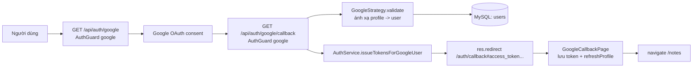

> **Status:** Draft — generated from code survey on 2026-06-15
> **Last updated:** 2026-06-15
> **Owners:** TODO: confirm

# Google OAuth Integration

Tích hợp đăng nhập bằng Google (OAuth 2.0) cho ứng dụng. Người dùng bấm "Đăng nhập với Google", backend dùng chiến lược Passport `passport-google-oauth20` để xác thực với Google, tự động tạo hoặc liên kết tài khoản nội bộ, rồi phát hành cặp JWT (access + refresh) và chuyển hướng về trang callback của frontend. Toàn bộ tính năng chỉ được bật khi có biến môi trường `GOOGLE_CLIENT_ID` và `GOOGLE_CLIENT_SECRET`; nếu thiếu, luồng này bị vô hiệu hóa một cách an toàn.

## Document Map

- [Root CLAUDE.md](../../../CLAUDE.md) · [Architecture index](../../architecture.md)
- [Backend architecture](../../architecture/backend.md) — thiết kế phân lớp controller/service.
- [Auth module](../../modules/auth/README.md) — module đăng nhập/đăng ký gốc và việc phát hành JWT.
- Liên quan: [Users module](../../modules/users/README.md), [Settings module](../../modules/settings/README.md), [Expense module](../../modules/expense/README.md) (seed danh mục mặc định khi tạo người dùng mới).

## Module Purpose

- Cung cấp luồng đăng nhập một chạm bằng tài khoản Google trên cùng cơ chế phiên (JWT access/refresh) như đăng nhập bằng email/mật khẩu.
- Tự động khởi tạo người dùng mới từ hồ sơ Google (email, tên hiển thị, ảnh đại diện) hoặc liên kết Google ID vào tài khoản email đã tồn tại.
- Khởi tạo dữ liệu khởi đầu cho người dùng mới: cấu hình mặc định (`SettingsService`) và danh mục chi tiêu mặc định (`CategoriesService`).
- THUỘC phạm vi module này: chiến lược Passport Google, controller `auth/google`, trang callback ở frontend, và việc đổi hồ sơ Google lấy JWT nội bộ.
- KHÔNG thuộc phạm vi: phát hành/làm mới JWT cốt lõi, đăng nhập bằng mật khẩu, quản lý refresh token (xem [Auth module](../../modules/auth/README.md)); lưu trữ và mã hóa secret người dùng (xem [Settings module](../../modules/settings/README.md)).

## Primary Entrypoints

| Layer | Entrypoint | Purpose |
|-------|-----------|---------|
| Controller | `apps/backend/src/auth/google.controller.ts` | `GET /api/auth/google` khởi động luồng OAuth; `GET /api/auth/google/callback` nhận callback từ Google, phát hành JWT và redirect về frontend. |
| Strategy / Provider | `apps/backend/src/auth/strategies/google.strategy.provider.ts` | Đăng ký chiến lược Passport `"google"` (chỉ khi có credentials); `validate()` ánh xạ hồ sơ Google → người dùng nội bộ (tìm / tạo / liên kết). |
| Service | `apps/backend/src/auth/auth.service.ts` | `issueTokensForGoogleUser(user)` phát hành cặp JWT cho người dùng đã xác thực qua Google. |
| Service | `apps/backend/src/users/users.service.ts` | `findByGoogleId`, `findByEmail`, `create`, `linkGoogle` — tra cứu, tạo và liên kết tài khoản Google. |
| Entity | `apps/backend/src/users/entities/user.entity.ts` | Cột `google_id` (`googleId`, unique khi không null) lưu liên kết tới tài khoản Google. |
| Frontend | `apps/frontend/src/pages/GoogleCallbackPage.tsx` | Đọc token từ URL fragment, lưu vào storage, làm mới hồ sơ rồi điều hướng vào ứng dụng. |
| Frontend (route) | `apps/frontend/src/router.tsx` | Đăng ký route công khai `/auth/callback` → `GoogleCallbackPage`. |

> Đường dẫn trong bảng là tuyệt đối từ repo root.

## Core Supporting Objects

- `AuthGuard("google")` (`@nestjs/passport`) — guard áp lên cả hai endpoint của controller; chính nó kích hoạt luồng redirect tới Google và xử lý callback.
- `GoogleStrategyProvider` — wrapper được Nest khởi tạo; nếu thiếu `GOOGLE_CLIENT_ID`/`GOOGLE_CLIENT_SECRET` thì chỉ log cảnh báo và KHÔNG đăng ký chiến lược (luồng bị vô hiệu hóa).
- `GoogleStrategy` (lớp nội bộ kế thừa `PassportStrategy(Strategy, "google")`) — cấu hình `clientID`, `clientSecret`, `callbackURL` và `scope: ["email", "profile"]`; chứa hàm `validate()`.
- `SettingsService.initForUser(userId)` và `CategoriesService.seedDefaults(userId)` — chạy khi tạo người dùng mới từ Google.
- `tokenStorage` (`apps/frontend/src/lib/storage.ts`) — lưu `accessToken`/`refreshToken`/`expiresIn` ở frontend.
- `useAuth().refreshProfile()` (`apps/frontend/src/features/auth/AuthContext.tsx`) — nạp lại hồ sơ sau khi có token.
- Biến môi trường: `GOOGLE_CLIENT_ID`, `GOOGLE_CLIENT_SECRET`, `GOOGLE_CALLBACK_URL`, `BACKEND_PUBLIC_URL` (xác thực trong `apps/backend/src/config/env.validation.ts`).

## Data Flow

Luồng đồng bộ (redirect-based, không có queue/background):

Các bước chi tiết:

1. Frontend mở `GET /api/auth/google`. `AuthGuard("google")` chuyển hướng người dùng tới màn hình đồng ý của Google. Nếu OAuth chưa cấu hình, `start()` ném `ServiceUnavailableException` với `{ code: "google_oauth_disabled", message: "Google OAuth chưa được cấu hình" }`.
2. Google gọi lại `GET /api/auth/google/callback`. Trước khi handler chạy, `AuthGuard("google")` kích hoạt `GoogleStrategy.validate()`.
3. `validate()` lấy email (chữ thường) từ `profile.emails[0]`. Nếu không có email → trả lỗi. Ngược lại tra cứu người dùng theo `findByGoogleId(profile.id)`, sau đó theo `findByEmail(email)`.
   - Nếu chưa tồn tại: `users.create(...)` với `passwordHash: null`, `googleId`, `name`, `avatarUrl`; rồi `settings.initForUser` và `categories.seedDefaults`.
   - Nếu đã tồn tại nhưng chưa có `googleId`: `users.linkGoogle(user.id, profile.id)`.
4. Handler `callback()`: nếu không có `req.user` → `res.redirect("/login?error=google_failed")`. Ngược lại gọi `auth.issueTokensForGoogleUser(req.user)` lấy `accessToken`/`refreshToken`/`expiresIn`, đóng gói vào `URLSearchParams` và `res.redirect("/auth/callback#<params>")` (token nằm trong URL fragment, không phải query string).
5. `GoogleCallbackPage` đọc `window.location.hash`, parse `access_token`/`refresh_token`/`expires_in`. Nếu đủ token → `tokenStorage.save(...)` rồi `refreshProfile()` và điều hướng `/notes`. Nếu thiếu → điều hướng `/login`.

- Async flow: Không có luồng queue/worker. TODO: confirm — biến `frontendCallback` (dựng từ `BACKEND_PUBLIC_URL`) được tính trong constructor của controller nhưng không thấy dùng trong handler hiện tại (redirect dùng đường dẫn tương đối `"/auth/callback"`).

## When To Touch Which File

| If you want to… | Edit | Then also… |
|-----------------|------|------------|
| Đổi scope/credentials/callback URL của Google | `apps/backend/src/auth/strategies/google.strategy.provider.ts` | cập nhật biến môi trường tương ứng trong `apps/backend/src/config/env.validation.ts` và tài liệu setup |
| Đổi cách ánh xạ hồ sơ Google → người dùng (tạo/liên kết) | `apps/backend/src/auth/strategies/google.strategy.provider.ts` (`validate()`) | xem lại `apps/backend/src/users/users.service.ts` (`create`/`linkGoogle`) và seed `SettingsService`/`CategoriesService` |
| Đổi cách phát hành/định dạng JWT cho người dùng Google | `apps/backend/src/auth/auth.service.ts` (`issueTokensForGoogleUser`/`issueTokens`) | đồng bộ với [Auth module](../../modules/auth/README.md) |
| Đổi URL redirect hoặc cách truyền token về frontend | `apps/backend/src/auth/google.controller.ts` (`callback()`) | cập nhật `apps/frontend/src/pages/GoogleCallbackPage.tsx` để parse đúng định dạng |
| Thêm field persist cho liên kết Google | `apps/backend/src/users/entities/user.entity.ts` + migration mới trong `apps/backend/src/database/migrations` | đăng ký trong `apps/backend/src/database/data-source.ts`; cập nhật shared schema nếu lộ ra DTO |
| Đổi route/điều hướng sau đăng nhập ở frontend | `apps/frontend/src/router.tsx` + `apps/frontend/src/pages/GoogleCallbackPage.tsx` | giữ `/auth/callback` trong danh sách public path |

## Permission & Access Rules

- Cả hai endpoint `auth/google` và `auth/google/callback` được bảo vệ bằng `AuthGuard("google")` — không phải `JwtAuthGuard`; đây là điểm vào công khai để khởi tạo phiên, nên không yêu cầu JWT trước đó.
- Route frontend `/auth/callback` là public path (khai báo trong `apps/frontend/src/router.tsx`), không bị chặn bởi guard đăng nhập.
- Việc ánh xạ tài khoản dựa trên `googleId` (unique khi không null) và `email`; mọi tra cứu/ghi người dùng đi qua `UsersService`. Sau khi phát hành JWT, các tài nguyên khác vẫn được scope theo `userId` thông qua `JwtAuthGuard` + `@CurrentUser()` như mọi module khác.
- KHÔNG được expose ra DTO/response: `passwordHash`, `googleId`, và hash refresh token. Hồ sơ trả về cho frontend chỉ gồm `id`, `email`, `name`, `avatarUrl`, `createdAt` (xem `AuthService.toProfile`).
- Token được truyền về frontend qua URL fragment (`#...`) thay vì query string để giảm rủi ro lộ qua log/referrer. TODO: confirm — đánh giá bảo mật của việc đặt refresh token trong URL fragment.

## Legacy / Operational Notes

- Luồng Google OAuth chỉ hoạt động khi cấu hình đủ `GOOGLE_CLIENT_ID` và `GOOGLE_CLIENT_SECRET`. Nếu thiếu: `GoogleStrategyProvider` không đăng ký chiến lược (log cảnh báo "Google OAuth disabled"), và `start()` ném `ServiceUnavailableException` (`code: google_oauth_disabled`).
- Biến môi trường liên quan được validate khi khởi động trong `apps/backend/src/config/env.validation.ts`: `GOOGLE_CLIENT_ID`/`GOOGLE_CLIENT_SECRET` mặc định rỗng (optional), `GOOGLE_CALLBACK_URL`, và `BACKEND_PUBLIC_URL` (mặc định `http://localhost:3000`).
- Người dùng tạo qua Google có `passwordHash = null` — họ không có mật khẩu cục bộ trừ khi được thiết lập sau. TODO: confirm — có luồng đặt mật khẩu cho tài khoản chỉ-Google hay không.
- Cột `google_id` có unique index theo điều kiện (`WHERE google_id IS NOT NULL`), khớp với migration init `1716600000000-init.ts`.
- `frontendCallback` dựng trong constructor controller hiện chưa được dùng ở handler — TODO: confirm liệu đây là phần thừa hay dự định cho redirect tuyệt đối.

## Where To Start Reading For Maintenance

1. `apps/backend/src/auth/google.controller.ts` — hai endpoint và luồng redirect/issue token (điểm vào của tính năng).
2. `apps/backend/src/auth/strategies/google.strategy.provider.ts` — `validate()` chứa toàn bộ logic tìm/tạo/liên kết người dùng.
3. `apps/backend/src/users/users.service.ts` + `apps/backend/src/users/entities/user.entity.ts` — cách lưu liên kết `googleId`.
4. `apps/backend/src/auth/auth.service.ts` (`issueTokensForGoogleUser`) — phát hành JWT.
5. `apps/frontend/src/pages/GoogleCallbackPage.tsx` + `apps/frontend/src/router.tsx` — phía frontend nhận token và điều hướng.

## Related Modules

- [Auth module](../../modules/auth/README.md) — phát hành JWT, refresh token, đăng nhập bằng mật khẩu (Google OAuth dùng chung cơ chế phiên).
- [Users module](../../modules/users/README.md) — entity `users` và `UsersService` (tra cứu/tạo/liên kết tài khoản).
- [Settings module](../../modules/settings/README.md) — `initForUser` chạy khi tạo người dùng mới.
- [Expense module](../../modules/expense/README.md) — `seedDefaults` tạo danh mục chi tiêu mặc định cho người dùng mới.

## Document History

| Date | Change | Author |
|------|--------|--------|
| 2026-06-15 | Initial draft generated from code survey | TODO: confirm |
