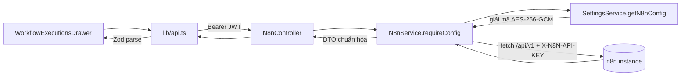

> **Status:** Draft — generated from code survey on 2026-06-15
> **Last updated:** 2026-06-15
> **Owners:** TODO: confirm

# n8n Integration

Module này là một **proxy phía backend** tới public API (`/api/v1/...`) của một instance n8n do người dùng tự cấu hình, dùng để **quản lý workflow executions** ngay trong app (xem ở view Jobs). Backend gọi n8n bằng API key (lưu mã hóa trong settings của từng user), chuẩn hóa payload thô của n8n về các DTO ổn định, rồi frontend parse lại bằng Zod. Không có bảng/DB riêng — dữ liệu execution sống trong n8n; module chỉ đọc/ghi qua API.

## Document Map

- [Root CLAUDE.md](../../../CLAUDE.md) · [Architecture index](../../architecture.md)
- [Backend architecture](../../architecture/backend.md) — kiến trúc phân lớp controller/service.
- [Jobs module](../../modules/jobs/README.md) — drawer "Quản lý Workflow Exc" mở từ view Jobs.
- [Settings module](../../modules/settings/README.md) — nơi lưu Base URL + API key n8n (đã mã hóa).

## Module Purpose

- Liệt kê workflow executions gần đây của n8n (`GET /n8n/executions`), kèm tên workflow (suy ra từ cache `workflowId → name`).
- Thống kê execution trên TOÀN BỘ (quét phân trang qua n8n, đếm theo trạng thái) cho badge số lỗi + bộ lọc (`GET /n8n/executions/stats`).
- Xem chi tiết một execution kèm dữ liệu thô, lỗi đã trích và tags (`GET /n8n/executions/:id`).
- Hành động trên execution: dừng (`stop`), chạy lại (`retry`), xóa (`delete`).
- Phạm vi KHÔNG thuộc module: tạo/sửa workflow, quản lý credential n8n, hay bất kỳ lịch chạy nền/queue nào của app (module này không dùng BullMQ; xem `schedule`/`job-sync`). Việc lưu trữ cấu hình kết nối n8n thuộc về module Settings.

## Primary Entrypoints

| Layer | Entrypoint | Purpose |
|-------|-----------|---------|
| Controller | `apps/backend/src/n8n/n8n.controller.ts` | Route `n8n/executions*`, áp `JwtAuthGuard`, validate id (regex) + body retry (Zod), ủy quyền cho service. |
| Service | `apps/backend/src/n8n/n8n.service.ts` | Proxy `/api/v1` của n8n bằng `X-N8N-API-KEY`, chuẩn hóa DTO, cache tên workflow + thống kê, xử lý retry đồng bộ với "ân hạn". |
| Module | `apps/backend/src/n8n/n8n.module.ts` | Khai báo controller/service; import `SettingsModule` để lấy cấu hình n8n. |
| Shared schema | `packages/shared/src/n8n.ts` | Nguồn sự thật cho `N8nExecution`, `…Detail`, `…Stats`, `…StatusCounts`, `RetryExecutionInput`, `N8nRetryResponse`. |
| Config source | `apps/backend/src/settings/settings.service.ts` | `getN8nConfig(userId)` giải mã `n8nBaseUrl` + `n8nApiKeyEnc` → `{ baseUrl, apiKey }`. |
| Frontend (drawer) | `apps/frontend/src/components/jobs/WorkflowExecutionsDrawer.tsx` | UI list/detail, auto-refresh, lọc theo trạng thái, hành động retry/stop/delete. |
| Frontend (HTTP) | `apps/frontend/src/lib/api.ts` | `listN8nExecutions`, `getN8nExecutionStats`, `getN8nExecution`, `stopN8nExecution`, `retryN8nExecution`, `deleteN8nExecution` — parse response bằng Zod. |

> Đường dẫn trong bảng là tuyệt đối từ repo root.

## Core Supporting Objects

- **`ensureExecutionId` / `EXECUTION_ID_RE`** (controller) — chặn id execution không hợp lệ (`^[A-Za-z0-9_-]{1,64}$`) → ném 400 `n8n_invalid_execution_id` trước khi gọi service.
- **`parseLimit`** (controller) — ép `limit` query về number, bỏ giá trị rác (service tự clamp).
- **`requireConfig`** (service) — lấy `N8nConfig` từ settings; chưa cấu hình → 400 `n8n_not_configured`.
- **`request`** (service) — wrapper `fetch` có timeout/`AbortController`, gắn header `X-N8N-API-KEY`; map lỗi upstream thành 400 (`n8n_unauthorized`) hoặc 503 (`n8n_error`/`n8n_timeout`/`n8n_unreachable`). **Cố ý không bao giờ ném 401.**
- **Bộ chuẩn hóa**: `mapExecution`, `normalizeStatus`, `pickWorkflowName`, `computeRunTime`, `toIso`, `mapTag`, `extractError`, `capJson` (cắt JSON ở `MAX_DATA_JSON_CHARS = 300_000`).
- **Phân trang/đếm**: `unwrapList`, `pickNextCursor`, `clampLimit`, `emptyStatusCounts`.
- **Cache in-memory theo user**: `workflowNames` (TTL 5 phút) và `statsByUser` (TTL 30s); bị xóa khi `retry`/`stop`/`delete` làm số liệu đổi.
- **`N8nConfig`** (`settings.service.ts`) — interface `{ baseUrl, apiKey }` (apiKey đã giải mã, chỉ dùng server-side).
- **Frontend `STATUS_META` / `STATUS_ORDER` / `STOPPABLE`** — nhãn tiếng Việt, thứ tự pill trạng thái, và tập trạng thái còn dừng được (`running`, `waiting`, `new`).

## Data Flow

Luồng request đồng bộ (list/detail/stats/stop/delete):

- Frontend chỉ gọi qua `lib/api.ts` (gắn `Authorization: Bearer`), rồi parse response bằng schema trong `packages/shared/src/n8n.ts`.
- `requireConfig` lấy `{ baseUrl, apiKey }` từ settings của user (apiKey được giải mã từ `n8nApiKeyEnc`); chưa cấu hình → 400.
- `listExecutions` gọi song song lấy tên workflow (cache) + danh sách executions; `getExecutionStats` quét phân trang theo `nextCursor` (tối đa `STATS_MAX_PAGES = 40` trang × `STATS_PAGE_SIZE = 250`), nếu vượt thì `truncated = true`.

Luồng retry (đồng bộ phía n8n + "ân hạn"):

- n8n chạy retry ĐỒNG BỘ — chỉ trả lời khi workflow chạy xong (có thể vài phút). Service phát request với timeout dài (`RETRY_TIMEOUT_MS = 10 phút`) nhưng chỉ **chờ** một khoảng ân hạn ngắn (`RETRY_GRACE_MS = 12s`, dưới timeout Nginx 60s).
- Xong nhanh trong thời gian chờ → `{ status: "completed", executionId }`.
- Lỗi nhanh (key sai/không retry được) → reject ngay, propagate thành lỗi cho người dùng.
- Vẫn đang chạy → trả `{ status: "accepted", executionId: null }`, để promise chạy nền (chỉ log kết quả), người dùng theo dõi ở danh sách tự làm mới.
- Không có queue/worker (BullMQ) trong module này — "chạy nền" chỉ là một promise không await ở tiến trình backend.

## When To Touch Which File

| If you want to… | Edit | Then also… |
|-----------------|------|------------|
| Đổi shape DTO execution/stats/retry | `packages/shared/src/n8n.ts` | cập nhật `mapExecution`/bộ chuẩn hóa trong service + frontend drawer + `lib/api.ts` |
| Thêm/đổi endpoint n8n | `apps/backend/src/n8n/n8n.controller.ts` | thêm method service + hàm trong `apps/frontend/src/lib/api.ts` |
| Đổi cách gọi/chuẩn hóa từ n8n | `apps/backend/src/n8n/n8n.service.ts` | kiểm tra lại schema shared nếu trường mới được trả về |
| Đổi nơi/định dạng lưu Base URL + API key | `apps/backend/src/settings/settings.service.ts` (+ entity/migration settings) | giữ `getN8nConfig` trả `{ baseUrl, apiKey }`; xem [Settings module](../../modules/settings/README.md) |
| Chỉnh UI list/detail/lọc/auto-refresh | `apps/frontend/src/components/jobs/WorkflowExecutionsDrawer.tsx` | giữ nhãn tiếng Việt trong `STATUS_META` |
| Đổi TTL cache / trần quét thống kê | hằng số đầu `apps/backend/src/n8n/n8n.service.ts` | cân nhắc `STATS_REFRESH_MS`/`AUTO_REFRESH_MS` ở drawer |

## Permission & Access Rules

- **Guard:** `@UseGuards(JwtAuthGuard)` ở cấp controller — mọi route yêu cầu đăng nhập.
- **Scoping theo user:** mọi method service nhận `userId` từ `@CurrentUser()` và đi qua `requireConfig(userId)` → `SettingsService.getN8nConfig(userId)`. Mỗi user chỉ thao tác với chính instance n8n của mình; không có truy cập chéo user. (Lưu ý: cô lập dữ liệu thực tế phụ thuộc vào instance n8n mà user cấu hình — TODO: confirm chính sách khi nhiều user trỏ tới cùng một n8n.)
- **Validate đầu vào:** id execution qua regex (`EXECUTION_ID_RE`), body retry qua `retryExecutionInputSchema` (`.strict()`).
- **KHÔNG bao giờ trả 401 ra frontend:** 401/403 từ n8n được map thành 400 `n8n_unauthorized`, tránh interceptor `lib/api.ts` tưởng access token hết hạn rồi refresh/đăng xuất nhầm.
- **Không expose ra DTO:** API key n8n (`cfg.apiKey` đã giải mã), blob mã hóa `n8nApiKeyEnc`, và header `X-N8N-API-KEY`. DTO trả về chỉ gồm `N8nExecution`/`N8nExecutionDetail`/`N8nExecutionStats` (không chứa credential). Ở settings, API key chỉ lộ dưới dạng `n8nApiKeyMasked` (đã che).

## Legacy / Operational Notes

- **Comment lỗi thời:** đầu `packages/shared/src/n8n.ts` và comment trong `apps/frontend/src/lib/api.ts` ghi rằng backend gọi "REST nội bộ" của n8n bằng "cookie `n8n-auth`". Code thực tế (`n8n.service.ts`) gọi **public API `/api/v1`** bằng header **`X-N8N-API-KEY`**. Lấy hành vi trong service làm chuẩn; nên cập nhật lại các comment đó.
- **Cấu hình kết nối** lưu trong settings của user: `n8nBaseUrl` (đã `normalizeBaseUrl`) + `n8nApiKeyEnc` (AES-256-GCM). Người dùng nhập trong màn Cài đặt; thiếu một trong hai → coi như chưa cấu hình.
- **Timeouts:** request thường `REQUEST_TIMEOUT_MS = 15s`; retry `RETRY_TIMEOUT_MS = 10 phút`; ân hạn `RETRY_GRACE_MS = 12s` (chọn dưới timeout Nginx 60s để response backend→frontend không bị cắt).
- **Cache in-memory theo tiến trình:** `workflowNames` (5 phút) và `statsByUser` (30s) không chia sẻ giữa nhiều instance backend và mất khi restart. Số liệu thống kê có thể là tối thiểu khi `truncated = true`.
- **Không có entity/migration** cho n8n (không persist gì trong DB của app). Không có biến môi trường riêng cấp app cho n8n — cấu hình là per-user. TODO: confirm nếu có env n8n nào ở tầng hạ tầng.

## Where To Start Reading For Maintenance

1. `apps/backend/src/n8n/n8n.controller.ts` — bề mặt route + validate.
2. `apps/backend/src/n8n/n8n.service.ts` — logic proxy, chuẩn hóa, cache, retry.
3. `packages/shared/src/n8n.ts` — hợp đồng DTO giữa hai phía.
4. `apps/backend/src/settings/settings.service.ts` (`getN8nConfig`) — nguồn Base URL + API key.
5. `apps/frontend/src/components/jobs/WorkflowExecutionsDrawer.tsx` + `apps/frontend/src/lib/api.ts` — UI và lớp HTTP.

## Related Modules

- [Jobs module](../../modules/jobs/README.md) — drawer n8n được mở từ view Jobs.
- [Settings module](../../modules/settings/README.md) — lưu và mã hóa Base URL + API key n8n.
- [Backend architecture](../../architecture/backend.md) — mẫu controller/service và quy ước lỗi `{ code, message }`.
- [Architecture index](../../architecture.md) — chỉ mục tổng.

## Document History

| Date | Change | Author |
|------|--------|--------|
| 2026-06-15 | Initial draft generated from code survey | TODO: confirm |
