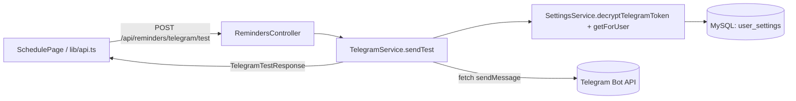
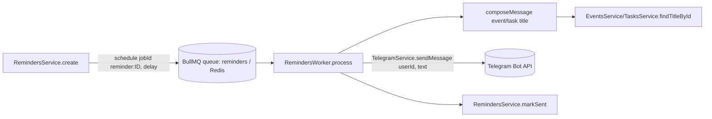

> **Status:** Draft — generated from code survey on 2026-06-15
> **Last updated:** 2026-06-15
> **Owners:** TODO: confirm

# Telegram Integration

Tích hợp Telegram dùng Telegram Bot API để gửi tin nhắn cho người dùng: nhắc lịch (reminder) cho `event`/`task` và tin nhắn thử nghiệm kết nối. Mỗi user tự cấu hình **bot token** và **chat_id** riêng trong Cài đặt; bot token được lưu **mã hóa AES-256-GCM** trong `user_settings`, không bao giờ lưu plaintext. Đây là kênh gửi thông báo cho module `schedule`, được kích hoạt bởi worker BullMQ khi reminder đến hạn.

## Document Map

- [Root CLAUDE.md](../../../CLAUDE.md) · [Architecture index](../../architecture.md) · [Backend architecture](../../architecture/backend.md)
- Module liên quan: [Schedule module](../../modules/schedule/README.md) · [Settings module](../../modules/settings/README.md)
- Hạ tầng liên quan: [BullMQ queues](../../infra/queue-bullmq/README.md) · [Crypto & secrets](../../infra/crypto-secrets/README.md)

## Module Purpose

- Gửi tin nhắn qua Telegram Bot API (`POST {base}/bot{token}/sendMessage`) cho một user cụ thể.
- Cung cấp endpoint "gửi thử" để xác minh cấu hình Telegram của user.
- Là đích gửi (delivery sink) của luồng reminder: worker compose nội dung rồi gọi service này.
- KHÔNG thuộc module này: lập lịch/lưu reminder (thuộc [Schedule module](../../modules/schedule/README.md)), lưu/mã hóa bot token (thuộc [Settings module](../../modules/settings/README.md)), và cơ chế queue/worker chung (thuộc [BullMQ queues](../../infra/queue-bullmq/README.md)). Telegram chỉ là tầng "gửi".

## Primary Entrypoints

| Layer | Entrypoint | Purpose |
|-------|-----------|---------|
| Service | `apps/backend/src/schedule/telegram.service.ts` | `sendMessage(userId, text)` và `sendTest(userId)`; resolve cấu hình rồi gọi Telegram Bot API qua `fetch`. |
| Worker | `apps/backend/src/schedule/reminders.worker.ts` | Worker BullMQ xử lý job reminder, compose nội dung (event/task) và gọi `TelegramService.sendMessage`. |
| Controller | `apps/backend/src/schedule/reminders.controller.ts` | `POST /reminders/telegram/test` → `TelegramService.sendTest(user.id)`. |
| Service (settings) | `apps/backend/src/settings/settings.service.ts` | `decryptTelegramToken(userId)` giải mã bot token; `update(...)` lưu `telegramBotTokenEnc` (mã hóa) + `telegramChatId`. |
| Entity | `apps/backend/src/settings/user-settings.entity.ts` | Cột `telegram_bot_token_enc` (varchar 1024, nullable) và `telegram_chat_id` (varchar 64, nullable). |
| Shared schema | `packages/shared/src/reminders.ts` | `telegramTestSchema` / `TelegramTestResponse` (`{ ok, message }`). |
| Shared schema | `packages/shared/src/settings.ts` | `telegramBotToken` (regex `^\d+:[A-Za-z0-9_-]+$`), `telegramChatId`, và field masked trong `userSettingsSchema`. |
| Frontend | `apps/frontend/src/lib/api.ts` | `testTelegram()` → `POST /reminders/telegram/test`, parse bằng `telegramTestSchema`. |
| Frontend | `apps/frontend/src/pages/SchedulePage.tsx` | Nút "Telegram test" gọi `api.testTelegram` và hiển thị `data.message`. |
| Frontend | `apps/frontend/src/pages/SettingsPage.tsx` | Form nhập bot token + Chat ID (gửi qua `update settings`). |

> Đường dẫn trong bảng là tuyệt đối từ repo root.

## Core Supporting Objects

- `RemindersQueue` (`apps/backend/src/schedule/reminders.queue.ts`) — Queue BullMQ `reminders`; `schedule()` enqueue job với `jobId = reminder:<reminderId>` và `delay` tới thời điểm nhắc; cấu hình `attempts: 3`, backoff `exponential` 30s. Kết nối Redis lấy từ `REDIS_HOST/REDIS_PORT/REDIS_PASSWORD`.
- `ReminderJobData` (`reminders.queue.ts`) — payload job: `{ reminderId, userId, targetType, targetId, remindAt }`.
- `CryptoService` (`apps/backend/src/common/crypto/...`) — `encrypt`/`decrypt`/`mask` cho bot token. Chi tiết: [Crypto & secrets](../../infra/crypto-secrets/README.md). TODO: confirm đường dẫn file chính xác của crypto service.
- Helper trong `telegram.service.ts`: hằng `TELEGRAM_BASE = "https://api.telegram.org"`, `REQUEST_TIMEOUT_MS = 10_000`; `post()` dùng `AbortController` để timeout; `safeBody()` cắt body lỗi còn 200 ký tự để log.
- Helper trong `reminders.worker.ts`: `escapeHtml()` (escape `& < >`) và `formatVN()` (định dạng ngày giờ theo `Asia/Ho_Chi_Minh`, 24h).

## Data Flow

Luồng đồng bộ — gửi thử (Telegram test):

- `sendTest(userId)` gọi `resolveConfig(userId)`: cần **cả** token đã giải mã (`decryptTelegramToken`) **và** `telegramChatId`. Thiếu một trong hai → ném `BadRequestException` code `telegram_not_configured` (message tiếng Việt). Gửi được → trả `{ ok: true, message: "Đã gửi tin nhắn thử nghiệm." }`; gửi lỗi (fetch/HTTP) → bắt lỗi và trả `{ ok: false, message: "Không gửi được: ..." }`.

Luồng async — gửi nhắc lịch (reminder) qua queue:

- Worker được tạo trong `onModuleInit` với `concurrency: 4`, lắng nghe sự kiện `failed` để log.
- `process(job)`: lấy `{ reminderId, userId, targetType, targetId }`, gọi `composeMessage`. Nếu target (event/task) không còn → log cảnh báo, **vẫn** `markSent` và bỏ qua việc gửi. Nếu có nội dung → `telegram.sendMessage(userId, text)` rồi `markSent(reminderId)`.
- `sendMessage` gọi `resolveConfig`; nếu user **chưa cấu hình** Telegram thì chỉ ghi log cảnh báo và **bỏ qua** (không ném lỗi), tránh làm fail job.
- Nội dung gửi dùng `parse_mode: "HTML"`, `disable_web_page_preview: true`; tiêu đề event/task được `escapeHtml`.

## When To Touch Which File

| If you want to… | Edit | Then also… |
|-----------------|------|------------|
| Đổi nội dung/format tin nhắn nhắc lịch | `apps/backend/src/schedule/reminders.worker.ts` (`composeMessage`/`formatVN`) | kiểm tra `parse_mode` HTML vẫn hợp lệ, escape input |
| Đổi cách gọi Telegram API (timeout, payload, parse_mode) | `apps/backend/src/schedule/telegram.service.ts` (`post`) | TODO: confirm test tương ứng |
| Đổi shape response của endpoint test | `packages/shared/src/reminders.ts` (`telegramTestSchema`) | controller `reminders.controller.ts` + `apps/frontend/src/lib/api.ts` |
| Thêm/đổi quy tắc cấu hình token/chat_id | `packages/shared/src/settings.ts` (regex/optional) | `settings.service.ts` + `SettingsPage.tsx` |
| Thêm field persist cho cấu hình Telegram | `apps/backend/src/settings/user-settings.entity.ts` + migration mới | cập nhật `packages/shared/src/settings.ts` + `settings.service.ts` (`toDto`) + frontend |
| Đổi tham số queue/retry của reminder | `apps/backend/src/schedule/reminders.queue.ts` | [BullMQ queues](../../infra/queue-bullmq/README.md) |

## Permission & Access Rules

- **Guard:** `RemindersController` áp dụng `@UseGuards(JwtAuthGuard)` ở cấp controller; endpoint `telegram/test` chỉ dùng `user.id` lấy từ `@CurrentUser()`.
- **userId-scoping:** mọi thao tác đều gắn với `userId`. `TelegramService.resolveConfig` đọc token + chat_id theo `userId`; `composeMessage` gọi `findTitleById(userId, targetId)` nên chỉ đọc được event/task của chính user đó. Worker lấy `userId` từ `ReminderJobData` của job.
- **Dữ liệu KHÔNG được expose ra DTO:** `telegram_bot_token_enc` (blob mã hóa) tuyệt đối không trả về; DTO chỉ trả `telegramBotTokenMasked` (qua `crypto.mask`) và `telegramChatId` plaintext (xem `SettingsService.toDto`). Khóa mã hóa (`ENCRYPTION_KEY`) không bao giờ rời server.
- **Validation biên:** bot token phải khớp regex `^\d+:[A-Za-z0-9_-]+$` (định nghĩa trong `packages/shared/src/settings.ts`); chat_id `min(1).max(64)`.
- TODO: confirm có rate limit riêng cho `POST /reminders/telegram/test` hay không.

## Legacy / Operational Notes

- **Telegram chưa cấu hình ≠ lỗi job:** `sendMessage` bỏ qua êm (chỉ log) khi user chưa có token/chat_id, để reminder job không bị fail hàng loạt.
- **Reminder mất target vẫn `markSent`:** nếu event/task đã bị xóa khi job chạy, worker không gửi nhưng vẫn đánh dấu đã gửi để tránh kẹt queue.
- **Timeout cứng 10s** (`REQUEST_TIMEOUT_MS`) cho mỗi lần gọi Telegram API; lỗi HTTP ném `Error("Telegram API <status>: <body>")` (body cắt 200 ký tự).
- **Env phụ thuộc:** Redis (`REDIS_HOST`, `REDIS_PORT`, `REDIS_PASSWORD`) cho queue/worker; `ENCRYPTION_KEY` (64 hex) cho mã hóa token. Worker chỉ chạy khi tiến trình backend khởi tạo `RemindersWorker` (đăng ký trong `schedule.module.ts`).
- **Múi giờ:** tin nhắn hiển thị giờ Việt Nam (`Asia/Ho_Chi_Minh`) dù DB lưu UTC.
- TODO: confirm hành vi khi chạy nhiều instance backend (worker trùng concurrency) trong môi trường production.

## Where To Start Reading For Maintenance

1. `apps/backend/src/schedule/telegram.service.ts` — điểm gọi Telegram API thực tế và quy tắc resolve cấu hình.
2. `apps/backend/src/schedule/reminders.worker.ts` — cách job reminder biến thành tin nhắn và gọi service.
3. `apps/backend/src/schedule/reminders.queue.ts` — cách job được enqueue/retry (ngữ cảnh BullMQ).
4. `apps/backend/src/settings/settings.service.ts` + `apps/backend/src/settings/user-settings.entity.ts` — nơi lưu/giải mã token và chat_id.
5. `packages/shared/src/reminders.ts` + `packages/shared/src/settings.ts` — contract giữa backend và frontend.

## Related Modules

- [Schedule module](../../modules/schedule/README.md) — chủ sở hữu reminder/event/task, kích hoạt việc gửi Telegram.
- [Settings module](../../modules/settings/README.md) — lưu và giải mã bot token + chat_id của user.
- [BullMQ queues](../../infra/queue-bullmq/README.md) — hạ tầng queue/worker cho reminder.
- [Crypto & secrets](../../infra/crypto-secrets/README.md) — mã hóa AES-256-GCM cho bot token.

## Document History

| Date | Change | Author |
|------|--------|--------|
| 2026-06-15 | Initial draft generated from code survey | TODO: confirm |
