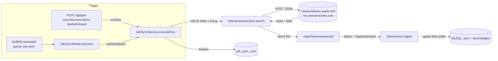

> **Status:** Draft — generated from code survey on 2026-06-15
> **Last updated:** 2026-06-15
> **Owners:** TODO: confirm

# VietnamWorks Integration

Tích hợp với **public job-search API của VietnamWorks** để kéo tin tuyển dụng về bảng `jobs` chung của hệ thống. Gồm hai phần: một HTTP client gọi endpoint tìm việc của VietnamWorks (`vietnamworks.client.ts`) và một mapper chuyển job thô (HTML, entity, cấu trúc của VNW) sang đúng shape `IngestJobInput` mà `JobsService.ingest` mong đợi (`vietnamworks.mapper.ts`). Module `job-sync` điều phối việc gọi client + map + ingest theo lịch hoặc khi bấm "Chạy ngay". Đây là **nguồn dữ liệu duy nhất** hiện được hỗ trợ (enum `provider` chỉ có `vietnamworks`).

## Document Map

- [Root CLAUDE.md](../../../CLAUDE.md) · [Architecture index](../../architecture.md) · [Backend architecture](../../architecture/backend.md)
- [Job sync module](../../modules/job-sync/README.md) — điều phối lịch, run, lịch sử (chủ sở hữu client + mapper này).
- [Jobs module](../../modules/jobs/README.md) — đích đến: `JobsService.ingest` upsert vào bảng `jobs`.
- Hàng đợi/lịch chạy dựa trên BullMQ + Redis: xem chi tiết queue/worker trong [Job sync module](../../modules/job-sync/README.md). TODO: confirm có doc riêng `infra/queue-bullmq` hay không.

## Module Purpose

- **Gọi public API tìm việc của VietnamWorks** với endpoint cố định, header giả lập trình duyệt, timeout và bộ trường (`retrieveFields`) cố định — trả về `{ nbPages, nbHits, items[] }` (job thô, chưa map).
- **Map một job thô VNW → object khớp `ingestJobInputSchema`**: tiền tố `jobId` bằng `vnw_`, giải mã HTML/entity, tách bullet cho yêu cầu/mô tả, lọc lương ẩn, gắn nhãn hình thức làm việc/ứng viên, v.v.
- **Phạm vi THUỘC module này:** logic HTTP gọi VNW (URL, header, body tìm kiếm, parse response, mã lỗi) và logic biến đổi dữ liệu (mapper + các helper HTML).
- **KHÔNG thuộc module này:** lập lịch/queue (do `JobSyncScheduler` + `JobSyncWorker`), điều phối run + đếm kết quả (do `JobSyncService`), và việc validate + upsert + chuẩn hóa công nghệ (do `JobsService.ingest`). Đầu vào (city/district filter, từ khóa, phân trang, lịch) là cấu hình của nguồn sync, không phải của client này.

## Primary Entrypoints

| Layer | Entrypoint | Purpose |
|-------|-----------|---------|
| External client | `apps/backend/src/job-sync/vietnamworks.client.ts` | `VietnamworksClient.search()` POST tới endpoint tìm việc VNW, dựng body, parse `meta`/`data`, ném `VietnamworksError` với `code` ổn định. |
| Mapper | `apps/backend/src/job-sync/vietnamworks.mapper.ts` | `mapVietnamworksJob(raw)` → object khớp `ingestJobInputSchema` (hoặc `null` nếu thiếu `jobId`/`title`); kèm helper HTML `decodeHtmlEntities` / `htmlToText` / `htmlToBullets`. |
| Mapper spec | `apps/backend/src/job-sync/vietnamworks.mapper.spec.ts` | Tài liệu sống cho quy tắc map (mẫu job thật, các trường hợp lương ẩn, entity, fallback địa điểm) — output phải qua `ingestJobInputSchema.parse`. |
| Service (caller) | `apps/backend/src/job-sync/job-sync.service.ts` | `executeRun()` lặp từ khóa → trang → `client.search` → `mapVietnamworksJob` → `JobsService.ingest`; đếm created/updated/failed và finalize run. |
| Controller | `apps/backend/src/job-sync/job-sync.controller.ts` | `@Controller("job-sync")` dưới `JwtAuthGuard`: CRUD nguồn, `POST sources/:id/run`, `GET overview`/`runs`. |
| Ingest target | `apps/backend/src/jobs/jobs.service.ts` | `JobsService.ingest()` validate bằng `ingestJobInputSchema`, upsert theo `jobId`, đồng bộ bảng công nghệ. |
| Shared schema | `packages/shared/src/job-sync.ts` | Schema/DTO nguồn sync, run, `JobSyncFilters` (`cityId`/`districtIds`) mà client nhận làm `filters`. |
| Shared schema | `packages/shared/src/jobs.ts` | `ingestJobInputSchema` — hợp đồng đích mà output của mapper phải khớp. |

> Đường dẫn trong bảng là tuyệt đối từ repo root.

## Core Supporting Objects

- **`VietnamworksSearchParams` / `VietnamworksSearchResult`** (`vietnamworks.client.ts`): interface tham số tìm kiếm (`query`, `filters`, `hitsPerPage`, `page` bắt đầu từ 0) và kết quả (`nbPages`, `nbHits`, `items[]`).
- **`buildSearchBody(params)`** (export, `vietnamworks.client.ts`): dựng body khớp định dạng VNW. `cityId` → filter `workingLocations.cityId`; `districtIds` được bọc thành **chuỗi JSON** dưới `workingLocations.districtId` (`[-1]` = mọi quận/huyện). Gắn kèm hằng `RETRIEVE_FIELDS`.
- **`VietnamworksError`** (`vietnamworks.client.ts`): lỗi mang `code` ổn định — `vietnamworks_http_error`, `vietnamworks_timeout`, `vietnamworks_unreachable` — để service ghi vào `run.errorMessage`.
- **Hằng số mapper** (`vietnamworks.mapper.ts`): `SOURCE = "vietnamworks"`, `JOB_ID_PREFIX = "vnw_"`, `MAX_BULLETS = 200`, `MAX_BULLET_LEN = 500`, bảng `WORKING_TYPE_LABELS` (`typeWorkingId` `1` → `"Toàn thời gian"`).
- **Helper HTML** (export, dùng cho mô tả/yêu cầu là HTML kèm entity như `C&#43;&#43;`): `decodeHtmlEntities` (entity tên + số thập phân/hex), `htmlToText` (đổi block thành xuống dòng, bỏ thẻ, gom khoảng trắng), `htmlToBullets` (tách bullet sạch, bỏ ký hiệu đầu dòng, khử trùng liền kề, cắt theo `MAX_*`).
- **Helper trường** (`vietnamworks.mapper.ts`): `pickLocation` (ưu tiên `cityNameVI` của vị trí đầu, fallback `address`), `skillNames`, `benefitLines` (`label: value`), `positiveOrNull` (lương ≤ 0 → `null`), `applicantsLabel` (`"<n> ứng viên"`).
- **Entities** (`apps/backend/src/job-sync/entities/`): `JobSyncSourceEntity` (`job_sync_sources`) và `JobSyncRunEntity` (`job_sync_runs`) — **bảng global, không có `user_id`** (xem Permission & Access Rules).

## Data Flow

Luồng đồng bộ thực tế: VNW client chỉ là một mắt xích trong `executeRun` của `JobSyncService`. Có hai cách kích hoạt (thủ công và theo lịch) nhưng đều hội tụ về cùng vòng quét.

Các bước (theo `executeRun`):

1. **Kích hoạt.** Thủ công: `POST /api/job-sync/sources/:id/run` → `runNow` tạo run `running`, chạy nền **trong tiến trình API** rồi trả run ngay (HTTP `202`). Theo lịch: `JobSyncScheduler` (BullMQ repeatable job, queue `job-sync`) → `JobSyncWorker.process` → `runScheduled` (bỏ qua nếu nguồn đã xóa/tắt/đang chạy).
2. **Quét.** Với mỗi từ khóa trong `source.queries`, lặp trang từ `0` đến `min(maxPages, nbPages)`; mỗi trang gọi `client.search({ query, filters, hitsPerPage, page })`.
3. **Gọi VNW.** Client POST tới `https://ms.vietnamworks.com/job-search/v1.0/search` với header giả lập trình duyệt, timeout `20s` (AbortController), parse `meta.nbPages/nbHits` + `data[]`.
4. **Map + ingest.** Mỗi item thô → `mapVietnamworksJob` (bỏ qua → `jobsFailed++` nếu trả `null`) → `JobsService.ingest` (upsert theo `jobId`; đếm `created`/`updated`, lỗi → `jobsFailed++`).
5. **Lịch sự + finalize.** Nghỉ `PAGE_DELAY_MS = 400ms` giữa các trang; dừng sớm khi trang rỗng. Cuối cùng `finalize` ghi `pagesFetched/jobsFound/jobsCreated/jobsUpdated/jobsFailed` + trạng thái (`success` / `partial` / `error`) vào `job_sync_runs` và cập nhật `lastStatus`/`lastRunAt` của nguồn.

## When To Touch Which File

| If you want to… | Edit | Then also… |
|-----------------|------|------------|
| Đổi endpoint / header / timeout / `retrieveFields` / body tìm kiếm VNW | `apps/backend/src/job-sync/vietnamworks.client.ts` | kiểm tra `buildSearchBody` còn khớp filter (`cityId`/`districtId` JSON); cập nhật mã lỗi nếu thêm. |
| Đổi/thêm quy tắc map từ job thô VNW | `apps/backend/src/job-sync/vietnamworks.mapper.ts` | cập nhật `vietnamworks.mapper.spec.ts`; nếu thêm field mới, sửa `ingestJobInputSchema` trong `packages/shared/src/jobs.ts` trước. |
| Thêm field persist cho job đích | `packages/shared/src/jobs.ts` + `apps/backend/src/jobs/entities/job.entity.ts` + migration mới | cập nhật mapper để điền field, `JobsService` (`toFields`/`toDto`), đăng ký entity trong `apps/backend/src/database/data-source.ts`. |
| Đổi shape API nguồn/run hoặc `JobSyncFilters` | `packages/shared/src/job-sync.ts` | controller + service + frontend; bảng `filters` được client đọc trực tiếp. |
| Thêm field persist cho nguồn/run | `apps/backend/src/job-sync/entities/*.entity.ts` + migration mới | cập nhật shared schema, `toSourceDto`/`toRunDto`, đăng ký trong `data-source.ts`. |
| Đổi cách quét/đếm/ingest mỗi run (rate, phân trang, dừng sớm) | `apps/backend/src/job-sync/job-sync.service.ts` (`executeRun`) | xem lại `PAGE_DELAY_MS`, `resolveStatus`, `job-sync.service.spec.ts`. |
| Đổi logic lịch chạy (interval/daily, timezone) | `apps/backend/src/job-sync/job-sync.scheduler.ts` | giới hạn lịch nằm ở `packages/shared/src/job-sync.ts` (`MIN/MAX_INTERVAL_MINUTES`). |
| Thêm provider thứ hai | `packages/shared/src/job-sync.ts` (`jobSyncProviderSchema`) | tạo client + mapper mới theo cùng khuôn, rẽ nhánh trong `executeRun`. TODO: confirm thiết kế đa-provider. |

## Permission & Access Rules

- **Guard:** toàn bộ `JobSyncController` áp `@UseGuards(JwtAuthGuard)` — mọi thao tác (gồm "Chạy ngay" tạo request đi ra ngoài) yêu cầu đăng nhập.
- **KHÔNG có scoping theo `userId`.** `JobSyncSourceEntity` và `JobSyncRunEntity` là **bảng global, không gắn `user_id`** (xác nhận trong comment entity: "Bảng global (không gắn `user_id`) — giống `jobs`/`vocab_items`"). Mọi người dùng đã đăng nhập đều thấy và sửa chung cấu hình nguồn + lịch sử run. Đây là khác biệt có chủ đích so với các module user-owned (notes/expense/…).
- **Validate biên:** body `create`/`update` qua `ZodValidationPipe` (`createJobSyncSourceInputSchema` / `updateJobSyncSourceInputSchema`); route `:id` qua `ParseUUIDPipe`; query `sourceId` lọc bằng regex UUID (rác → bỏ).
- **Không có secret/credential per-user.** Client gọi **public endpoint, không API key** — `VietnamworksClient` chỉ gửi header giả lập trình duyệt (hằng số trong code), không đọc env nhạy cảm. URL là hằng số nên **không có rủi ro SSRF** từ input người dùng.
- **Dữ liệu KHÔNG đưa ra DTO ngoài hợp đồng:** mapper chỉ phát các khóa mà `ingestJobInputSchema` chấp nhận; không có hash/khóa mã hóa/`storedPath` trong domain này. Lưu ý: `run.errorMessage` (text lỗi từ `VietnamworksError`/ingest) **được surface có chủ đích** cho UI — tránh nhét chi tiết nhạy cảm vào thông điệp lỗi.

## Legacy / Operational Notes

- **Endpoint không chính thức.** `https://ms.vietnamworks.com/job-search/v1.0/search` là API public của trang VNW; client mô phỏng header trình duyệt (`user-agent`/`origin`/`referer`/`x-source`) để không bị chặn. Nếu VNW đổi API/anti-bot, client sẽ vỡ — quan sát mã lỗi trong `job_sync_runs.errorMessage`.
- **Lịch sự / rate limiting:** nghỉ `PAGE_DELAY_MS = 400ms` giữa các trang; lịch tối thiểu `MIN_INTERVAL_MINUTES = 15` phút (tối đa `1440`); worker `concurrency = 2`. Timeout mỗi request `REQUEST_TIMEOUT_MS = 20s`.
- **Chống trùng nguồn trong bảng `jobs` chung:** mọi `jobId` được tiền tố `vnw_` để không đụng id từ nguồn khác (vd n8n).
- **`crawlAt = null`** từ mapper → `JobsService` điền thời điểm hiện tại lúc sync.
- **Run treo:** run `running` cũ hơn `STALE_RUNNING_MS = 30 phút` được coi là treo và cho phép chạy lại.
- **Env liên quan:** chỉ Redis cho BullMQ (`REDIS_HOST`/`REDIS_PORT`/`REDIS_PASSWORD`). Không có biến môi trường riêng cho VietnamWorks. TODO: confirm không có cấu hình VNW nào ngoài hằng số trong code.
- **`cityId`/`districtId`** dùng mã của VietnamWorks (vd Hồ Chí Minh = `29`, thấy trong test/spec). TODO: confirm nơi lưu bảng tra cứu mã thành phố/quận-huyện (không có trong các file đã khảo sát).
- **`employmentType`** chỉ map giá trị chắc chắn (`typeWorkingId = 1` → "Toàn thời gian"); các giá trị khác → `null`. TODO: confirm các mã `typeWorkingId` còn lại.

## Where To Start Reading For Maintenance

1. `apps/backend/src/job-sync/vietnamworks.client.ts` — hiểu cách gọi VNW (URL, header, body, parse, mã lỗi).
2. `apps/backend/src/job-sync/vietnamworks.mapper.ts` + `vietnamworks.mapper.spec.ts` — quy tắc biến đổi job thô → `IngestJobInput` (đọc spec để nắm các case).
3. `apps/backend/src/job-sync/job-sync.service.ts` (`executeRun`) — cách client + mapper được điều phối, đếm và finalize run.
4. `apps/backend/src/job-sync/job-sync.scheduler.ts` + `job-sync.worker.ts` — lịch chạy BullMQ và worker tiêu thụ.
5. `packages/shared/src/job-sync.ts` + `packages/shared/src/jobs.ts` — hợp đồng input/output (filters, source/run DTO, `ingestJobInputSchema`).

## Related Modules

- [Job sync module](../../modules/job-sync/README.md) — chủ sở hữu client + mapper này: lập lịch (BullMQ), điều phối run, lịch sử và overview.
- [Jobs module](../../modules/jobs/README.md) — đích ingest: `JobsService.ingest` upsert vào bảng `jobs`, chuẩn hóa công nghệ.

## Document History

| Date | Change | Author |
|------|--------|--------|
| 2026-06-15 | Initial draft generated from code survey | TODO: confirm |
